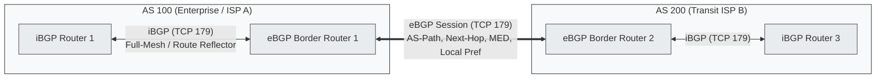

# BGP(Border Gateway Protocol)

---

## I. 인터넷 자율 시스템(AS) 간 정책 기반 경로 제어, BGP의 개요

* **정의**: 서로 다른 자율 시스템(AS, Autonomous System) 간에 경로 도달 가능성(Reachability) 정보와 경로 속성(Path Attributes)을 교환하는 [[TCP]](포트 179) 기반의 외부 [[게이트웨이]] 라우팅 [[프로토콜]](EGP)
* **필요성/특징**:
* **Path Vector 기반**: 최단 홉 카운트 대신 AS-Path 목록을 전달하여 라우팅 루프 원천 차단
* **정책 기반 라우팅(Policy-Based Routing)**: 대역폭/지연시간이 아닌 조직의 상업적 계약 및 트래픽 엔지니어링 정책 우선 적용
* **안정적 [[신뢰성]]**: 전송 계층으로 TCP 179번 포트를 사용하여 [[세션]] 수립 및 Keepalive를 통한 세션 유지

---

## II. BGP의 개념도 및 핵심 기술 요소

### 가. BGP의 구성도 및 동작 원리

* **동작 흐름**: TCP 3-Way Handshake $\rightarrow$ Open $\rightarrow$ Keepalive 메시지를 통한 피어링 세션 성립 후 Update 메시지로 NLRI(Network Layer Reachability Information) 및 경로 속성 증분 교환

### 나. BGP의 핵심 기술 및 구성 요소

| 구분 | 요소기술(키워드) | 세부 설명 |
| --- | --- | --- |
| **운영 방식** | **eBGP (External BGP)** | 서로 다른 AS 간 [[라우터]] 간 피어링(기본 TTL=1), AS-Path 속성에 자가 AS 추가 |
| **운영 방식** | **iBGP (Internal BGP)** | 동일 AS 내부 라우터 간 피어링(Loopback IP 기반 권장), 수신 경로 재광고 제한(루프 방지) |
| **스케일링** | **Route Reflector (RR)** | iBGP의 Full-Mesh 요구 한계($N(N-1)/2$) 극복을 위한 대표 반사 라우터(RFC 4456) |
| **스케일링** | **BGP Confederation** | 대규모 단일 AS를 내부 서브 AS(자율 시스템) 구조로 분할하여 확장성 확보 |
| **경로 속성** | **AS-Path / Next-Hop** | 목적지까지 거쳐간 AS 목록(루프 방지 및 최단 AS 선택) / 패킷을 전달할 다음 홉 IP |
| **경로 속성** | **Local Preference** | AS 내부 트래픽이 외부로 나가는 출구 경로를 결정하는 최우선 표준 속성(높을수록 우선) |
| **경로 속성** | **MED (Metric)** | 인접 AS 트래픽이 자가 AS로 들어오는 입구 경로를 유도하는 비필수 속성(낮을수록 우선) |
| **보안 기술** | **RPKI (Resource PKI)** | 라우트 하이재킹 방지를 위해 IP 접두부와 원점 AS 번호의 유효성을 검증하는 ROA 서명 체계 |

---

## III. BGP와 IGP(OSPF) 비교 및 보안 동향

### 가. BGP vs OSPF 비교

| 비교 항목 | BGP (Border Gateway Protocol) | OSPF (Open Shortest Path First) |
| --- | --- | --- |
| **프로토콜 범주** | EGP (Exterior Gateway Protocol) | IGP (Interior Gateway Protocol) |
| **[[알고리즘]]** | Path-Vector (경로 벡터) | Link-State ([[다익스트라 알고리즘|Dijkstra]] SPF) |
| **동작 계층** | [[전송 계층]] 상위 (TCP 포트 179) | [[네트워크 계층]] (IP 프로토콜 89) |
| **경로 결정 기준** | 관리자 정의 정책(Policy) 및 BGP 속성 우선순위 | 링크 코스트(Cost, 대역폭 기반 수치 메트릭) |
| **수렴 속도/규모** | 수렴 속도 느림(대규모 글로벌 확장성 보장) | 수렴 속도 빠름(AS 내부 규모에 국한) |

### 나. 한계점 및 보안 최신 동향

* **BGP Hijacking / Route Leak 취약성**: 경로 정보 무단 위조 및 잘못된 광고로 인한 글로벌 트래픽 탈취 위험 상존
* **BGPsec 및 ASPA 도입**: RPKI를 통한 ROA(Route Origin Authorization) 적용 확대 및 AS 전송 경로 위변조를 검증하는 ASPA(Autonomous System Provider Authorization) 기반 제로트러스트 라우팅 고도화 진행 중

---

### 🔗 연관 토픽

- **소속 도메인**: [[00_네트워크_MOC|🌐 네트워크]]
- **세부 분류**: `1. OSI 7계층 & 데이터링크 계층 (L1/L2)`
- **핵심 연관 토픽**:
  - [[네트워크 계층|네트워크 계층 (Network Layer)]]
  - [[라우터]]
  - [[신뢰성]]
  - [[프로토콜]]
  - [[TCP]]
