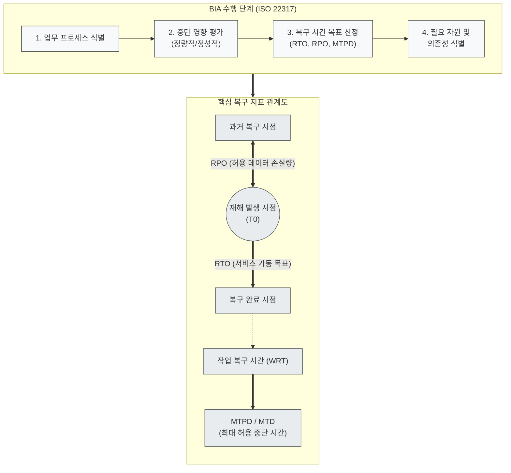

# BIA (Business Impact Analysis)

---

## I. 비즈니스 연속성 확보를 위한 영향도 평가, BIA의 개요

* **정의**: 조직의 재난·재해 등 업무 중단 사고 발생 시 핵심 비즈니스 기능의 중단으로 인한 유·무형의 손실 영향을 시간 경과에 따라 분석·평가하여 복구 목표 및 우선순위를 도출하는 기법
* **필요성/특징**:
* **[[BCP]]/DR 구축의 초석**: 정량적/정성적 손실 평가를 통해 RTO, RPO 등 핵심 복구 기준점 제시
* **자원 배분의 합리성**: 한정된 재난복구 자원을 핵심 비즈니스 프로세스에 집중 투자할 수 있는 우선순위 수립
* **국제 표준 준수**: [[ISO 22301]](BCMS, 비즈니스연속성관리시스템) 및 ISO 22317(BIA 가이드라인) 요구사항 충족

---

## II. BIA의 프레임워크 및 핵심 구성 요소

### 가. BIA의 분석 절차 및 복구 지표 관계도

* **핵심 관계**: 재해 발생 시점 기준 데이터 복구 한계는 RPO, 시스템 가동은 RTO이며, 업무 [[무결성]] 검증(WRT)을 거쳐 최종 서비스 정상화는 치명적 손실 임계점인 MTPD(MTD) 이내에 완료되어야 함

### 나. BIA의 핵심 지표 및 분석 요소

| 구분 | 요소기술/지표 (키워드) | 세부 설명 |
| --- | --- | --- |
| **복구 지표** | **MTPD / MTD** | 최대 허용 중단 시간(Maximum Tolerable Period of Disruption), 조직 존립에 치명적 영향을 미치기 전의 한계 시점 |
| **복구 지표** | **RTO (Recovery Time Objective)** | 목표 복구 시간, 재해 발생 후 비즈니스 서비스나 IT 시스템이 재가동되기까지의 허용 시간 |
| **복구 지표** | **RPO (Recovery Point Objective)** | 목표 복구 시점, 재해 발생 시 허용 가능한 최대 데이터 손실 시간(백업 주기 및 동기화 기준) |
| **복구 지표** | **WRT (Work Recovery Time)** | 작업 복구 시간, 시스템 복구 후 데이터 정합성 검증 및 미처리 업무를 수기/배치로 처리하는 시간 |
| **복구 지표** | **MBCO (Min. Business Continuity Objective)** | 최소 업무 연속성 목표, 중단 기간 동안 조직이 유지해야 하는 최소한의 서비스 수준 |
| **영향 분석** | **정량적 영향 분석 (Quantitative)** | 금전적 직접 손실, 위약금, 법적 과징금, 복구 비용 등 계량화 가능한 재무적 지표 산출 |
| **영향 분석** | **정성적 영향 분석 (Qualitative)** | 브랜드 인지도 하락, 고객 신뢰 상실, 규제 기관 제재, 직원 안전 등 비재무적 위험 평가 |
| **의존성 분석** | **자원 및 의존성 매핑 (Interdependency)** | 핵심 [[프로세스]] 수행에 요구되는 IT 인프라, 인력, 타 시스템(API/DB), 서드파티 공급망 식별 |

---

## III. BIA와 RA(위험 평가) 비교 및 최신 동향

### 가. BIA vs RA (Risk Assessment) 비교

| 비교 항목 | BIA (Business Impact Analysis) | RA (Risk Assessment) |
| --- | --- | --- |
| **분석 초점** | **결과(Impact) 중심** | **원인 및 가능성(Likelihood) 중심** |
| **핵심 질문** | "업무가 중단되면 얼마나 큰 손실이 발생하고, 언제까지 복구해야 하는가?" | "어떤 위협(Threat)과 취약점(Vulnerability)이 재해를 유발할 수 있는가?" |
| **주요 산출물** | RTO, RPO, MTPD, MBCO, 핵심 업무 우선순위 | 위험 식별 목록, 위험도(Risk Level), 위험 완화 계획 |
| **BCP 내 역할** | 전략 수립 기준(복구 우선순위 및 자원 할당 목표) 제공 | 완화 조치 및 예방 통제(보안/이중화 대책) 도출 |

### 나. 최근 동향 및 발전 방향

* **공급망 및 SaaS 의존도 확대**: 클라우드 [[CSP]](AWS, Azure) 장애 및 서드파티 SaaS 연동 장애를 포괄하는 외부 의존성 BIA로 범위 확대
* **데이터 기반 동적 BIA**: 수작업 설문/인터뷰 중심의 정적 분석 한계를 극복하기 위해, CMDB 및 옵저버빌리티 도구와 연계한 실시간 비즈니스 영향 분석(Continuous BIA) 도입 가속

---

### 🔗 연관 토픽

- **소속 도메인**: [[00_경영전략_MOC|📈 경영전략]]
- **세부 분류**: `3. 비즈니스 프로세스 혁신 & 디지털 전환 (DX)`
- **핵심 연관 토픽**:
  - [[BCP|BCP (Business Continuity Planning)]]
  - [[ISO 22301]]
  - [[BCM|BCM (Business Continuity Management)]]
  - [[DRaaS]]
  - [[비즈니스 연속성 계획]]
