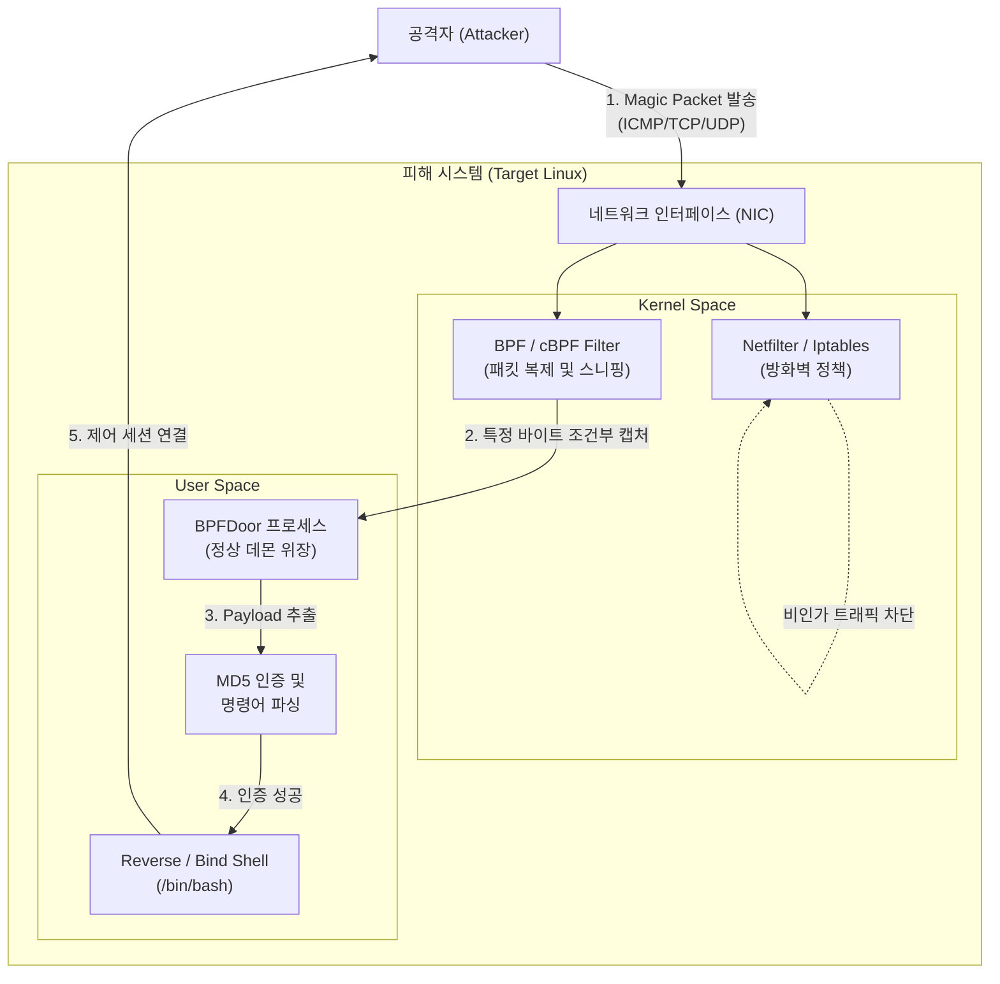

# BPFDoor

---

## I. 커널 레벨 패킷 스니핑 기반 은닉형 악성코드, BPFDoor의 개요

* **정의**: 리눅스 커널의 BPF(Berkeley Packet Filter) 기술을 악용하여, 고정된 리슨 포트(Listen Port) 없이 매직 패킷(Magic Packet)으로 동작하는 고도의 은닉형 리눅스 백도어 악성코드
* 네트워크 [[방화벽]](Iptables 등)이 패킷을 차단하기 전에 [[커널]] 단에서 트래픽을 가로채어 명령을 수신하는 포트리스(Port-less) 통신 수행
* **특징**: 커널 단위 패킷 스니핑, 정상 데몬 [[프로세스]] 위장(Process Spoofing), APT 공격 그룹(Red Menshen 등)의 장기 지속형 내부망 장악에 활용

---

## II. BPFDoor의 아키텍처 및 핵심 구성요소

### 가. BPFDoor의 아키텍처 및 동작 원리

* 공격자의 매직 패킷이 유입되면, 커널 단의 BPF 필터가 방화벽 차단 정책과 무관하게 패킷을 복제하여 악성코드에 전달함
* 수신 패킷 내 데이터를 Salt와 결합해 MD5 해시 인증을 수행한 후, 환경변수 조작과 함께 리버스 쉘을 실행하여 제어권 획득

### 나. BPFDoor의 핵심 기술 요소

| 구분 | 요소기술(키워드) | 세부 설명 |
| --- | --- | --- |
| **기반 기술** | BPF / cBPF | 커널 레벨 네트워크 패킷 캡처 및 필터링 악용 (Raw Socket 활용) |
| **은닉/회피** | Port-less 통신 | 시스템에 리슨 포트를 열지 않아 `netstat` 등 포트 스캔 기반 탐지 우회 |
| **은닉/회피** | Process Spoofing | `/sbin/udevd`, `auditd` 등 시스템 정상 프로세스 이름으로 위장하여 실행 |
| **은닉/회피** | Anti-[[Debugging]] | PID 파일(`/var/run/hald-smartd.pid` 등) 생성으로 악성코드 중복 실행 방지 |
| **인증/제어** | Magic Packet | 특정 바이트 시퀀스가 포함된 조작된 패킷으로 유휴 상태의 백도어 트리거 |
| **인증/제어** | MD5 + Salt Auth | 매직 패킷 내 비밀번호와 하드코딩된 Salt(`I5*AYbs...`)를 조합한 해시 인증 |
| **공격 수행** | Reverse / Bind Shell | `execve` 호출 및 `HISTFILE=/dev/null` 설정으로 명령어 흔적 없이 쉘 실행 |
| **공격 수행** | Iptables Modification | 쉘 통신 허용을 위해 내부 방화벽 룰을 임시로 변조 및 공격 완료 후 원복 처리 |

---

## III. BPFDoor와 일반 백도어의 비교 및 대응 방안

### 가. 일반 백도어와 BPFDoor의 비교

| 비교 항목 | 일반 백도어 (Traditional Backdoor) | BPFDoor |
| --- | --- | --- |
| **동작 방식** | 특정 포트를 오픈하고(Listen) 지속적 연결 대기 | 포트 오픈 없이 BPF를 통해 네트워크 패킷 직접 캡처 |
| **방화벽 우회** | 내부 인바운드 보안 정책에 의해 통신 차단 가능성 높음 | 커널 단(Netfilter 이전) 패킷 캡처로 방화벽 룰 원천 우회 |
| **프로세스 은닉** | 랜덤한 파일명 사용 또는 커널 [[루트킷|루트킷(Rootkit)]] 활용 | 시스템 정상 데몬 이름으로 프로세스명 변조 및 환경 조작 |
| **주요 탐지 방법** | `netstat`, `lsof` 등을 통한 활성화된 포트 모니터링 | `auditd`(bpf syscall 감시), 비정상 원시 소켓 및 PID 파일 탐지 |

### 나. BPFDoor 탐지 및 보안 강화 대응 방안

* **시스템 감시**: `auditd`를 활용하여 비정상적인 `bpf()` 시스템 콜 호출 및 Raw Socket 생성 행위 실시간 모니터링
* **엔드포인트 보안**: [[무결성]] 검증 기반 [[EDR(Endpoint Detection and Response)|EDR]] 도입 및 하드코딩된 IoC(특정 PID 파일, 고정 Salt 문자열 등) 기반 침해 탐지 규칙 적용
* **네트워크 보안**: 인바운드 [[ICMP]] 패킷 필터링 강화 및 비정상 트래픽 흐름 식별을 위한 NTA/NDR 솔루션 연동 도입

---

### 🔗 연관 토픽

- **소속 도메인**: [[00_보안_MOC|🛡️ 보안]]
- **세부 분류**: `3. 네트워크 & 엔드포인트 · 인프라 보안`
- **핵심 연관 토픽**:
  - [[EDR(Endpoint Detection and Response)]]
  - [[방화벽]]
  - [[루트킷|루트킷(Rootkit)]]
  - [[SIEM]]
  - [[샌드박스|샌드박스 (Sandbox)]]
