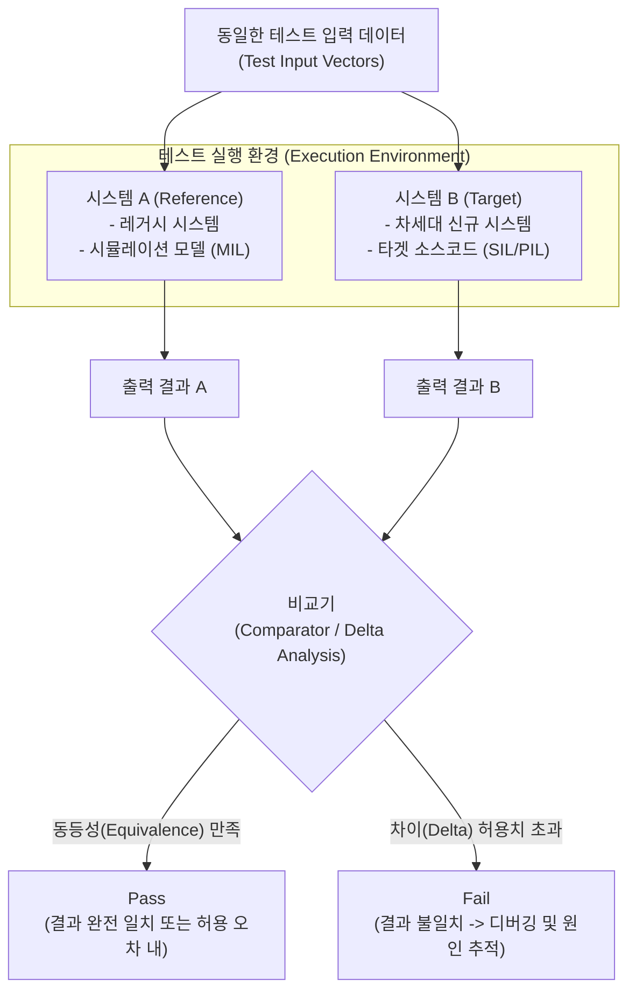

# Back-to-Back 테스트

---

## I. 시스템 동등성 검증의 핵심, Back-to-Back 테스트의 개요

* **가. Back-to-Back 테스트의 정의**
* 동일한 입력 데이터(Test Vector)를 두 개 이상의 상이한 시스템, 버전, 또는 환경에 인가한 후, 생성된 출력 결과를 상호 비교하여 기능적/비기능적 동등성을 검증하는 테스트 기법

* **나. Back-to-Back 테스트의 등장배경 및 특징**
* **등장배경**: 차세대(마이그레이션) 프로젝트 시 기존 시스템과 신규 시스템 간의 [[무결성]] 검증 한계, 모델 기반 설계(MBD) 환경에서 모델과 자동 생성 코드 간 불일치 위험 증가
* **특징**: 의사 오라클(Pseudo-Oracle) 기반 테스트, 자동화된 차이(Delta) 분석, 허용 오차(Tolerance) 적용, 자동차 [[기능안전 표준]]([[ISO 26262]])의 핵심 검증 요구사항

---

## II. Back-to-Back 테스트의 개념도 및 핵심 기술 요소

### 가. Back-to-Back 테스트의 개념도 및 동작 원리

* 미리 정의된 정답(True Oracle)이 없더라도, 신뢰할 수 있는 기존 시스템(시스템 A)의 출력을 정답(Pseudo-Oracle)으로 삼아 타겟 시스템(시스템 B)의 결함을 식별하고 검증함.

### 나. Back-to-Back 테스트의 핵심 기술 및 구성 요소

| 분류 | 요소기술(키워드) | 세부 설명 |
| --- | --- | --- |
| **테스트 구성** | **Test Vector** | 두 시스템에 동시에 동일한 조건으로 인가되는 입력 데이터 및 자극(Stimulus) 집합 |
| **테스트 구성** | **Comparator (비교기)** | 두 시스템의 출력 결과를 자동 비교하여 차이(Delta)를 도출하는 분석 모듈 |
| **검증 기준** | **Pseudo-Oracle (의사 오라클)** | 명확한 정답을 알 수 없는 경우, 레거시 시스템이나 시뮬레이션 모델을 임시 정답으로 간주하는 기법 |
| **검증 기준** | **Tolerance (허용 오차)** | 부동소수점 연산 등 이기종 하드웨어/소프트웨어 환경 차이로 인해 발생하는 미세한 출력 차이의 허용 범위 |
| **MBD 적용** | **MIL (Model-in-the-Loop)** | 시스템 요구사항을 수학적 모델(Simulink 등)로 구현하여 시뮬레이션 상에서 수행하는 사전 검증 |
| **MBD 적용** | **SIL / PIL / HIL** | 생성된 코드를 소프트웨어(SIL), 프로세서(PIL), 하드웨어(HIL) 레벨에서 모델과 Back-to-Back으로 교차 검증 |
| **분석 기법** | **Delta Analysis (차이 분석)** | 출력 값 간의 불일치 원인을 분석하여 모델의 버그인지, 코드 자동 변환기의 오류인지 근본 원인 추적 |
| **컴플라이언스** | **ISO 26262** | 자동차 기능안전 국제 표준으로, [[ASIL]] 등급에 따라 모델과 코드 간의 Back-to-Back 테스트를 강하게 권고(Highly Recommended) |

---

## III. Back-to-Back 테스트와 회귀 테스트 비교 및 향후 전망

### 가. Back-to-Back 테스트와 회귀 테스트(Regression Test) 비교

| 비교 항목 | Back-to-Back 테스트 | [[리그레션 테스트|회귀 테스트]] ([[Regression Test]]) |
| --- | --- | --- |
| **목적** | 상이한 **두 시스템 간의 동등성** 확인 | 동일 시스템의 **변경 전후 오류 발생** 여부 확인 |
| **테스트 대상** | 시스템 A vs 시스템 B (이종 환경 동시 실행) | 버전 N vs 버전 N+1 (동일 환경 순차 실행) |
| **[[테스트 오라클]]** | **의사 오라클 (Pseudo-Oracle)** (시스템 A의 결과) | **참 오라클 / 경험적 오라클** (사전 정의된 기댓값) |
| **주요 활용 분야** | MBD 모델-코드 검증, 금융권 차세대 마이그레이션 | [[유지보수]], CI/CD 파이프라인, [[형상 관리]] |
| **데이터 셋 규모** | 방대한 실거래 데이터(Shadowing) 활용 가능 | 선택적 테스트 케이스 기반 (결함 발생 가능성 집중) |

* **전망 및 동향**:
* 최근 금융/공공 등 대규모 엔터프라이즈 환경의 [[클라우드 네이티브]] 전환(마이그레이션) 시, 실시간 사용자 트래픽을 기존 환경과 신규 클라우드 환경에 동시에 미러링(Traffic Shadowing)하여 비교하는 **라이브 Back-to-Back 테스트(병행 테스트)** 도입이 필수로 자리 잡고 있음.
* [[Smart Car(자율주행)|자율주행]] 및 SDV(Software Defined Vehicle) 시대가 도래함에 따라, 시뮬레이션 환경(가상 모델)과 실제 차량 제어기(타겟 보드) 간의 동작 무결성을 보장하기 위한 AI 기반 자동화 Back-to-Back 테스트 솔루션 수요가 급증하는 추세임.

---

### 🔗 연관 토픽

- **소속 도메인**: [[00_소프트웨어공학_MOC|🏗️ 소프트웨어공학]]
- **세부 분류**: `6. 소프트웨어 테스팅 & 품질 보증 (QA/QC)`
- **핵심 연관 토픽**:
  - [[기능안전 표준|기능안전 표준 (Functional Safety Standards)]]
  - [[유지보수]]
  - [[ISO 26262]]
  - [[리그레션 테스트|리그레션(회귀, Regression) 테스트]]
  - [[ASIL|ASIL (Automotive Safety Integrity Level)]]
