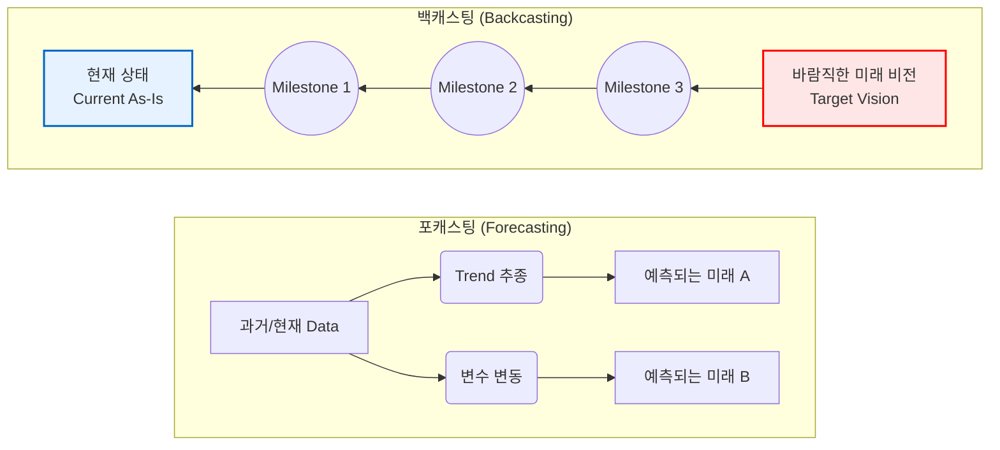

# 백캐스팅 (Backcasting)

---

## I. 미래 비전 달성을 위한 역방향 전략 수립 방법론, 백캐스팅의 개요

* **가. 백캐스팅(Backcasting)의 정의**
* 달성하고자 하는 미래의 바람직한 목표(Vision)를 최우선으로 설정하고, 이를 기준으로 현재로 역추적(Working Backwards)하여 최적의 달성 경로와 실행 전략을 수립하는 기획 방법론

* **나. 백캐스팅의 등장배경 및 특징**
* **등장배경**: 과거 데이터 연장선 기반의 예측(Forecasting)이 지닌 패러다임 시프트 대응 한계 극복, 파괴적 혁신 및 지속가능성(Sustainability) 달성을 위한 새로운 전략 [[프레임워크]] 요구
* **특징**: 목표 지향적(Goal-oriented) 접근, 규범적 시나리오(Normative Scenario) 활용, 현재와 미래 간의 간극(Gap) 극복을 위한 단계별 마일스톤(Milestone) 도출

---

## II. 백캐스팅의 개념도 및 핵심 구성요소

### 가. 백캐스팅의 아키텍처 및 동작 원리

* **포캐스팅**은 현재의 제약조건과 트렌드를 바탕으로 미래를 탐색(Forward)하는 반면, **백캐스팅**은 도달해야 할 미래의 명확한 목표 지점에서 시작하여 현재로 거슬러 올라오며(Backward) 필요 조건을 도출함.

### 나. 백캐스팅의 핵심 기술 및 구성 요소

| 분류 | 요소기술(키워드) | 세부 설명 |
| --- | --- | --- |
| **목표 설정** | **바람직한 비전 (Vision)** | 10~20년 후 달성해야 하는 이상적이고 명확한 미래 상태 정의 (예: 2050 넷제로) |
| **시나리오** | **규범적 시나리오 (Normative)** | '어떻게 될 것인가'가 아닌, '어떻게 되어야만 하는가'에 초점을 맞춘 목표 달성 시나리오 |
| **분석 기법** | **격차 분석 (Gap Analysis)** | 정의된 미래 비전(To-Be)과 현재 상태(As-Is) 간의 기술적, 자원적, 환경적 차이 분석 |
| **전략 도출** | **역추적 (Working Backwards)** | 미래의 목표 시점부터 현재 시점까지 역방향으로 시간을 되감으며 단계별 필요 조치 도출 |
| **이행 점검** | **마일스톤 (Milestone)** | 역추적 경로 상에서 각 단계별로 반드시 달성하고 넘어가야 하는 핵심 중간 목표 및 체크포인트 |
| **전략 도출** | **ABCD 프레임워크** | Awareness(인식), Baseline(현황 파악), Creative solutions(창의적 해결책), Decide(우선순위 결정) |
| **실행 체계** | **액션 플랜 (Action Plan)** | 도출된 마일스톤을 달성하기 위한 단기, 중기, 장기 관점의 구체적 자원 할당 및 세부 실행 계획 |
| **적용 분야** | **파괴적 혁신 및 ESG** | 과거 추세로 예측이 불가능한 신사업 기획, 기후 변화 대응, 탄소 중립, [[디지털 전환|디지털 전환(DX)]] 전략 수립 |

---

## III. 포캐스팅과 백캐스팅 비교 및 향후 전망

### 가. 포캐스팅(Forecasting)과 백캐스팅(Backcasting) 비교

| 비교 항목 | 포캐스팅 (Forecasting) | 백캐스팅 (Backcasting) |
| --- | --- | --- |
| **접근 방향** | **현재 $\rightarrow$ 미래** (Forward) | **미래 $\rightarrow$ 현재** (Backward) |
| **기반 데이터** | 과거의 추세(Trend) 및 축적된 통계 데이터 | 달성하고자 하는 비전(Vision) 및 규범적 목표 |
| **시나리오 특성** | **탐색적 시나리오** (가능한 미래가 무엇인가?) | **규범적 시나리오** (원하는 미래를 어떻게 만들 것인가?) |
| **주요 제약사항** | 현재의 제약 조건과 한계가 미래 예측에 크게 반영됨 | 현재의 제약을 배제하고 창의적이고 혁신적인 해결책 모색 |
| **적합한 환경** | 환경 변화가 점진적이고 불확실성이 상대적으로 낮은 경우 | 패러다임 시프트가 요구되며 불확실성이 극도로 높은 환경 |
| **주요 활용 사례** | 단기 매출 예측, 인구 구조 변화 추이 분석, 인프라 용량 산정 | ESG 탄소중립 로드맵, 우주 탐사 프로젝트, 6G/양자 컴퓨팅 R&D |

* **전망 및 동향**:
* 최근 기후 위기 극복([[ESG 경영]], 넷제로 2050 달성) 및 [[인공지능]]([[AGI]])과 같은 파괴적 기술 도입 시, 기존의 점진적 예측 방식으로는 한계가 명확하므로 **백캐스팅 프레임워크가 장기 전략 수립의 표준**으로 자리 잡고 있음.
* 또한, 아마존(Amazon)의 'Working Backwards (보도자료를 먼저 작성하고 제품을 개발하는 방식)'와 같이 신제품 개발 및 스타트업의 린([[린 방법론|Lean]]) 프로세스에 결합되어, **고객 가치 중심의 역방향 상품 기획 방법론**으로 광범위하게 응용되고 있음.

---

### 🔗 연관 토픽

- **소속 도메인**: [[00_경영전략_MOC|📈 경영전략]]
- **세부 분류**: `1. 경영 환경 분석 & 전략 수립 프레임워크`
- **핵심 연관 토픽**:
  - [[디지털 전환|디지털 전환(DX)]]
  - [[ESG 경영]]
  - [[인공지능]]
  - [[AGI|AGI (Artificial General Intelligence)]]
  - [[린 방법론|린 (Lean) 방법론]]
