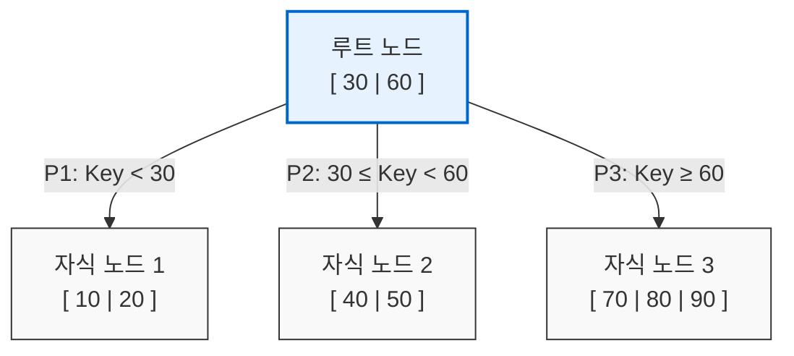

# B-Tree (Balanced Tree)

---

## I. 대규모 데이터 탐색 및 디스크 I/O 최적화를 위한 자가 균형 트리, B-Tree의 개요

* **가. B-Tree의 정의**
* [[이진 탐색 트리]](BST)의 한쪽 [[편향]] 문제와 큰 트리의 높이로 인한 비효율성을 극복하기 위해, 하나의 노드에 여러 개의 키(Key)와 자식을 가지며 모든 리프 노드가 동일한 깊이를 유지하는 다원(m-way) 탐색 자가 균형 트리

* **나. B-Tree의 필요성/등장배경/특징**
* **등장배경**: 대용량 [[데이터베이스]] 및 파일 시스템에서 디스크 블록 접근(I/O) 횟수를 최소화하기 위한 자료구조 요구 (이진 트리는 디스크 I/O가 과다하게 발생)
* **특징**: 모든 리프 노드 동일 레벨 유지(완전 균형), 시간 복잡도 $O(\log N)$ 보장, 삽입/삭제 시 노드의 분할(Split) 및 병합(Merge) 수행, 노드 크기와 디스크 블록 크기의 일치화

---

## II. B-Tree의 개념도 및 핵심 기술 요소

### 가. B-Tree의 개념도 및 동작 원리

* $m$차 B-Tree는 루트 노드를 제외한 모든 노드가 최소 $\lceil m/2 \rceil$개의 자식을 가지며, 키 값에 따라 탐색 경로가 결정(P1, P2, P3)됨으로써 디스크 단편화를 줄이고 탐색 성능을 극대화함.

### 나. B-Tree의 핵심 기술 / 구성 요소

| 분류 | 요소기술(키워드) | 세부 설명 |
| --- | --- | --- |
| **기본 구조** | **차수 (Degree, $m$)** | 하나의 노드가 가질 수 있는 최대 자식(포인터)의 수 (m차 B-Tree) |
| **기본 구조** | **키(Key)의 개수 제한** | 각 노드는 최소 $\lceil m/2 \rceil - 1$개, 최대 $m-1$개의 키(Key)를 포함해야 함 |
| **탐색 제어** | **자식 포인터 (Pointer)** | 노드 내 키가 $k$개 존재할 경우, 자식을 가리키는 포인터는 반드시 $k+1$개 존재 |
| **균형 유지** | **리프 노드 레벨 보장** | 모든 리프 노드(Leaf Node)는 트리 상에서 동일한 레벨(Depth)에 위치해야 함 |
| **삽입 연산** | **노드 분할 (Split)** | 노드에 키를 삽입하여 최대 허용치($m$)를 초과(Overflow)할 경우, 중앙값을 부모 노드로 올리고 나머지 반을 두 개의 노드로 분할 |
| **삭제 연산** | **재분배 (Redistribution)** | 노드의 키가 최소치 미만(Underflow)이 될 경우, 인접한 형제 노드로부터 키를 빌려와 균형 유지 |
| **삭제 연산** | **노드 병합 (Merge)** | 형제 노드도 키를 빌려줄 수 없는 경우, 부모 노드의 키와 형제 노드를 하나의 노드로 병합하여 트리 재구성 |
| **최적화** | **디스크 블록 매핑** | 디스크의 1 블록(Page) 크기와 노드의 크기를 동일하게 설정하여, 1회 I/O로 다수의 키를 메모리로 적재 |

---

## III. B-Tree 계열 인덱스 비교 및 향후 전망

### 가. B-Tree 파생 자료구조 (B-Tree, B+Tree, B*Tree) 비교

| 비교 항목 | B-Tree | B+ Tree | B* Tree |
| --- | --- | --- | --- |
| **데이터 저장 위치** | **모든 노드** (루트, 내부, 리프) | **리프 노드에만 저장** (내부 노드는 인덱스/라우팅 역할만 수행) | 모든 노드 (B-Tree와 동일) |
| **리프 노드 연결** | 연결 없음 (순차 탐색 시 [[트리 순회]] 필요) | 리프 노드 간 **Linked List 연결** (순차 탐색 매우 우수) | 연결 없음 |
| **노드 분할 방식** | 노드 꽉 찰 경우 1/2로 즉시 분할 | B-Tree와 동일 (1/2 분할) | 인접 형제 노드로 **키 재배치 후, 2/3 수준에서 분할** (공간 낭비 최소화) |
| **트리 높이** | 데이터가 중간 노드에 있어 상대적으로 높을 수 있음 | 내부 노드에 포인터만 있어 더 많은 분기 가능 (높이 낮음) | 노드 활용률이 높아 B-Tree 대비 높이 낮음 |
| **주요 활용 분야** | 구형 파일 시스템 | **현대 [[RDBMS 인덱스(index)|RDBMS 인덱스]]** (Oracle, MySQL InnoDB), NTFS | 파일 시스템 확장 등 |

* **전망 및 동향**:
* 관계형 데이터베이스(RDBMS) 환경에서는 순차 검색 및 범위(Range) 탐색 성능이 압도적으로 우수한 **B+ Tree**가 인덱스의 표준으로 완전히 자리 잡았음.
* 최근에는 쓰기 연산(Write)이 폭증하는 빅데이터 및 [[NoSQL (CAP 이론 BASE 속성)|NoSQL]] 환경을 지원하기 위해, In-place Update 방식의 B-Tree 한계를 극복하는 **LSM-Tree(Log-Structured Merge Tree)** 방식이나, 인메모리 환경에 최적화된 **Bw-Tree(Lock-free B-Tree)** 로 발전 및 상호 보완되며 진화하고 있음.

---

### 🔗 연관 토픽

- **소속 도메인**: [[00_컴퓨터구조_MOC|💻 컴퓨터구조]]
- **세부 분류**: `3. 고성능 AI 가속기 & 입출력 시스템`
- **핵심 연관 토픽**:
  - [[RDBMS 인덱스(index)]]
  - [[이진 탐색 트리|이진 탐색 트리(Binary Search Tree)]]
  - [[트리 순회|트리 순회 (Tree Traversal)]]
  - [[데이터베이스]]
  - [[NoSQL (CAP 이론 BASE 속성)]]
