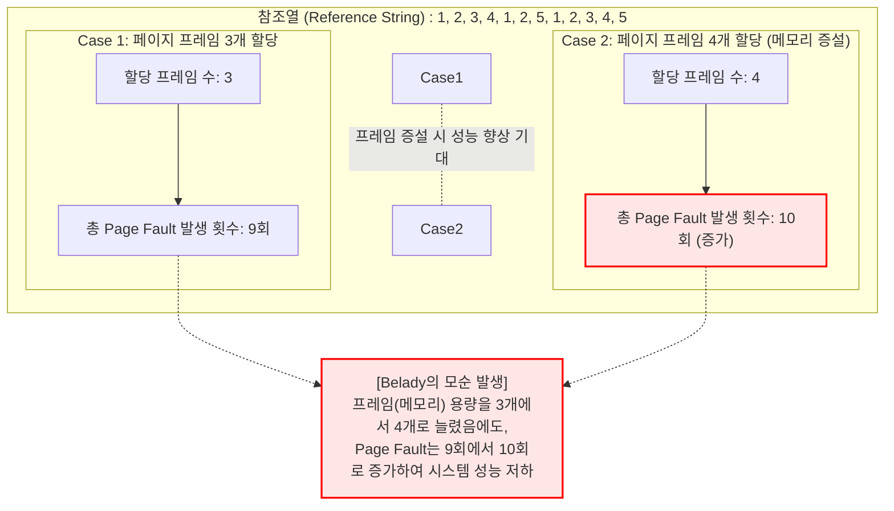

# Belady's Anomaly (벨라디의 모순)

---

## I. FIFO 페이지 교체 알고리즘의 한계, Belady's Anomaly의 개요

* **가. Belady's [[Anomaly(이상현상)|Anomaly]]의 정의**
* 운영체제의 메모리 관리에서 프로세스에 할당된 페이지 프레임(Page Frame)의 수를 늘렸음에도 불구하고, 오히려 페이지 부재(Page Fault) 발생 횟수가 증가하는 모순적인 현상

* **나. Belady's Anomaly의 발생 배경 및 특징**
* **발생 배경**: 메모리 용량을 증설하면 성능이 향상될 것이라는 일반적인 직관(Intuition)과 위배되는 현상으로, 1969년 Laszlo Belady에 의해 증명됨
* **특징**: [[FIFO]](First-In-First-Out) 기반 페이지 교체 알고리즘에서 주로 발생, 스택([[Stack]]) 속성, 즉 포함 성질(Inclusion Property)을 만족하지 못하는 알고리즘의 근본적 한계

---

## II. Belady's Anomaly의 발생 원리 및 메커니즘

### 가. Belady's Anomaly의 개념도 및 검증 모델

* FIFO 알고리즘은 단순히 메모리에 가장 먼저 들어온 페이지를 교체 대상으로 삼기 때문에, 프레임이 늘어나면 큐([[Queue]])의 길이가 길어져 오히려 자주 사용되는 페이지가 쫓겨나는 타이밍의 엇갈림이 발생함.

### 나. Belady's Anomaly 발생 관련 핵심 기술 요소

| 분류 | 요소기술(키워드) | 세부 설명 |
| --- | --- | --- |
| **발생 원인** | **FIFO [[알고리즘]]** | 페이지의 실제 사용 빈도나 미래의 사용 가능성을 전혀 고려하지 않고 오직 적재된 시간 순서만 평가 |
| **발생 원인** | **포함 성질 결여** | $n$개의 프레임에 적재된 페이지 집합이 $n+1$개의 프레임에 적재된 집합의 부분집합이 되지 않는 현상 |
| **핵심 지표** | **Page Fault (페이지 부재)** | [[CPU]]가 참조하려는 가상 메모리의 페이지가 물리적 주 기억장치(RAM)에 존재하지 않는 상태 |
| **핵심 지표** | **Page Frame (페이지 프레임)** | 물리 메모리를 일정한 크기로 나눈 블록으로, 가상 메모리의 페이지가 매핑되어 적재되는 공간 |
| **해결 조건** | **Stack Algorithm** | 프레임 수가 증가하면 항상 이전 프레임의 페이지들을 포함(Inclusion Property)하는 특성을 가진 알고리즘 |
| **해결 기법** | **[[LRU]] (Least Recently Used)** | 가장 오랫동안 참조되지 않은 페이지를 교체 (스택 알고리즘의 대표격으로 모순 미발생) |
| **해결 기법** | **[[OPT]] (Optimal)** | 앞으로 가장 오랫동안 사용되지 않을 페이지를 교체 (이론상 최적, 모순 미발생) |

---

## III. 페이지 교체 알고리즘 비교 및 현대 운영체제의 해결 방안

### 가. FIFO와 LRU (Stack Algorithm) 특성 비교

| 비교 항목 | FIFO (First-In-First-Out) | LRU (Least Recently Used) |
| --- | --- | --- |
| **교체 기준** | 메모리에 적재된 지 **가장 오래된** 페이지 | 참조된 지 **가장 오래된** 페이지 |
| **자료구조 기반** | Queue (큐) | Stack (스택) 또는 Linked List |
| **포함 성질 만족** | 만족하지 않음 | **항상 만족함 (Inclusion Property)** |
| **Belady's Anomaly** | **발생함** | **절대 발생하지 않음** |
| **구현 비용/복잡도** | 매우 단순하며 하드웨어 지원 불필요 | 참조 시점 갱신을 위한 하드웨어/소프트웨어 오버헤드 큼 |
| **실무 적용도** | 오버헤드는 적으나 단독 사용 안함 | 현대 OS 페이지 교체의 근간 알고리즘 |

* **현대 운영체제의 전망 및 동향**:
* 순수 LRU는 모든 메모리 참조마다 타임스탬프를 갱신해야 하는 막대한 오버헤드가 발생하므로, 현대 OS(Windows, Linux 등)는 하드웨어의 참조 비트(Reference Bit)를 활용하여 LRU에 근접한 성능을 내면서도 구현 비용을 줄인 **[[NUR]](Not Used Recently)** 및 **Clock Algorithm**을 변형하여 사용함.
* 이러한 현대적 페이지 교체 기법들은 스택 알고리즘의 성질을 근사하게 만족시켜 Belady's Anomaly의 발생을 원천적으로 차단하고 메모리 증설 시 확실한 성능 향상을 보장함.

---

### 🔗 연관 토픽

- **소속 도메인**: [[00_운영체제_MOC|⚙️ 운영체제]]
- **세부 분류**: `1. 프로세스 & 스레드 관리`
- **핵심 연관 토픽**:
  - [[FIFO]]
  - [[LRU]]
  - [[NUR]]
  - [[OPT]]
  - [[Stack]]
