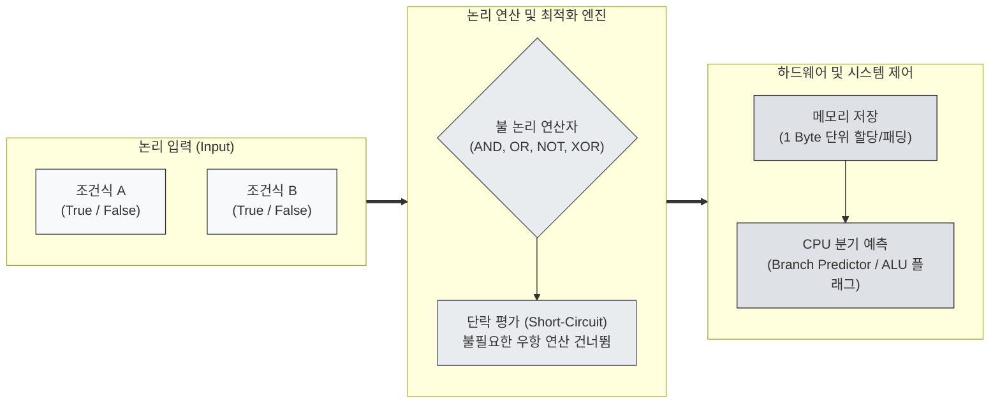

# Boolean Type

---

## I. 참과 거짓의 논리 연산 기반 원시 자료형, Boolean Type의 개요

* **정의**: 조지 불(George Boole)의 불 대수(Boolean Algebra)에 기반하여 참(True, 1)과 거짓(False, 0) 두 가지 논리 상태만을 표현하는 기본 원시 자료형(Primitive [[Data Type]])
* **필요성/특징**:
* **조건 제어의 기초**: 프로그램 내 분기문(if/switch) 및 반복문(while/for)의 흐름 제어 조건 평가식으로 활용
* **논리 연산 수행**: AND, OR, NOT 등의 불 대수 논리 연산자를 통한 복합 논리 조건식 검증 지원
* **메모리 단위 불일치**: 이론상 1비트(Bit)로 표현 가능하나, 하드웨어 아키텍처의 바이트 어드레싱(Byte Addressing) 단위 제약으로 통상 1바이트(Byte) 이상 메모리 점유

---

## II. Boolean Type의 아키텍처 및 핵심 기술 요소

### 가. Boolean Type의 평가 및 연산 처리 구조

* **처리 구조**: 입력된 논리식은 단락 평가(Short-Circuit Evaluation)를 통해 최소 연산으로 참/거짓을 도출하며, [[CPU]] ALU의 상태 레지스터 플래그 및 분기 제어에 직접 매핑됨

### 나. Boolean Type의 핵심 기술 및 구현 요소

| 구분 | 요소기술/개념 (키워드) | 세부 설명 |
| --- | --- | --- |
| **논리 대수** | **불 대수 (Boolean Algebra)** | 진리값(Truth Value)을 다루는 대수학 체계, 드모르간 법칙(De Morgan's Laws) 기반 논리 최적화 지원 |
| **[[연산자]]** | **논리 연산자 (Logical Ops)** | Conjunction(AND, `&&`), Disjunction(OR, `||`), Negation(NOT, `!`), Exclusive OR(XOR, `^`) |
| **실행 최적화** | **단락 평가 (Short-Circuit)** | AND 연산 시 좌항이 거짓이거나, OR 연산 시 좌항이 참이면 우항 평가를 생략하여 연산 효율성 극대화 및 NullPointerException 방지 |
| **메모리 저장** | **바이트 어드레싱 (Byte Alignment)** | 1비트 데이터이나 CPU 메모리 주소 지정 최소 단위(1 Byte) 제약으로 인해 C/C++, Java 등에서 1바이트 크기로 할당 |
| **메모리 최적화** | **비트 필드 / 비트셋 (BitSet)** | 대규모 불린 배열 처리 시 메모리 낭비를 줄이기 위해 정수형(32/64비트) 내 비트 마스킹(Bitmasking)을 활용한 압축 저장 |
| **타입 평가** | **Falsy / Truthy 개념** | Python/JavaScript 등 동적 타입 언어에서 `0`, `""`, `null`, `undefined`, `[]` 등을 불린 문맥에서 암묵적 형변환 평가 |
| **[[데이터베이스]]** | **3가 논리 (3-Valued Logic)** | [[SQL(Structured Query Language)|SQL]] 등 [[DBMS]]에서 `TRUE`, `FALSE` 외에 알 수 없는 상태인 `NULL(UNKNOWN)`을 포함하는 3차원 평가 체계 |
| **래퍼 [[클래스]]** | **Boxing / Unboxing** | 객체 지향 언어(Java `Boolean` 등)에서 기본형과 참조형 객체 간의 변환 지원, `null` 허용 여부에 따른 버그 주의 필요 |

---

## III. 언어별 Boolean Type 비교 및 설계 시 고려사항

### 가. 주요 프로그래밍 언어별 Boolean 구현 비교

| 비교 항목 | C 언어 (C99 이전 vs 이후) | Java | Python |
| --- | --- | --- | --- |
| **타입 키워드** | 정수형(`int`) 대체 $\rightarrow$ `<stdbool.h>` `bool` | `boolean` (기본형) / `Boolean` (참조형) | `bool` (내장 클래스) |
| **실제 점유 크기** | 1바이트 (`_Bool`) | 1바이트 (JVM 스택 내에서는 4바이트 int 취급 가능) | 가변 객체 (Python `int` 서브클래스, 28바이트 내외) |
| **타입 안정성** | 0은 False, 0 이외는 True로 암묵적 정수 변환 허용 | 엄격한 타입 체크 (정수형과 상호 호환/변환 불가) | `int`의 서브클래스 (`True == 1`, `False == 0` 성립) |
| **NULL 허용 여부** | 미지원 (포인터 레벨 검사) | 기본형 불인정, 참조형 `Boolean`은 `null` 허용 | `None` 객체는 Falsy로 평가됨 |

### 나. 설계 및 구현 시 고려사항

* **3가 논리(Three-Valued Logic) 대응**: DB의 `NULL` 값이 애플리케이션의 2가 논리(`true`/`false`) 기본형으로 언박싱될 때 발생하는 예외를 방지하기 위해 설계 단계에서 Nullable 제약조건 또는 Optional 처리 표준화 필요
* **분기 예측(Branch Prediction) 최적화**: 대규모 반복문 내 빈번한 불린 조건 분기는 파이프라인 버블을 유발할 수 있으므로, 분기 없는 연산(Branchless Programming) 또는 비트 연산 기법을 통한 처리 성능 고도화 고려

---

### 🔗 연관 토픽

- **소속 도메인**: [[00_컴퓨터구조_MOC|💻 컴퓨터구조]]
- **세부 분류**: `3. 고성능 AI 가속기 & 입출력 시스템`
- **핵심 연관 토픽**:
  - [[연산자]]
  - [[CPU]]
  - [[데이터베이스]]
  - [[클래스]]
  - [[SQL(Structured Query Language)]]
