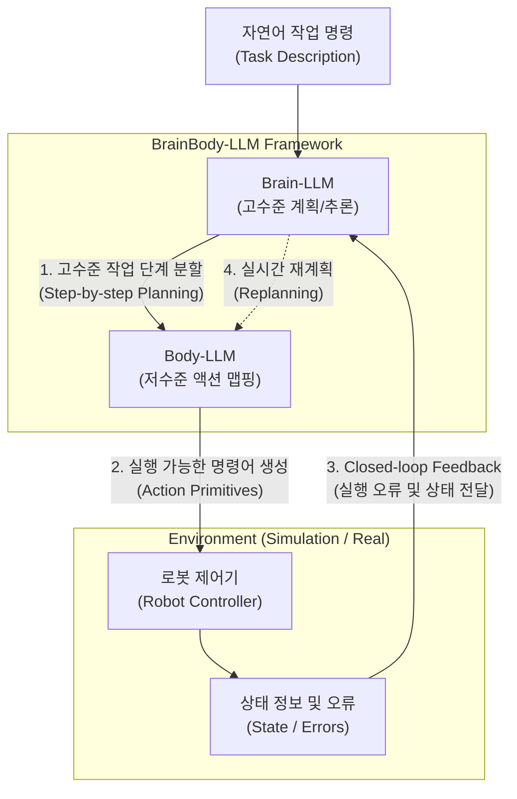

# BrainBody-LLM

---

## I. 로봇 작업 계획의 한계 극복, BrainBody-LLM의 개요

* **정의**: 대규모 언어 모델([[초거대 언어 모델|LLM]])을 고수준 인지(Brain)와 저수준 제어(Body)로 이원화하고, 폐쇄 루프(Closed-loop) 상태 피드백을 활용하여 자율적인 로봇 작업 계획(Task Planning)을 수행하는 차세대 AI [[프레임워크]]
* **등장 배경**: 기존 단일 LLM을 로봇 제어에 적용할 때 발생하는 환경 비접지성(Ungrounded) 문제 및 물리적 환각(Hallucination) 현상 해결 필요
* **특징**: 인간의 신경계를 모방한 계층적 작업 분할(Brain/Body 이원화), 실행 오류를 즉각 수용하는 폐쇄 루프 기반 실시간 재계획(Replanning) 지원

---

## II. BrainBody-LLM의 아키텍처 및 핵심 기술 요소

### 가. BrainBody-LLM의 개념도 및 동작 원리

* 사용자의 자연어 명령을 Brain-LLM이 논리적 단계로 분할하고, 이를 Body-LLM이 로봇 제어 명령으로 변환하여 실행함
* 환경에서 발생한 실행 오류는 실시간 상태 피드백을 통해 Brain-LLM으로 반환되어 자율적인 오류 수정 및 재계획(Replanning)을 수행함

### 나. BrainBody-LLM의 핵심 기술 요소

| 구분 | 요소기술(키워드) | 세부 설명 |
| --- | --- | --- |
| **인지/계획** | Brain-LLM | 사용자 명령을 인식하여 고수준 작업 단계로 분해 및 전체 [[프로세스]] [[스케줄링]] 수행 |
| **명령 변환** | Body-LLM | 분할된 작업 단계를 로봇이 직접 수행할 수 있는 저수준 액션으로 맵핑 및 변환 |
| **제어 영역** | Action Primitives | 로봇 환경에 사전 정의된 구체적인 동작 명령어 세트 라이브러리 (예: Pick, Place, Move) |
| **접지 기술** | State Grounding | 센서 및 시나리오 상태값을 LLM 프롬프트에 지속적으로 주입하여 가상-현실 간 동기화 확보 |
| **피드백** | Closed-loop Feedback | 로봇과 환경 간 상호작용 결과를 모니터링하고, 실패 로그나 상태 변화를 상위 모델로 반환 |
| **자율 수정** | Error Resolution | 반환된 피드백을 바탕으로 실패 원인을 분석하고 실시간으로 대안 계획(Replanning) 생성 |
| **아키텍처** | Hierarchical Planning | 단일 병목을 방지하기 위해 추론과 제어를 나누어 처리하는 계층적 시스템 설계 |

---

## III. BrainBody-LLM과 단일 LLM 제어 방식 비교 및 향후 전망

### 가. 단일 LLM과 BrainBody-LLM의 비교

| 비교 항목 | 단일 LLM (Single-LLM) 기반 로봇 제어 | BrainBody-LLM 프레임워크 |
| --- | --- | --- |
| **처리 아키텍처** | 단일 모델이 계획 및 제어 동시 수행 | Brain(계획)과 Body(제어)의 계층적 이원화 구조 |
| **작업 흐름** | 오픈 루프 (Open-loop, 1회성 명령 생성) | 폐쇄 루프 (Closed-loop, 지속적 피드백 수용) |
| **환경 접지성** | 낮음 (사전 학습된 텍스트 데이터에 강하게 의존) | 높음 (실시간 환경 상태값을 프롬프트에 반영) |
| **환각(Hallucination)** | 환경 정보 결여로 인한 물리적 환각 발생 가능성 높음 | 상태 피드백 기반 오류 교정으로 환각 발생 최소화 |
| **적용 환경** | 단순하고 변수가 적은 제한적 환경 | 복잡하고 동적인 자율 로봇 작업 및 시뮬레이션 |

### 나. 향후 전망 및 발전 방향

* **Embodied AI로의 확장**: 물리적 실체를 가진 구체화된 AI(Embodied AI)의 핵심 아키텍처로 자리매김하여 스마트 팩토리, 휴머노이드 로봇 등 복잡한 실세계 상호작용 도메인으로 확산 예정
* **멀티모달 접목 고도화**: 향후 시각(Vision) 및 촉각(Tactile) 등 다양한 센서 데이터를 수용하는 **Multi-modal BrainBody-LLM**으로 진화하여 로봇의 환경 인지 능력이 비약적으로 고도화될 것으로 기대됨

---

### 🔗 연관 토픽

- **소속 도메인**: [[00_인공지능_MOC|🤖 인공지능]]
- **세부 분류**: `4. 거대언어모델 (LLM) & 생성형 AI`
- **핵심 연관 토픽**:
  - [[AX (AI Transformation)]]
  - [[LangGraph]]
  - [[초거대 언어 모델|초거대 언어 모델(Large Language Model)]]
  - [[스케줄링]]
  - [[프롬프트 엔지니어링|프롬프트 엔지니어링(Prompt Engineering)]]
