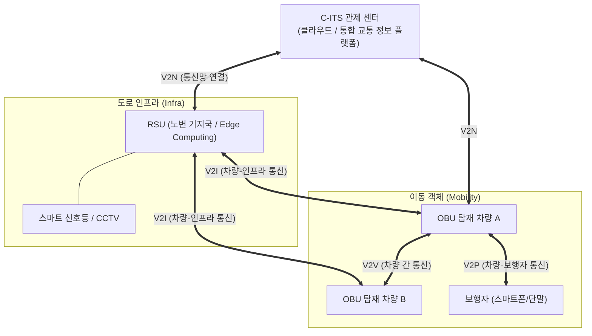

# C-ITS (Cooperative-Intelligent Transport Systems)

---

## I. 완전 자율주행 시대를 위한 핵심 인프라, C-ITS의 개요

* **정의**: 차량이 주행 중 다른 차량, 도로 인프라, 보행자 등과 실시간으로 교통 정보 및 상태를 양방향으로 공유하여 교통사고를 예방하고 완전 자율주행을 지원하는 협력형 지능형 교통 체계
* 기존 단방향 ITS(지능형 교통 시스템)의 한계를 극복하기 위해 V2X(Vehicle-to-Everything) 통신 기술을 기반으로 구현됨
* **특징**: 초저지연 양방향 통신, 비가시권(사각지대) 돌발 상황 인지, 능동적 사전 사고 예방, 완전 [[Smart Car(자율주행)|자율주행]](Level 4 이상) 인프라 제공

---

## II. C-ITS의 아키텍처 및 핵심 구성요소

### 가. C-ITS의 아키텍처 및 동작 원리

* 관제 센터, 노변 기지국(RSU), 차량 단말기(OBU) 간의 끊김 없는 융합 연결 수행
* V2X를 통해 차량-차량(V2V), 차량-인프라(V2I), 차량-보행자(V2P) 간 상호작용 및 초저지연 데이터 처리([[EDGE|Edge]]) 수행

### 나. C-ITS의 핵심 기술 요소

| 구분 | 요소기술(키워드) | 세부 설명 |
| --- | --- | --- |
| **통신 기술** | WAVE (IEEE 802.11p) | 고속 주행 환경에 최적화된 근거리 전용 무선 통신 (DSRC 진화형) |
| **통신 기술** | C-V2X (Cellular V2X) | 3GPP 표준 기반의 이동통신(LTE/5G) 망을 활용한 광역/대용량 V2X 통신 |
| **인프라 장치** | RSU (Road-Side Unit) | 도로변에 설치되어 차량과 센터 간의 통신을 중계하는 핵심 기지국 |
| **차량 장치** | OBU (On-Board Unit) | 차량 내부에 탑재되어 실시간 차량 상태 데이터(위치, 속도 등) 송수신 단말 |
| **공간 데이터** | LDM (Local Dynamic Map) | 정밀 도로 지도(HD Map) 위에 동적 교통 상황을 실시간으로 갱신하는 저장소 |
| **처리/분석** | MEC ([[Mobile Edge Computing]]) | RSU 인근에 컴퓨팅 자원을 배치하여 초저지연 교통 데이터 분산 처리 |
| **보안 체계** | SCMS (Security Credential) | 기기 간 상호 인증 및 메시지 위변조 방지를 위한 자격증명 관리 시스템 |
| **보안 체계** | IEEE 1609.2 | 차량 통신 메시지의 [[암호화]] 및 전자서명을 규정한 국제 보안 표준 |

---

## III. ITS와 C-ITS 비교 및 향후 전망

### 가. 기존 ITS와 C-ITS의 비교

| 비교 항목 | ITS (Intelligent Transport Systems) | C-ITS (Cooperative ITS) |
| --- | --- | --- |
| **통신 방식** | 단방향 통신 (수집 $\rightarrow$ 가공 $\rightarrow$ 전달) | 양방향 통신 (상호 협력형 정보 교환) |
| **정보 수집 체계** | 센터 집중형 (관제 센터에서 통합 수집/배포) | 분산형 (차량 간, 차량-인프라 간 직접 수집/공유) |
| **인지 범위** | 가시권(LoS) 내 센서 기반 수집 의존 | 비가시권(NLoS) 및 원거리 사각지대 인지 가능 |
| **시스템 목적** | 교통 흐름 관리 및 사후 돌발 상황 대응 | 능동적 교통사고 사전 예방 및 완전 자율주행 지원 |
| **주요 통신 기술** | DSRC, 3G, 4G LTE | WAVE, 5G 기반 C-V2X |

### 나. 향후 전망 및 동향

* **통신 표준의 진화**: 초기 WAVE 중심의 시범사업에서 데이터 전송량과 지연시간 확보에 유리한 **5G-V2X (C-V2X)** 단일 표준으로 글로벌 생태계 전환 중
* **정밀 측위 및 [[디지털 트윈]] 융합**: 오차 범위 cm 수준의 정밀 측위 기술(RTK 등)과 디지털 트윈을 결합하여, 도심항공교통([[UAM]]) 등 미래 모빌리티 통합 관제 프레임워크로 발전 중

---

### 🔗 연관 토픽

- **소속 도메인**: [[00_디지털서비스_MOC|🚀 디지털서비스]]
- **세부 분류**: `3. 사물인터넷 (IoT) & 스마트 플랫폼 · 메타버스`
- **핵심 연관 토픽**:
  - [[디지털 트윈|디지털 트윈 (Digital Twin)]]
  - [[Smart Car(자율주행)]]
  - [[UAM|UAM (Urban Air Mobility)]]
  - [[Mobile Edge Computing|Mobile Edge Computing (MEC)]]
  - [[CPS]]
