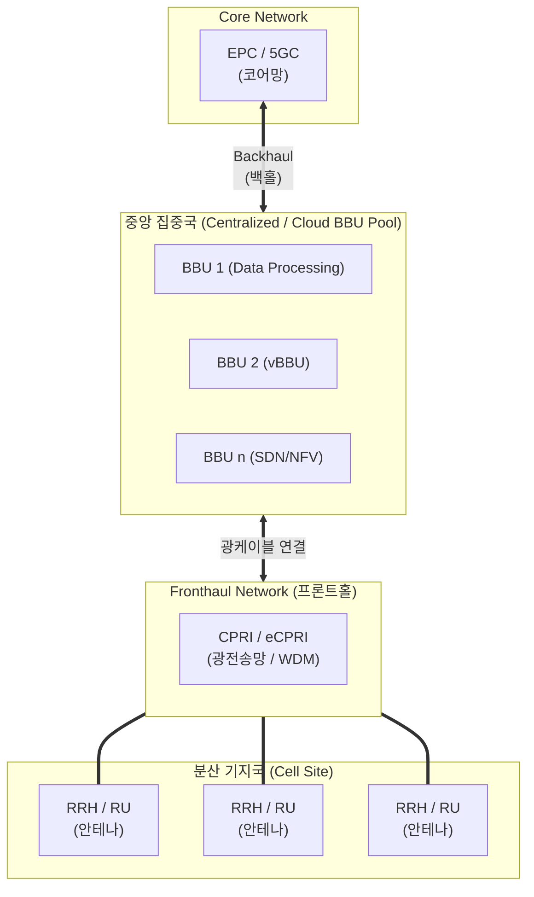

# C-RAN

---

## I. 5G/6G 초저지연 통신망 구축의 핵심, C-RAN의 개요

* **정의**: 기존 기지국 장비를 디지털 기지국(BBU)과 무선 송수신반(RRH)으로 분리하여, BBU는 중앙 집중국(클라우드)에 모아 통합 처리하고 RRH는 서비스 지역에 분산 배치하는 차세대 무선 접속망(RAN) 아키텍처
* **등장 배경**: 스몰셀(Small Cell) 급증으로 인한 셀 간 간섭(Interference) 심화, 기지국별 장비 구축에 따른 투자비(CAPEX) 및 운영비(OPEX) 폭증 문제 해결 필요
* **특징**: BBU 풀링(Pooling)을 통한 유연한 자원 할당, 다중 기지국 협력 통신(CoMP) 기반 품질 향상, [[가상화]](vRAN) 및 개방형 아키텍처([[O-RAN]])로의 진화 기반 제공

---

## II. C-RAN의 아키텍처 및 핵심 구성요소

### 가. C-RAN의 개념도 및 동작 원리

* 백홀(Backhaul)을 통해 코어망과 BBU Pool이 연결되며, 기지국의 디지털 처리 자원을 중앙에서 통합 관리(Pooling)함
* 중앙의 BBU와 분산된 RRH 사이는 프론트홀(Fronthaul)망의 CPRI/eCPRI 인터페이스를 통해 광대역 무손실 데이터 전송을 수행함

### 나. C-RAN의 핵심 기술 요소

| 구분 | 요소기술(키워드) | 세부 설명 |
| --- | --- | --- |
| **핵심 장비** | BBU (Baseband Unit) | 통신 데이터의 [[암호화]], 변복조 등 디지털 신호 처리를 수행하는 장치 (중앙 집중화) |
| **핵심 장비** | RRH (Remote Radio Head) | 아날로그 RF 신호 증폭 및 송수신을 담당하는 안테나 결합 무선 장치 (현장 분산) |
| **연결망** | Fronthaul (프론트홀) | BBU와 RRH 구간을 연결하는 광가입자망 (모바일 백홀과 대비되는 개념) |
| **인터페이스** | CPRI / eCPRI | BBU와 RRH 간 디지털화된 기저대역 신호를 전송하기 위한 공통 규격 (eCPRI는 패킷 기반) |
| **품질/제어** | CoMP (다중지점 협력) | 인접한 여러 기지국(RRH)이 협력하여 셀 경계 지역의 간섭을 줄이고 통신 품질 개선 |
| **가상화** | vRAN (Virtual RAN) | 하드웨어 기반 BBU 기능을 x86 기반 범용 서버에 소프트웨어 형태([[NFV]])로 구현 |
| **광전송** | WDM / PON | 프론트홀 구간의 대용량 트래픽을 처리하기 위한 파장 분할 [[다중화]] 및 수동 광통신망 기술 |
| **개방화** | O-RAN (Open RAN) | 기지국 장비의 하드웨어와 소프트웨어를 분리하고 표준화된 개방형 인터페이스 제공 |

---

## III. D-RAN과 C-RAN의 비교 및 향후 전망

### 가. D-RAN과 C-RAN의 비교

| 비교 항목 | D-RAN (Distributed RAN) | C-RAN (Centralized/Cloud RAN) |
| --- | --- | --- |
| **아키텍처 구조** | 기지국 일체형 분산 구조 (BBU+RRH 결합) | 기지국 분리형 구조 (BBU 중앙 집중 / RRH 분산) |
| **초기 투자비 (CAPEX)** | 높음 (모든 국소에 상면, 전원, 항온항습기 필요) | 낮음 (RRH만 설치하여 임대료, 상면 비용 대폭 절감) |
| **[[유지보수]] (OPEX)** | 낮음~보통 (장애 시 개별 기지국 직접 방문 필요) | 매우 낮음 (중앙 집중국에서 일괄 제어 및 소프트웨어 업데이트) |
| **자원 효율성** | 낮음 (기지국별 고정 자원 할당, 유휴 자원 발생) | 높음 (BBU Pool을 통한 트래픽 변동에 따른 동적 자원 할당) |
| **셀 간섭 제어** | 제한적 (기지국 간 지연 발생) | 우수함 (중앙에서 실시간 CoMP 제어로 간섭 최소화) |

### 나. 향후 전망 및 동향

* **[[클라우드 네이티브]] 및 개방형 생태계 확산**: C-RAN 구조는 하드웨어 인프라 중심에서 벗어나 vRAN(가상화)을 거쳐 특정 벤더 종속성을 탈피하는 O-RAN(개방형 무선접속망)으로 통신 패러다임 전환을 주도하고 있음
* **6G 및 지능화 융합**: AI/ML 기술을 결합한 RIC(RAN Intelligent Controller)를 도입하여, 트래픽 예측 기반 자원 [[스케줄링]] 및 자율 네트워크(Autonomous Network) 최적화를 구현하는 방향으로 진화 중

---

### 🔗 연관 토픽

- **소속 도메인**: [[00_네트워크_MOC|🌐 네트워크]]
- **세부 분류**: `4. 무선 및 차세대 이동통신 (5G/6G/Wi-Fi)`
- **핵심 연관 토픽**:
  - [[O-RAN]]
  - [[가상화]]
  - [[다중화|다중화(Multiplexing)]]
  - [[NFV]]
  - [[클라우드 네이티브]]
