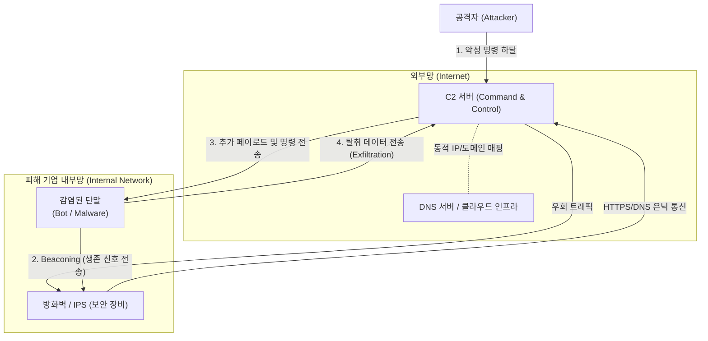

# C2 (Command and Control)

---

## I. 지능형 지속 위협(APT)의 컨트롤 타워, C2(Command and Control)의 개요

* **정의**: 해커(공격자)가 악성코드에 감염된 내부 시스템(Botnet, 좀비 PC 등)과 통신하며, 원격으로 악성 행위 명령을 하달하고 탈취한 데이터를 수집하는 제어 서버 및 통신 체계
* 사이버 킬체인(Cyber Kill Chain) 7단계 중 6단계(명령 및 제어)에 해당하며, 공격자가 피해 시스템에 대한 원격 제어권을 유지하는 핵심 기반임
* **특징**: 정상 트래픽 위장(HTTPS, [[DNS(Domain Name System)|DNS]]), 은닉성 및 생존성 극대화(DGA, Fast Flux), 클라우드 및 SNS(Telegram 등) 인프라 악용을 통한 보안 솔루션 우회

---

## II. C2의 동작 아키텍처 및 핵심 기술 요소

### 가. C2의 통신 아키텍처 및 동작 원리

* 감염된 단말은 방화벽의 아웃바운드 정책(Outbound)을 우회하기 위해 정상적인 웹 트래픽(HTTPS)이나 DNS 질의응답 형태로 C2 서버에 주기적인 접속(Beaconing)을 시도함
* C2 서버는 응답 패킷에 악성 명령이나 추가 악성코드 다운로드 링크를 은닉하여 전달하고, 최종적으로 내부 데이터를 외부로 유출(Exfiltration)시킴

### 나. C2 은닉 및 통신 유지를 위한 핵심 기술 요소

| 구분 | 요소기술(키워드) | 세부 설명 |
| --- | --- | --- |
| **인프라 은닉** | DGA (Domain Generation Algorithm) | 무작위로 수많은 도메인을 생성하여 보안 장비의 블랙리스트 기반 차단을 우회 |
| **인프라 은닉** | Fast Flux | 하나의 도메인에 수많은 IP 주소를 빠르게 갱신 및 매핑하여 추적 회피 |
| **통신 연결** | Beaconing (비코닝) | 감염된 단말이 C2 서버로 주기적인(또는 무작위 주기의) 생존 및 연결 대기 신호 송신 |
| **통신 위장** | DNS Tunneling | DNS 질의(Query) 및 응답 패킷의 TXT 레코드 등에 명령과 데이터를 분할하여 전송 |
| **통신 위장** | HTTPS / TLS 통신 | 트래픽 구간을 암호화하여 패킷 심층 분석(DPI) 등 네트워크 보안 솔루션 탐지 우회 |
| **명령 은닉** | Steganography (스테가노그래피) | 정상적인 이미지나 미디어 파일 내부에 악성 제어 명령을 은닉하여 전달 |
| **인프라 우회** | Cloud / SaaS C2 | AWS, 구글 드라이브, 깃허브 등 정상적인 클라우드 서비스를 C2 인프라로 악용 |
| **망 분리 우회** | Air-gapped C2 | 오디오(초음파), 온도, 전자기파 등을 이용하여 물리적 망분리 환경의 단말과 통신 |

---

## III. C2 서버 진화 유형 비교 및 탐지/대응 방안

### 가. 전통적 C2와 모던 C2의 진화 유형 비교

| 비교 항목 | 전통적 C2 (Traditional C2) | 차세대 모던 C2 (Next-Gen C2) |
| --- | --- | --- |
| **인프라 구조** | 중앙 집중형 (Centralized) | 분산형 (P2P), 클라우드 기반 (SaaS, SNS) |
| **통신 [[프로토콜]]** | IRC, HTTP, 평문 [[TCP]] | HTTPS, DNS, [[ICMP]], DoH (DNS over HTTPS) |
| **IP/도메인 관리** | 고정된 하드코딩 IP / 도메인 | DGA [[알고리즘]] 기반 동적 생성, Fast Flux 활용 |
| **보안 탐지율** | 높음 (침해지표/IoC, 블랙리스트 차단 가능) | 매우 낮음 (정상 트래픽 및 서비스 평판에 숨어 탐지 곤란) |
| **주요 차단 방안** | [[방화벽]] IP 차단, 웹 프록시 필터링 | 행위 기반 분석, AI 기반 비콘 주기 탐지, SSL 복호화 |

### 나. 차세대 C2 탐지 및 대응 방안

* **네트워크 트래픽 분석(NDR/NTA)**: 머신러닝을 활용하여 패킷의 크기, 통신 주기(Jitter), 심야 시간대 대용량 아웃바운드 트래픽 등 비정상 행위 프로파일링 및 비코닝 탐지
* **엔드포인트 연계([[XDR]])**: [[EDR(Endpoint Detection and Response)|EDR]]을 통한 프로세스의 비정상 외부 통신 생성(예: 파워쉘, 엑셀 프로세스의 네트워크 연결)을 실시간 차단하고, 킬체인 전 단계에 걸친 통합 가시성 확보 필요

---

### 🔗 연관 토픽

- **소속 도메인**: [[00_보안_MOC|🛡️ 보안]]
- **세부 분류**: `5. 사이버 공격 기법 & 침해사고 대응`
- **핵심 연관 토픽**:
  - [[EDR(Endpoint Detection and Response)]]
  - [[ICMP]]
  - [[TCP]]
  - [[방화벽]]
  - [[XDR|XDR(eXtended Detection Response)]]
