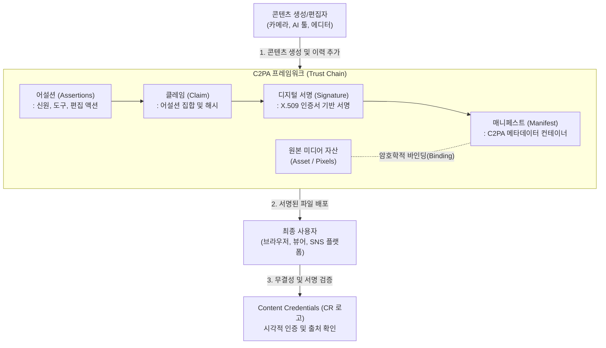

# C2PA (Coalition for Content Provenance and Authenticity)

---

## I. 딥페이크 및 허위 정보 방지를 위한 디지털 콘텐츠 검증 표준, C2PA의 개요

* **정의**: 디지털 미디어 콘텐츠의 출처(Provenance)와 생성 및 수정 이력(Authenticity)을 [[암호화]] 기술 기반으로 기록하여 투명성과 신뢰성을 제공하는 글로벌 개방형 기술 표준
* **등장 배경**: 생성형 AI(GenAI) 발전에 따른 [[딥페이크|딥페이크(Deepfake)]] 확산, 디지털 미디어 조작 및 허위 정보에 대한 사회적 신뢰 하락 문제 대두
* **특징**: 메타데이터(Manifest) 바인딩, 위변조 탐지(Cryptographic Hashing), 다양한 포맷(이미지, 영상, 텍스트 등) 지원, 어도비 주도의 CAI(Content Authenticity Initiative)와 Project Origin의 통합 연합체

---

## II. C2PA의 아키텍처 및 핵심 구성요소

### 가. C2PA의 개념도 및 동작 원리

* 미디어 파일 생성 또는 편집 시, 변경 이력이나 생성 도구 등을 담은 어설션(Assertion)을 모아 클레임(Claim)을 생성함
* X.509 인증서 기반 디지털 서명을 거친 매니페스트(Manifest)를 원본 미디어 파일에 암호학적으로 결합(바인딩)하여 무결성을 검증하고 위조를 방지함

### 나. C2PA의 핵심 기술 요소

| 구분 | 요소기술(키워드) | 세부 설명 |
| --- | --- | --- |
| **데이터 구조** | Manifest (매니페스트) | 콘텐츠의 출처, 변경 이력 등을 모두 담고 있는 표준 메타데이터 [[컨테이너]] |
| **데이터 구조** | Assertion (어설션) | 생성자 신원, 사용 소프트웨어(AI 모델), 편집 액션 등 개별 사실 정보 조각 |
| **데이터 구조** | Claim (클레임) | 다수의 어설션 해시값들을 하나로 묶어 무결성을 보장하는 검증 데이터의 단위 |
| **[[무결성]]/보안** | PKI / X.509 인증서 | 생성자 및 편집자의 신원 확인과 클레임 전자서명을 위한 공개키 기반 인프라 |
| **무결성/보안** | Cryptographic Hashing | 미디어 원본(픽셀) 및 메타데이터의 변경 여부를 탐지하기 위한 암호화 해시 (SHA-256 등) |
| **결합 기술** | Data Binding | 암호화된 매니페스트를 실제 미디어 파일(JPEG, MP4 등) 구조에 영구 결합하는 기술 |
| **검증/UI** | Content Credentials | 검증된 C2PA 정보(출처, AI 사용 여부)를 최종 사용자에게 시각적으로 보여주는 CR(로고) 체계 |
| **보안 강화** | Soft Binding / Watermarking | 메타데이터 유실에 대비하여 워터마크 기술과 연동, 출처 복원을 지원하는 보조 기법 |

---

## III. C2PA와 기존 디지털 워터마킹의 비교 및 향후 전망

### 가. C2PA와 디지털 워터마킹의 비교

| 비교 항목 | C2PA (Content Provenance) | [[디지털 워터마킹]] (Digital Watermarking) |
| --- | --- | --- |
| **동작 및 구현 방식** | 파일 헤더 구조 내 메타데이터 및 디지털 서명 삽입 | 픽셀, 주파수 영역 등에 시각적/비가시적으로 데이터 은닉 |
| **제공 정보량** | 매우 많음 (생성 도구, 편집 내역 트리, 신원 등) | 제한적 (저작권자 ID, 단순 AI 생성 식별자 수준) |
| **데이터 무결성 대응** | 픽셀 1비트만 변경되어도 해시 불일치로 변조 즉각 탐지 | 압축, 리사이징 등 변형이 가해져도 정보 생존 (강인성 보유) |
| **한계점 (취약점)** | 일부 SNS 플랫폼 업로드 시 메타데이터 삭제(Stripping) 가능성 | 원본 데이터 자체의 미세한 품질 손상(열화) 수반 |

### 나. 향후 전망 및 동향

* **글로벌 규제 의무화 및 빅테크 채택 가속**: EU AI Act(인공지능법)의 AI 생성물 식별 표기 의무화 시행에 따라 OpenAI, Microsoft, 구글, 네이버 등 주요 빅테크의 C2PA 표준 채택이 본격화됨
* **상호 보완적인 하이브리드 진화**: 플랫폼을 거치며 C2PA 메타데이터가 삭제되는 단점을 극복하기 위해, 비가시적 워터마킹(예: 구글 SynthID) 기술과 C2PA를 상호 결합하는 **하이브리드 신뢰 [[프레임워크]]**로 고도화 중임

---

### 🔗 연관 토픽

- **소속 도메인**: [[00_보안_MOC|🛡️ 보안]]
- **세부 분류**: `2. 현대 암호학 & 키 관리 · 전자서명`
- **핵심 연관 토픽**:
  - [[딥페이크|딥페이크(Deepfake)]]
  - [[디지털 워터마킹|디지털 워터마킹(Digital Watermarking)]]
  - [[암호화|암호화 (Encryption)]]
  - [[FIPS (Federal Information Processing Standards)]]
  - [[안티 포렌식|안티 포렌식(Anti-forensic)]]
