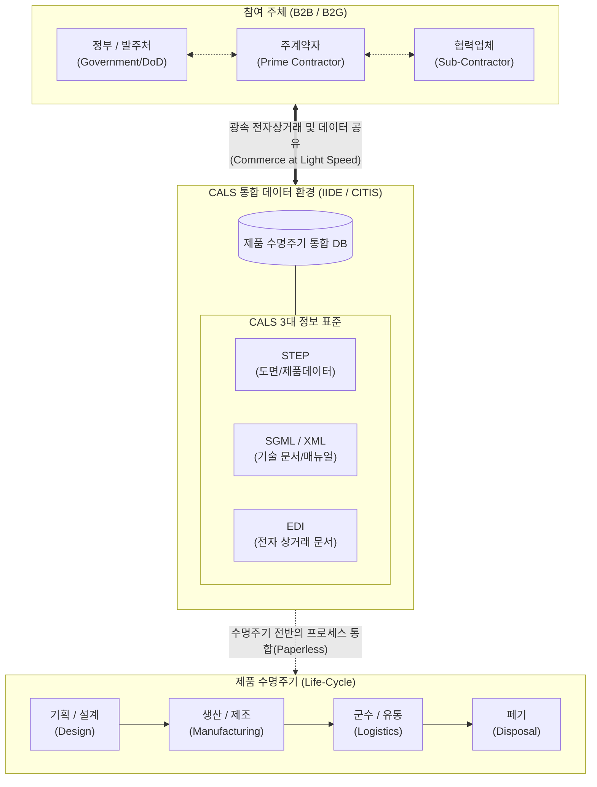

# CALS (Commerce At Light Speed)

## I. 광속 상거래 및 라이프사이클 통합, CALS(Commerce At Light Speed)의 개요

* **정의**: 제품의 기획, 설계, 생산, 유통, 폐기에 이르는 전체 수명주기(Life Cycle)의 모든 정보를 표준화 및 디지털화하여 관련 기업 간(B2B, B2G) 실시간으로 공유하는 초고속 경영 통합 정보 시스템
* **등장 배경**: 미 국방성(DoD)의 무기 체계 조달 [[프로세스]] 효율화를 위한 물류 지원(Computer Aided Logistics Support)에서 출발하여, 글로벌 전자상거래 환경 확산에 따라 민간 산업의 광속 상거래로 진화
* **특징**: 서류 없는 업무 환경(Paperless), 글로벌 표준 기반 데이터 통합, 부서 및 기업 간 동시공학(Concurrent Engineering) 지원

---

## II. CALS의 아키텍처 및 핵심 구성요소

### 가. CALS의 개념도 및 동작 원리

* 발주처와 제조사, 협력업체가 통합 정보 환경(CITIS)에 원격으로 접속하여 제품 설계도면, 매뉴얼, 거래 문서를 실시간으로 공유함
* 특정 부품의 설계 변경이 발생하면 동시공학 기반으로 연관된 생산, 물류 계획이 즉각적으로 반영 및 조율되어 업무 처리 지연(Lead Time)을 극적으로 단축함

### 나. CALS의 핵심 기술 요소

| 구분 | 요소기술(키워드) | 세부 설명 |
| --- | --- | --- |
| **운영 환경** | CITIS | 발주자가 계약자의 데이터베이스에 직접 접속하여 기술 정보를 조회 및 승인하는 상호 정보 서비스 체계 |
| **운영 환경** | IIDE | 설계, 생산, 지원 등 수명주기 전반의 데이터를 통합 관리하는 통합 정보 데이터 환경 |
| **표준화(제품)** | STEP (ISO 10303) | 이기종 CAD/CAM 시스템 간 호환성을 보장하기 위한 제품 데이터 모델 교환 국제 표준 |
| **표준화(문서)** | SGML / [[XML]] | 방대한 분량의 기술 교범 및 매뉴얼을 구조화된 전자 문서로 관리하기 위한 마크업 언어 표준 |
| **표준화(거래)** | [[EDI]] | 발주, 납품, 대금 청구 등 기업 간 상거래용 비즈니스 문서를 전자적 형태로 교환하는 표준 |
| **경영 혁신** | CE (동시공학) | 제품 개발 초기 단계부터 생산, [[유지보수]] 부서가 동시에 참여하여 오류를 최소화하는 협업 체계 |
| **경영 혁신** | BPR | 기존의 종이 문서 기반 순차적 업무 프로세스를 전자 환경에 맞게 근본적으로 재설계 |
| **보안 체계** | [[암호화]] 및 접근제어 | 국가 안보 및 기업 기밀 데이터 공유를 위한 PKI 기반 인증 및 다중 등급 보안 통제(MLS) |

---

## III. CALS의 진화 발전 단계 및 향후 전망

### 가. CALS의 진화 발전 단계

| 진화 단계 | 명칭 (약어) | 주요 패러다임 및 적용 범위 |
| --- | --- | --- |
| **1단계 (1985)** | Computer Aided Logistics Support | 미 국방성 중심의 무기 체계 군수 지원 및 조달 업무 **전산화(자동화)** |
| **2단계 (1993)** | Continuous Acquisition & Life-cycle Support | 국방 분야를 넘어 민간 제조 산업 전반의 **제품 수명 주기** 데이터 통합 |
| **3단계 (1995~)** | **Commerce At Light Speed** | 인터넷 기술 발달에 따른 **글로벌 전자상거래(B2B)** 및 초고속 경영 혁신 체계 확립 |

### 나. 향후 전망 및 동향

* **엔터프라이즈 시스템의 모태**: CALS가 제시한 라이프사이클 관리 및 협업 사상은 현대 기업의 PLM(제품수명주기관리), ERP(전사적자원관리), [[SCM (Supply Chain Management)|SCM]](공급망관리) 시스템의 근간으로 완벽히 흡수되어 발전함
* **[[디지털 트윈]] 및 스마트 팩토리로의 진화**: 과거 텍스트 및 정적 도면(STEP) 중심의 정보 공유 체계는 4차 산업혁명 시대를 맞아 3D 객체와 실시간 IoT 센서 데이터가 동기화되는 [[CPS]](사이버물리시스템) 및 디지털 트윈 아키텍처로 고도화되고 있음

---

### 🔗 연관 토픽

- **소속 도메인**: [[00_경영전략_MOC|📈 경영전략]]
- **세부 분류**: `2. IT 거버넌스 & 엔터프라이즈 아키텍처 (EA/ISP)`
- **핵심 연관 토픽**:
  - [[EDI]]
  - [[디지털 트윈|디지털 트윈 (Digital Twin)]]
  - [[CPS]]
  - [[SI]]
  - [[XML]]
