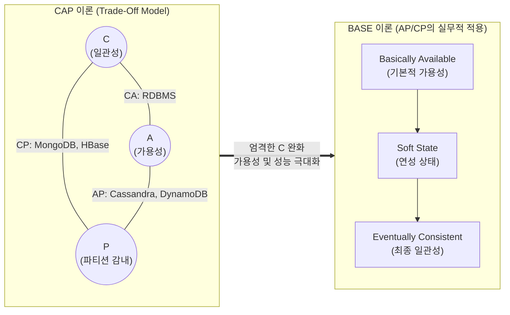

# CAP 이론과 BASE 이론

---

## I. 분산 시스템의 데이터 정합성 패러다임, CAP 이론과 BASE 이론의 개요

* **정의**:
* **CAP 이론**: [[분산 데이터베이스]] 시스템에서 일관성(Consistency), [[HA(High Availability)|가용성]](Availability), [[파티셔닝|파티션]] 감내(Partition Tolerance)의 3가지 속성 중 동시에 최대 2가지만 충족할 수 있다는 에릭 브루어(Eric Brewer)의 정리
* **BASE 이론**: CAP의 한계를 극복하기 위해 ACID의 엄격한 일관성을 완화하여, 기본적 가용성(BA), 연성 상태(S), 최종 일관성(E)을 보장하는 [[NoSQL (CAP 이론 BASE 속성)|NoSQL]] 기반 분산 시스템의 설계 철학

* **등장 배경**: 클라우드 및 빅데이터 환경 확산으로 단일 RDBMS(ACID)의 수직적 확장(Scale-up) 한계에 직면함에 따라, 수평적 확장(Scale-out)이 필수적인 분산 환경에서의 새로운 정합성 기준 필요
* **특징**: 네트워크 장애(P)를 기본 전제(Default)로 수용하며, 비즈니스 특성에 따라 일관성(C)과 가용성(A) 중 하나를 선택적(Trade-off)으로 타협(BASE 적용)

---

## II. CAP 및 BASE 이론의 아키텍처 및 핵심 구성 요소

### 가. CAP 이론 및 BASE 이론의 개념도와 상관관계

* 분산 시스템(Network) 특성상 파티션 감내(P)는 포기할 수 없으므로, 장애 상황 시 CP(일관성 우선) 또는 AP(가용성 우선) 구조를 선택해야 함
* BASE 이론은 AP 구조를 근간으로 하여, 당장의 엄격한 데이터 불일치(Soft State)를 허용하되 종국에는 동기화를 완료(Eventual Consistency)하는 메커니즘임

### 나. CAP 및 BASE 이론의 핵심 기술 요소

| 구분 | 요소기술(키워드) | 세부 설명 |
| --- | --- | --- |
| **CAP 속성** | Consistency (일관성) | 분산된 모든 노드가 동일한 시간에 동일한 데이터를 반환해야 하는 특성 |
| **CAP 속성** | Availability (가용성) | 일부 노드에 장애가 발생하더라도 클라이언트는 항상 정상적인 응답을 받는 특성 |
| **CAP 속성** | Partition Tolerance | 노드 간 네트워크 단절(메시지 유실) 상황에서도 시스템은 정상 동작해야 함 (분산망 필수) |
| **BASE 속성** | Basically Available | 다수 노드 장애 시에도 응답 지연이나 부분 데이터를 통해 기본적 서비스 제공 (가용성 중시) |
| **BASE 속성** | Soft State (연성 상태) | 외부의 개입 없이도 노드의 상태가 업데이트될 수 있는 과도기적 데이터 불일치 허용 상태 |
| **BASE 속성** | Eventually Consistent | 일정 시간이 지나면 결국 갱신된 데이터가 전체 노드에 전파되어 일관성이 달성되는 상태 |
| **구현 기법** | Quorum (정족수) | `N = W + R` 공식을 통해 읽기/쓰기 노드의 과반수 동의를 얻어 최종 일관성을 제어하는 기법 |
| **구현 기법** | Gossip Protocol | 분산 노드들이 무작위로 인접 노드와 상태 정보를 주기적으로 교환하여 최종 일관성을 맞추는 통신 방식 |

---

## III. ACID와 BASE 모델의 비교 및 발전 동향 (PACELC)

### 가. ACID 트랜잭션과 BASE 모델의 비교

| 비교 항목 | ACID (전통적 RDBMS) | BASE (NoSQL, 분산 DB) |
| --- | --- | --- |
| **일관성 수준** | 강한 일관성 (Strict Consistency) | 약한 일관성 / 최종 일관성 (Eventual) |
| **가용성 수준** | 낮음 (일관성 확보를 위해 레코드 블로킹 발생) | 높음 (부분 장애를 허용하고 항상 응답) |
| **설계 철학** | 비관적 (Pessimistic) - 충돌 발생을 기본 가정 | 낙관적 (Optimistic) - 충돌이 적을 것을 가정 |
| **도입 목적** | 데이터의 정확성과 [[무결성]] 보장 | 대용량 트랜잭션의 빠른 처리 및 확장성 보장 |
| **적용 도메인** | 금융, 결제, ERP 등 | SNS, IoT 센서 데이터, 빅데이터 분석 등 |

### 나. 분산 정합성 이론의 발전 (PACELC 정리)

* **CAP의 한계 극복**: CAP 이론은 '네트워크 장애(P) 상황'에서의 선택(C or A)만을 정의하므로, 정상 상태일 때의 시스템 거동을 설명할 수 없음
* **[[PACELC]] 정리 등장**: 네트워크 파티션(P) 시에는 A와 C 중 선택(PAC)하고, 시스템이 정상(E, Else)일 때는 지연시간(L, Latency)과 일관성(C, Consistency) 중 선택(ELC)한다는 확장된 실무 설계 이론으로 발전 (예: Cassandra는 PA/EL 지향)

---

### 🔗 연관 토픽

- **소속 도메인**: [[00_데이터베이스_MOC|🗄️ 데이터베이스]]
- **세부 분류**: `2. 트랜잭션 & 동시성 제어 (Concurrency)`
- **핵심 연관 토픽**:
  - [[무결성]]
  - [[분산 데이터베이스|분산 데이터베이스 (Distributed Database)]]
  - [[PACELC]]
  - [[NoSQL (CAP 이론 BASE 속성)]]
  - [[파티셔닝|파티션]]
