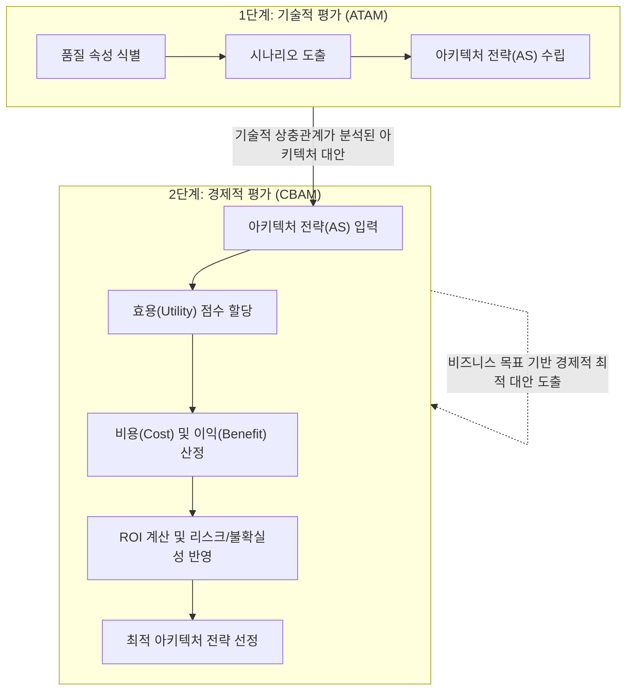

# CBAM (Cost Benefit Analysis Method)

---

## I. 소프트웨어 아키텍처의 경제성 평가 기법, CBAM의 개요

* **정의**: 카네기멜론 대학(CMU SEI)에서 개발한 모델로, [[ATAM]]을 통해 도출된 아키텍처 대안(전략)들에 대하여 비용(Cost), 이익(Benefit), 리스크를 경제적 관점에서 분석하여 최적의 ROI를 제공하는 아키텍처를 선택하는 정량적 평가 기법
* **등장 배경**: 기존 ATAM 기법은 기술적 관점(품질 속성, 상충관계)의 평가에 집중되어 있어, 경영진의 의사결정에 필수적인 경제적(ROI) 타당성 검증 모델이 요구됨
* **특징**: 경제적 가치(Utility) 정량화, 비즈니스 목표와 아키텍처 설계의 연계, 불확실성(Uncertainty) 기반의 리스크 수용, ATAM에 종속적이며 보완적인 성격

---

## II. CBAM의 아키텍처 평가 프로세스 및 핵심 구성 요소

### 가. CBAM의 동작 원리 및 프로세스 개념도

* 기술적 평가(ATAM)를 통해 도출된 아키텍처 전략(AS)을 입력으로 받아, 비즈니스 목표 달성에 기여하는 효용(Utility)을 정량화함
* 각 전략을 구현하기 위한 비용과 예상되는 이익을 산출하여 최종적으로 가장 높은 투자 대비 수익률(ROI)을 가진 대안을 선정함

### 나. CBAM의 핵심 기술 및 구성 요소

| 구분 | 요소기술(키워드) | 세부 설명 |
| --- | --- | --- |
| **평가 대상** | 아키텍처 전략 (AS) | 품질 속성을 달성하기 위해 적용되는 설계 대안 (Architectural [[Strategy (알고리즘 교체)|Strategy]]) |
| **상황 정의** | 시나리오 (Scenario) | 시스템에 가해지는 자극(Stimulus)과 반응(Response)을 정의한 구체적 상황 |
| **가치 척도** | 효용 (Utility) | 특정 아키텍처 전략이 비즈니스 목표 달성에 미치는 가치와 긍정적 영향력 수준 |
| **경제 지표** | 비용 (Cost) | 해당 아키텍처 전략을 구현하고 유지하는 데 소모되는 자원 (인력, 시간, 비용) |
| **경제 지표** | 이익 (Benefit) | 이전 상태 대비 아키텍처 전략 도입으로 인해 창출되는 금전적/비금전적 효익 |
| **경제 지표** | ROI (투자 수익률) | 총 이익을 총 비용으로 나눈 값 (Benefit / Cost)으로, 의사결정의 핵심 지표 |
| **위험 관리** | 불확실성 (Uncertainty) | 비용과 이익 추정 시 발생하는 오차 범위와 리스크를 반영하는 확률적 편차 |
| **기반 방법론** | ATAM (기술 평가) | 소프트웨어 품질 속성 간의 Trade-off를 분석하여 아키텍처를 평가하는 SEI [[프레임워크]] |

---

## III. ATAM과 CBAM의 비교 및 활용 시 고려사항

### 가. 소프트웨어 아키텍처 평가 모델 비교 (ATAM vs CBAM)

| 비교 항목 | ATAM (Architecture Tradeoff Analysis Method) | CBAM (Cost Benefit Analysis Method) |
| --- | --- | --- |
| **평가 관점** | 기술적 관점 (Technical Point of View) | 경제적 관점 (Economic Point of View) |
| **주요 목적** | 품질 속성 간 상충관계(Trade-off) 발견 및 검증 | 최적의 투자 대비 수익률(ROI) 도출 |
| **핵심 지표** | 민감점(Sensitivity Point), 위험(Risk) | 비용(Cost), 이익(Benefit), 효용(Utility) |
| **참여자** | 아키텍트, 개발자, 시스템 엔지니어 등 기술진 | 프로젝트 관리자(PM), 스폰서, 경영진 등 |
| **수행 순서** | 시스템 분석 초기 및 CBAM 수행 전 필수 진행 | ATAM 수행 후 도출된 대안을 바탕으로 수행 |

### 나. 성공적인 CBAM 적용을 위한 고려사항

* **정량화의 한계 극복**: 효용(Utility)이나 무형의 이익을 수치화하는 과정에서 주관이 개입될 수 있으므로, 델파이 기법 등 다양한 이해관계자의 합의 도출 [[프로세스]] 병행 필수
* **[[Agile]] 환경으로의 융합**: 릴리즈 주기가 짧은 [[MSA (Micro Service Architecture)|MSA]]/Agile 환경에서는 전체 아키텍처 대상의 무거운 CBAM 수행보다 핵심 마이크로서비스 및 주요 컴포넌트 단위의 경량화된(Lightweight) ROI 분석 기법 적용이 효과적임

---

### 🔗 연관 토픽

- **소속 도메인**: [[00_소프트웨어공학_MOC|🏗️ 소프트웨어공학]]
- **세부 분류**: `4. 아키텍처 스타일 & 객체지향 설계 원리`
- **핵심 연관 토픽**:
  - [[ATAM]]
  - [[ARID]]
  - [[SW Architecture 평가]]
  - [[프레임워크]]
  - [[MSA (Micro Service Architecture)]]
