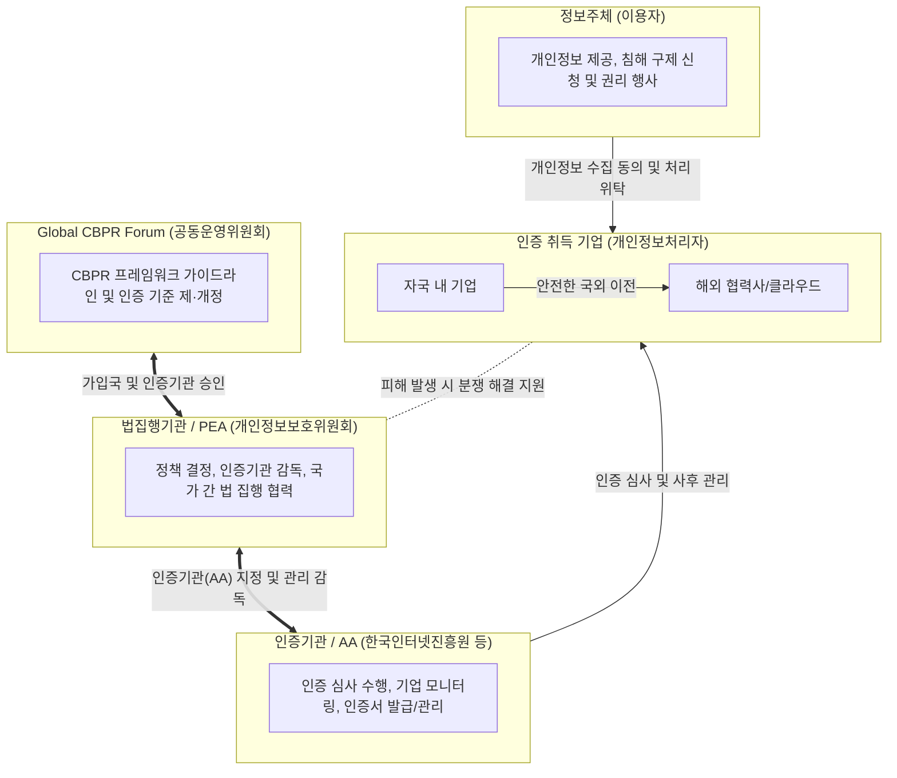

# CBPR

---

## I. 안전한 데이터 유통의 촉매제, CBPR (Cross-Border Privacy Rules)의 개요

* **정의**: 국가 간 상이한 개인정보보호 법제도로 인한 규제 충돌을 최소화하고, 신뢰할 수 있는 개인정보의 국외 이전을 보장하기 위해 마련된 글로벌 자율 인증 [[프레임워크]]
* **등장 배경**: 디지털 경제 가속화에 따른 국경 간 데이터 이동 급증, 데이터 현지화(Data Localization) 장벽 극복, 개별 국가의 규제(GDPR, CCPA 등) 대응 비용 절감 및 상호운용성 확보 필요성 증대
* **특징**:
* **비대체성**: 각국의 개인정보보호 법·제도를 대체하지 않고 국내법을 최우선으로 적용
* **자발성 및 유연성**: 기업의 자발적 참여를 기반으로 하며, 각국의 법·제도 환경에 맞게 유연한 운영 가능
* **글로벌 확장성**: 기존 APEC 회원국 중심에서 비회원국까지 포괄하는 'Global CBPR Forum'으로 체계 확장

---

## II. CBPR의 개념도 및 핵심 인증 구성 요소

### 가. CBPR 운영 체계 및 프레임워크 개념도

* 글로벌 포럼(기준 마련), 법집행기관(감독 및 협력), 인증기관(심사), 기업(규칙 준수) 간의 역할 분담을 통해 상호 신뢰 기반의 개인정보 국외 이전 생태계 구축

### 나. CBPR 핵심 원칙 및 인증 요소

| 분류 (APEC 9원칙 기반) | 요소기술 (키워드) | 세부 설명 |
| --- | --- | --- |
| **개인정보 관리체계** | 책임성 (Accountability) | 정보보호 책임자 지정 및 프라이버시 정책 수립, 컴플라이언스 이행 보장 |
| **수집 및 고지** | 수집 제한 및 사전 고지 | 목적 달성에 필요한 최소한의 정보만 공정하게 수집, 처리 목적의 명확한 고지 |
| **동의 및 선택권** | 정보주체 선택권 (Choice) | 적절한 방식을 통한 정보주체의 수집·이용·제공에 대한 동의 및 선택권 보장 |
| **이용 및 위탁** | 목적 내 이용 (Usage) | 최초 수집 목적과 양립 가능한 범위 내에서만 이용, 위탁 및 제3자 제공 통제 |
| **[[무결성]] 유지** | 데이터 무결성 (Integrity) | 수집된 개인정보의 정확성, 완전성, 최신성 유지 및 목적 달성 후 파기 |
| **보안 및 보호대책** | 안전성 확보 조치 (Security) | 유출, 훼손, 무단 접근 방지를 위한 물리적/기술적/관리적 보호대책 적용 |
| **권리 보장** | 접근 및 정정 (Access) | 정보주체의 개인정보 열람(접근), 정정, 삭제 요구권 보장 및 처리 절차 마련 |
| **피해 구제** | 불만 처리 (Complaint) | 개인정보 침해 관련 민원 제기 창구 운영 및 신속한 분쟁 해결 체계 제공 |

---

## III. CBPR 최신 글로벌 동향 및 향후 전망

### 가. 국경 간 데이터 이전 규범의 통합 및 글로벌 동향

* **글로벌 CBPR 포럼 출범 및 체계 전환**: 기존 APEC 회원국에 국한되었던 한계를 극복하기 위해 한국, 미국, 일본, 영국 등 다수 국가가 참여하는 'Global CBPR 포럼'이 독자 출범하여 전 세계 국가로 참여 대상을 대폭 확대
* **국내 법제도와의 연계 강화**: 개정된 한국의 [[개인정보보호법]](제28조의8)에 따라 개인정보보호위원회가 인정하는 인증(CBPR)을 받은 기업은 정보주체의 별도 동의 없이도 국외 이전이 가능해져 기업의 컴플라이언스 부담 경감
* **향후 전망 및 상호운용성(Interoperability) 확보**: 유럽의 GDPR(적절성 결정), [[ISO 27701]], OECD 프라이버시 가이드라인 등 이기종 글로벌 데이터 보호 규범과의 상호운용성 맵핑 및 교차 인정(Cross-Recognition) 논의가 가속화될 전망

---

### 🔗 연관 토픽

- **소속 도메인**: [[00_보안_MOC|🛡️ 보안]]
- **세부 분류**: `6. 개인정보보호 & 프라이버시 강화 기술`
- **핵심 연관 토픽**:
  - [[개인정보보호법]]
  - [[ISO 27701]]
  - [[IEC 62443]]
  - [[디지털 면역 시스템|디지털 면역 시스템(DIS, Digital Immune System)]]
  - [[전자증거개시제도|전자증거개시제도(e-Discovery)]]
