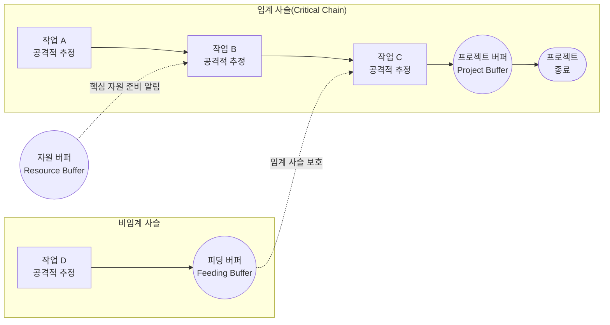

# CCM (Critical Chain Management)

---
## I. 제약이론(TOC) 기반 자원 최적화 일정 관리 기법, CCM의 개요

* **가. CCM(Critical Chain Management)의 정의**
* 프로젝트 일정 계획 시 작업 간의 논리적 선후행 연관성뿐만 아니라 '자원 제약(Resource Constraints)'과 인간의 심리적 요인을 종합적으로 고려하여, 통합 버퍼(Buffer)를 통해 전체 일정을 최적화하고 통제하는 프로젝트 일정 관리 기법임.

* **나. CCM의 필요성 및 특징**
* **필요성**: 기존 [[CPM]](임계 경로법) 기법의 자원 경합 미고려 한계 극복, 개별 여유시간 남용에 따른 프로젝트 납기 지연(학생증후군, 파킨슨 법칙) 문제 해결 필요.
* **특징**: 제약이론(TOC) 적용, 50% 완료 확률의 공격적인 작업 시간(Duration) 추정, 개별 작업의 여유시간 제거 및 통합 버퍼(PB, FB, RB) 배치, 멀티태스킹 최소화.

---

## II. CCM의 개념도 및 핵심 기술 요소

### 가. CCM의 개념도 및 동작 원리

* 개별 태스크에 숨겨진 여유시간(Safety)을 모두 제거하여 50% 확률의 공격적 일정으로 압축함.
* 제거된 여유시간을 모아 프로젝트 마지막에 프로젝트 버퍼(PB)로, 합류 지점에 피딩 버퍼(FB)로 통합 배치하여 불확실성으로부터 전체 납기를 보호함.

### 나. CCM의 핵심 기술/구성 요소

| 분류 | 요소기술(키워드) | 세부 설명 |
| --- | --- | --- |
| **일정 계획** | 임계 사슬 (Critical Chain) | 자원 제약과 작업 간 선후행 관계를 모두 고려하여 도출된 프로젝트 내 가장 긴 작업 경로 |
| **버퍼 요소** | 프로젝트 버퍼 (PB) | 임계 사슬의 마지막 단계에 위치하여 전체 프로젝트의 최종 납기 지연을 방어하는 시간 버퍼 |
| **버퍼 요소** | 피딩 버퍼 (FB) | 비임계 경로가 임계 사슬에 합류하는 지점에 위치하여, 비임계 경로의 지연이 임계 사슬에 영향을 주지 않도록 보호 |
| **버퍼 요소** | 자원 버퍼 (RB) | 시간적 여유가 아닌, 핵심 자원이 필요한 시점에 즉시 투입될 수 있도록 사전에 알려주는 경고(Alert) 체계 |
| **심리 요인** | 학생 증후군 (Student Syndrome) | 작업 마감일이 임박해서야 서둘러 일을 시작하여 초기 여유시간을 낭비하는 심리적 지연 현상 방지 |
| **심리 요인** | 파킨슨의 법칙 (Parkinson's Law) | 작업에 할당된 시간이 모두 소진될 때까지 불필요하게 업무를 팽창시키는 현상 차단 |
| **관리 통제** | 멀티태스킹 제한 | 자원의 빈번한 작업 전환(Context Switching)으로 인해 발생하는 셋업 타임 증가 및 생산성 저하 방지 |
| **관리 통제** | 피버 차트 (Fever Chart) | 프로젝트 진척도 대비 버퍼 소진율을 색상(초록, 노랑, 빨강)으로 시각화하여 선제적인 리스크 모니터링 수행 |

---

## III. CCM과 CPM의 비교 및 활용 사례

### 가. 기존 일정관리 기법(CPM)과의 비교

| 비교 항목 | CPM (Critical Path Method) | CCM (Critical Chain Management) |
| --- | --- | --- |
| **기반 이론** | 네트워크 분석 (네트워크 다이어그램) | 제약이론 (TOC, Theory of Constraints) |
| **일정 추정 방식** | 결정론적 추정 (안전 여유시간 포함, 90% 확률 수준) | 공격적/확률적 추정 (안전 여유시간 배제, 50% 확률 수준) |
| **주요 제약 고려** | 작업 간의 논리적 선후행 관계 우선 | 논리적 선후행 관계 + **자원 제약(Resource)** 종합 고려 |
| **여유 시간 관리** | 개별 활동(Activity)별 여유(Float/Slack) 부여 | 개별 여유 제거 후 **통합 버퍼(PB, FB)** 로 프로젝트 차원에서 관리 |
| **중점 통제 요소** | 임계 경로(Critical Path) 상의 개별 일정 통제 준수 여부 | 전체 버퍼 소진율(Buffer Penetration) 상태 및 병목 자원 관리 |

* **활용 시 고려사항**: CCM은 한정된 자원을 여러 프로젝트가 공유해야 하는 매트릭스 조직이나 멀티 프로젝트 환경(CCPM, Critical Chain Project Management)에서 자원 경합을 해소하고 리드타임을 단축하는 데 매우 효과적인 표준 기법으로 활용됨.

---

### 🔗 연관 토픽

- **소속 도메인**: [[00_프로젝트관리_MOC|📋 프로젝트관리]]
- **세부 분류**: `1. PMBOK 표준 & 프로젝트 거버넌스`
- **핵심 연관 토픽**:
  - [[CPM|CPM (Critical Path Management)]]
  - [[비용산정 일정관리 모델]]
  - [[프로젝트 관리 계획서]]
  - [[일정단축 기법]]
  - [[SCRUM]]
