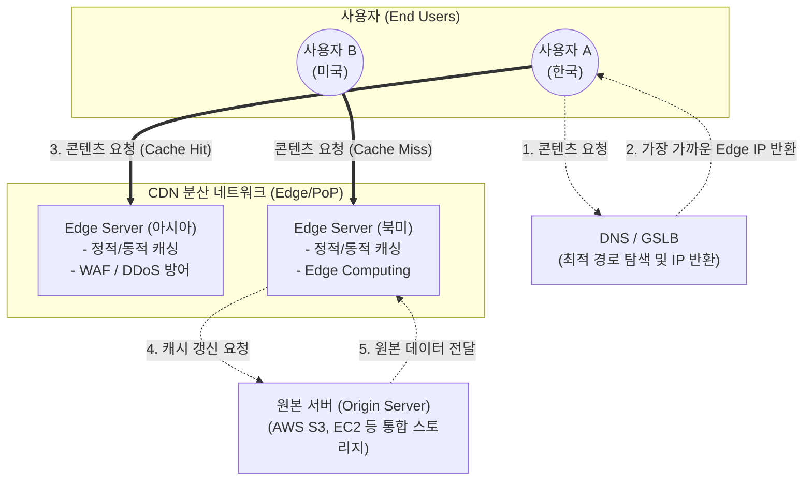

# CDN (Contents Delivery Network)

---

## I. 글로벌 콘텐츠의 빠르고 안정적인 전송 기술, CDN의 개요

* **가. CDN(Contents Delivery Network)의 정의**
* 대용량 콘텐츠를 빠르고 안정적으로 전달하기 위해, 사용자와 지리적으로 가장 가까운 분산된 엣지 서버([[EDGE|Edge]] Server, PoP)에 원본 콘텐츠를 캐싱(Caching)하여 제공하는 글로벌 전송 네트워크 기술임.

* **나. CDN의 등장 배경 및 특징**
* **등장 배경**: 스트리밍 등 대용량 멀티미디어 트래픽 급증, 원본 서버(Origin) 집중으로 인한 병목현상 및 응답 지연(Latency) 심화, 글로벌 서비스 확장에 따른 네트워크 비용 증가.
* **주요 특징**: 응답속도 최적화(GSLB 라우팅), 대역폭(Bandwidth) 비용 절감(캐시 히트), [[HA(High Availability)|가용성]] 향상 및 보안 강화(SPOF 방지, 엣지단 [[DDOS|DDoS]] 흡수).

---

## II. CDN의 개념도 및 핵심 기술 요소

### 가. CDN의 아키텍처 및 동작 원리

* 사용자의 [[DNS(Domain Name System)|DNS]] 질의 시 GSLB가 위치/네트워크 상태를 파악하여 가장 가까운 엣지 서버로 연결함.
* 엣지에 데이터가 있으면 즉시 반환(Cache Hit)하고, 없으면 원본 서버에서 가져와 캐싱 후 전달(Cache Miss)함.

### 나. CDN의 핵심 기술 및 구성 요소

| 분류 | 요소기술(키워드) | 세부 설명 |
| --- | --- | --- |
| **트래픽 라우팅** | GSLB (Global Server Load Balancing) | 접속자의 지리적 위치, 서버 상태, 네트워크 지연시간을 종합 분석하여 최적의 엣지 노드로 트래픽을 분산 |
| **트래픽 라우팅** | Anycast Routing | 다수의 엣지 서버가 동일한 IP 주소를 공유하며, [[BGP]] 프로토콜을 통해 네트워크상 가장 짧은 경로의 서버로 자동 라우팅 |
| **콘텐츠 가속** | Caching & TTL | 원본 데이터를 엣지에 임시 저장하며, TTL(Time To Live)을 설정하여 데이터의 최신성(Freshness) 유지 관리 |
| **콘텐츠 가속** | [[DSA]] (Dynamic Site Acceleration) | 정적 자산뿐만 아니라 동적 콘텐츠(API, HTML)의 전송 경로 최적화 및 [[TCP]] 연결 지속을 통한 지연시간 최소화 |
| **보안 강화** | Edge WAF (Web App Firewall) | 엣지 서버 단에서 악의적 웹 트래픽([[SQL(Structured Query Language)|SQL]] 인젝션, [[XSS]] 등)을 원본 도달 전에 사전 차단 |
| **보안 강화** | DDoS Mitigation | 수백 Tbps급의 글로벌 대역폭을 활용하여 분산 서비스 거부 공격 트래픽을 엣지에서 흡수 및 무효화 |
| **확장 연산** | Edge Computing | 엣지 노드에서 직접 Serverless 함수(예: AWS Lambda@Edge, Cloudflare Workers)를 실행하여 개인화 및 연산 수행 |
| **미디어 전송** | 적응형 비디오 스트리밍 | 사용자의 네트워크 대역폭에 맞춰 화질을 동적으로 조절하는 [[프로토콜]](HLS, MPEG-DASH) 지원 |

---

## III. 전통적 웹 호스팅과 CDN 비교 및 발전 동향

### 가. 전통적 웹 호스팅과 CDN 아키텍처 비교

| 비교 항목 | 전통적 웹 호스팅 (Origin Only) | CDN 기반 서비스 |
| --- | --- | --- |
| **콘텐츠 위치** | 단일 데이터센터 (중앙 집중형) | 글로벌 분산 엣지 서버 (지역 분산형) |
| **트래픽 처리** | 트래픽 폭증 시 원본 서버 부하 직격 (SPOF 우려) | 수많은 엣지로 트래픽이 분산되어 부하 경감 |
| **응답 지연(Latency)** | 서버와 사용자 간의 물리적 거리에 비례하여 증가 | 사용자와 가장 가까운 엣지에서 응답하여 지연 최소화 |
| **대역폭 비용** | 모든 요청이 원본을 향하므로 트래픽 비용 과다 | 캐시 히트율(Cache Hit Ratio)만큼 원본 트래픽 절감 |

### 나. CDN의 최근 발전 동향 (Trend)

* **Multi-CDN 전략 도입**: 특정 CDN 업체의 전면 장애(SPOF)에 대비하고, 지역별/[[ISP (Information Strategy Plan)|ISP]]별 강점을 조합하여 비용 효율성과 가용성을 극대화하는 멀티 벤더 라우팅 확산.
* **Edge AI 추론(Inference) 결합**: 단순 콘텐츠 전송을 넘어, 엣지 서버에 [[NPU]]/[[GPU]]를 탑재하여 사용자 위치에서 실시간 AI 추론(얼굴 인식, 개인화 추천)을 수행하는 **초저지연 엣지 인텔리전스**로 진화 중임.

---

### 🔗 연관 토픽

- **소속 도메인**: [[00_네트워크_MOC|🌐 네트워크]]
- **세부 분류**: `3. 전송 계층 & 트래픽 / 혼잡 제어 (L4)`
- **핵심 연관 토픽**:
  - [[DNS(Domain Name System)]]
  - [[프로토콜]]
  - [[TCP]]
  - [[DDOS]]
  - [[BGP|BGP(Border Gateway Protocol)]]
