# CI/CD (Continuous Integration, Continuous Delivery/Deployment)

---

## I. DevOps 실현을 위한 소프트웨어 생명주기 자동화, CI/CD의 개요

* **정의**: 개발자의 소스 코드 병합(Integration)부터 빌드, 테스트, 운영 환경으로의 배포(Delivery/Deployment)에 이르는 소프트웨어 배포 전 과정을 자동화하여 짧은 주기로 고품질의 서비스를 제공하는 [[DevOps]] 핵심 프랙티스
* **등장배경/필요성**:
* 비즈니스 요구사항 변화에 따른 애자일([[Agile]]) 방법론 및 마이크로서비스([[MSA (Micro Service Architecture)|MSA]]) 아키텍처 도입 가속화
* 수동 배포로 인한 휴먼 에러(Human Error) 방지, 릴리즈 병목 현상 해소 및 장애 복구 시간(MTTR) 단축 요구 증가

* **특징**:
* **파이프라인 자동화**: 빌드-테스트-배포 단계를 일련의 파이프라인으로 연결하여 무중단 자동화 수행
* **빠른 피드백 루프**: 코드 커밋 즉시 오류를 탐지하여 개발자에게 피드백 제공 (Shift-left 테스트)
* **지속적 품질 검증**: 테스트 및 정적 코드 분석 자동화를 통한 소프트웨어 품질(Quality Gate) 유지

---

## II. CI/CD의 파이프라인 개념도 및 핵심 구성 요소

### 가. CI/CD 파이프라인 개념도 및 동작 원리

```mermaid
flowchart LR
    Dev(("개발자"))
    VCS["VCS<br/>(Git/GitHub)"]

    subgraph CI["Continuous Integration (지속적 통합)"]
        direction LR
        Build["빌드<br/>(Compile/Package)"]
        Test["단위 테스트<br/>(Unit Test)"]
        Analyze["코드 분석<br/>(SonarQube)"]
        Build --> Test --> Analyze
    end

    Registry[("Artifact /<br/>Container Registry")]

    subgraph CD["Continuous Delivery / Deployment (지속적 배포)"]
        direction LR
        Deploy_Stg["Staging 배포<br/>(ArgoCD)"]
        Test_E2E["통합/E2E 테스트"]
        Approve{"수동 승인<br/>(Delivery)"}
        Deploy_Prd["Production 배포<br/>(Kubernetes)"]
        
        Deploy_Stg --> Test_E2E --> Approve --> Deploy_Prd
    end

    Dev -- "1. Commit & Push" --> VCS
    VCS -- "2. Webhook 트리거" --> CI
    CI -- "3. 이미지/패키지 Push" --> Registry
    Registry -- "4. Image Pull 및 배포" --> CD
    
    classDef highlight fill:#f9f,stroke:#333,stroke-width:2px;
    class CI,CD highlight;

```

* 코드 변경 사항이 저장소에 푸시되면 웹훅(Webhook)을 통해 CI 서버가 트리거되어 빌드/테스트를 수행하고, 생성된 아티팩트를 기반으로 CD 도구가 타겟 환경(Staging/Prod)에 자동 배포하는 파이프라인 구조임

### 나. CI/CD의 핵심 기술 및 구성 요소

| 구분 | 요소기술(키워드) | 세부 설명 |
| --- | --- | --- |
| **[[형상 관리]]** | VCS (Version Control System) | 소스 코드의 버전을 관리하고 협업을 지원하는 시스템 (Git, GitLab, Bitbucket) |
| **CI 엔진** | Jenkins, GitHub Actions | 전체 파이프라인 워크플로우를 스크립트(Declarative) 기반으로 정의하고 실행 및 오케스트레이션 수행 |
| **빌드/테스트** | Maven, Gradle, JUnit | 소스 코드 의존성 관리 및 컴파일, 실행 가능한 패키지 생성 및 [[단위 테스트]] 수행 |
| **품질 검증** | 정적 코드 분석 (SonarQube) | 소스 코드의 취약점, 버그, 코드 스멜(Code Smell) 등을 룰 기반으로 자동 검사 (Quality Gate 통과) |
| **저장소** | Container Registry (Harbor, Nexus) | CI 결과물인 바이너리 파일(.jar, .war)이나 도커([[도커|Docker]]) [[컨테이너]] 이미지를 저장하고 버전 관리 |
| **[[프로비저닝]]** | IaC (Infrastructure as Code) | Terraform, Ansible 등을 활용하여 배포 대상 인프라 구성을 코드로 자동화 |
| **배포/운영** | Kubernetes, ArgoCD | 컨테이너 오케스트레이션 및 상태 감지를 통한 [[무중단 배포]](Blue-Green, Canary) 지원 |
| **모니터링** | Prometheus, Grafana | 배포 후 애플리케이션 및 인프라의 상태 메트릭을 실시간 수집, 시각화 및 알람 제공 |

---

## III. Continuous Delivery와 Deployment 비교 및 발전 동향

### 가. Continuous Delivery와 Continuous Deployment 비교

| 비교 항목 | Continuous Delivery (지속적 제공) | Continuous Deployment (지속적 배포) |
| --- | --- | --- |
| **핵심 개념** | 언제든 배포 가능한 상태(Release Ready)를 항시 유지 | 코드 변경 시 운영 환경(Production)까지 **완전 자동 배포** |
| **운영 반영 (승인)** | 비즈니스 검토 후 **수동 승인(Manual Approval)** 필요 | 수동 개입 없이 자동화된 테스트 통과 시 **즉시 배포** |
| **테스트 의존도** | 높음 (릴리즈를 위한 품질 검증용) | **매우 높음** (장애 방지를 위한 강력하고 촘촘한 자동화 테스트 필수) |
| **적용 비즈니스** | 금융, 의료, B2B 등 안정성과 승인 절차가 중요한 엔터프라이즈 | 넷플릭스, 아마존 등 사용자 피드백의 즉각적 반영이 필요한 B2C IT 서비스 |

### 나. CI/CD의 최신 발전 동향 및 시사점

* **GitOps의 부상**: 선언적(Declarative) 인프라 관리 방식인 GitOps(ArgoCD, Flux)가 확산되며, Git 저장소를 단일 진실 공급원(SSOT)으로 삼아 클러스터의 상태를 지속적으로 동기화하는 Pull 방식의 CD 아키텍처가 표준으로 자리잡음
* **[[DevSecOps]]로의 진화 (Shift-Left Security)**: 파이프라인의 설계 단계부터 보안(SCA, [[DAST]], [[SAST]])을 내재화하여, CI 단계에서 취약점을 조기에 발견하고 차단하는 보안 중심 배포 체계로 고도화되고 있음

---

### 🔗 연관 토픽

- **소속 도메인**: [[00_소프트웨어공학_MOC|🏗️ 소프트웨어공학]]
- **세부 분류**: `1. 소프트웨어 개발 생명주기(SDLC) & 방법론`
- **핵심 연관 토픽**:
  - [[단위 테스트]]
  - [[형상 관리]]
  - [[MSA (Micro Service Architecture)]]
  - [[Agile]]
  - [[DevOps|데브옵스 (DevOps)]]
