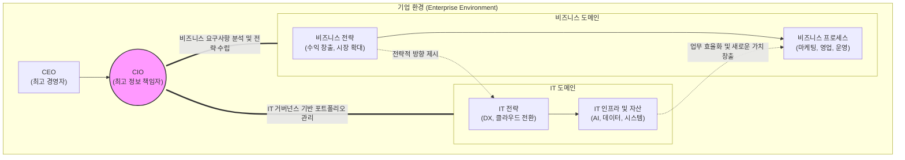

# CIO (Chief Information Officer)

---

## I. 비즈니스와 IT의 융합 리더, CIO의 개요

* **정의**: 기업의 비즈니스 목표 달성을 위해 정보기술(IT) 및 디지털 전략을 수립하고, 전사적 IT 자산과 인력을 총괄하는 최고 정보 책임자
* **등장배경/필요성**: IT 인프라가 단순 업무 지원 도구(Cost Center)에서 비즈니스 혁신과 수익 창출의 핵심 동인(Profit Center)으로 변화함에 따라, IT 투자의 타당성 검증 및 전사적 [[IT 거버넌스]] 확립 요구 증대
* **특징**: 비즈니스 전략과 IT 전략의 정렬(Alignment), 전사 아키텍처(EA) 최적화, 디지털 트랜스포메이션(DX) 및 신기술(AI, Cloud 등) 도입 주도

---

## II. CIO의 역할 프레임워크 및 핵심 직무 요소

### 가. CIO의 비즈니스-IT 정렬(Alignment) 역할 개념도

* CIO는 CEO의 비즈니스 비전을 바탕으로 비즈니스 도메인과 IT 도메인 간의 간극을 메우고, 양방향 전략적 정렬(Strategic Alignment)을 통해 전사적 가치를 극대화함

### 나. CIO의 핵심 직무 및 기술 요소

| 구분 | 요소기술(키워드) | 세부 설명 |
| --- | --- | --- |
| **전략 기획** | 비즈니스-IT 정렬 | 기업의 중장기 경영 전략에 부합하도록 IT 마스터플랜([[ISP (Information Strategy Plan)|ISP]]) 및 정보화 마스터플랜 수립 |
| **통제/관리** | IT 거버넌스 (Governance) | IT 투자의 투명성 확보 및 리스크 관리를 위한 의사결정 체계(COBIT 등) 확립 |
| **투자 관리** | IT 포트폴리오 관리 | 제한된 IT 예산을 바탕으로 투자 대비 가치(ROI)가 높은 프로젝트를 선별하고 자원 배분 |
| **구조 최적화** | 전사 아키텍처 (EA) | 비즈니스, 데이터, 애플리케이션, 기술 아키텍처의 통합 청사진 제시 및 IT 복잡성 통제 |
| **운영/서비스** | IT 서비스 관리 ([[ITSM(Information Technology Service Management)|ITSM]]) | ITIL 기반의 안정적인 IT 서비스 제공, 장애 관리 및 사용자 서비스 수준 협약([[SLA]]) 보장 |
| **보안/위험** | IT 리스크 관리 | 사이버 위협, 데이터 유출, 시스템 장애 등의 IT 리스크 식별 및 비즈니스 연속성([[BCP]]) 확보 |
| **혁신 주도** | 디지털 트랜스포메이션 | 클라우드, AI, 빅데이터 등 파괴적 신기술을 선제적으로 도입하여 기존 비즈니스 모델 혁신 |
| **관계 관리** | 벤더 및 소싱 관리 | 외부 IT 서비스 제공자, 클라우드 사업자([[CSP]])와의 파트너십 구축 및 외주(Outsourcing) 전략 수립 |

---

## III. 유사 C-Level 임원과의 비교 및 향후 전망

### 가. CIO, CTO, CDO의 역할 비교

| 비교 항목 | CIO (Chief Information Officer) | CTO (Chief Technology Officer) | CDO (Chief Data/Digital Officer) |
| --- | --- | --- | --- |
| **핵심 역할** | 내부 IT 운영 및 전사 비즈니스-IT 정렬 | 외부 고객향 제품 개발 및 원천 기술 확보 | 전사 데이터 자산화 및 디지털 비즈니스 혁신 |
| **주요 대상** | 사내 임직원, 내부 인프라, 비즈니스 [[프로세스]] | 외부 고객, 소프트웨어/하드웨어 제품군 | 데이터 사이언티스트, 신사업 부서 |
| **핵심 성과 지표(KPI)** | IT 비용 최적화, 시스템 가동률, 내부 만족도 | 신제품 출시 속도(TTM), 기술 특허, 제품 성능 | 데이터 기반 매출 증대, 신규 디지털 서비스 창출 |

### 나. CIO 역할의 향후 전망 및 시사점

* **Chief Innovation Officer로의 역할 격상**: 단순한 IT 시스템 운영자를 넘어 비즈니스 프로세스 자체를 재설계하고 새로운 수익 모델을 발굴하는 '최고 혁신 책임자'로서의 역할이 강조되고 있음
* **Bimodal IT 및 [[AI 거버넌스]] 주도**: 안정성이 중요한 레거시 시스템 운영(Mode 1)과 민첩성이 요구되는 디지털 혁신(Mode 2)을 동시에 수행하는 Bimodal IT 전략 수립과 더불어, 최근에는 기업 내 안전한 생성형 AI 도입을 위한 'AI 거버넌스' 체계 구축이 CIO의 최우선 과제로 대두됨

---

### 🔗 연관 토픽

- **소속 도메인**: [[00_경영전략_MOC|📈 경영전략]]
- **세부 분류**: `1. 경영 환경 분석 & 전략 수립 프레임워크`
- **핵심 연관 토픽**:
  - [[IT 거버넌스]]
  - [[ITSM(Information Technology Service Management)]]
  - [[ISP (Information Strategy Plan)]]
  - [[비즈니스 연속성 계획]]
  - [[BCP|BCP (Business Continuity Planning)]]
