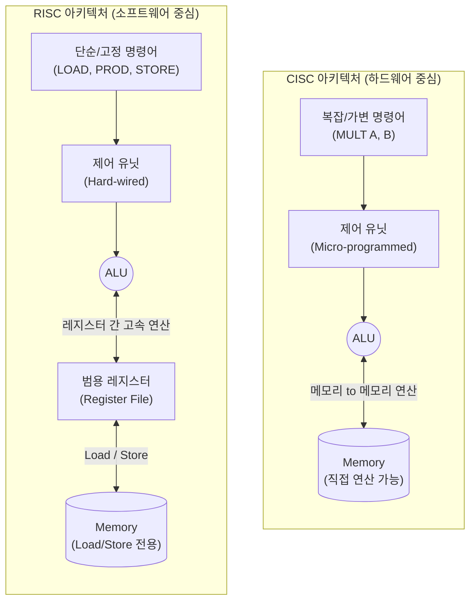

# CISC와 RISC

---

## I. 프로세서 아키텍처의 양대 산맥, CISC와 RISC의 개요

* **정의**: [[CPU]]의 명령어 집합 구조(ISA, Instruction Set Architecture) 설계 철학으로, 복잡하고 다양한 명령어로 하드웨어 중심 처리를 수행하는 CISC(Complex)와, 단순화된 명령어로 소프트웨어 최적화 및 파이프라이닝을 극대화하는 RISC(Reduced)
* **등장배경**: 초기 메모리 고비용 문제를 해결하기 위해 코드 길이를 줄이는 CISC가 발전하였으나, 이후 메모리 가격 하락과 컴파일러 기술의 발전으로 연산 속도와 클럭 효율을 중시하는 RISC가 등장함
* **특징**:
* **CISC**: 가변 길이 명령어, 메모리 직접 연산, 마이크로코드(Microcode) 기반의 복잡한 제어 유닛
* **RISC**: 고정 길이 명령어, Load/Store 전용 메모리 접근, 하드와이어드(Hardwired) 기반 제어, 다수의 범용 레지스터 활용

---

## II. CISC와 RISC의 아키텍처 및 핵심 기술 요소

### 가. CISC와 RISC의 아키텍처 개념도

* CISC는 하나의 복잡한 명령어로 메모리 간 직접 연산을 수행하는 반면, RISC는 메모리 접근을 Load/Store 명령어로 제한하고 연산은 내부 레지스터 간에만 수행하여 단일 클럭 실행을 지향함

### 나. CISC와 RISC의 핵심 기술 및 구성 요소

| 구분 | 요소기술(키워드) | 세부 설명 |
| --- | --- | --- |
| **명령어 구조** | 가변 길이 vs 고정 길이 | CISC는 명령어 길이가 가변적(1~15바이트), RISC는 고정 길이(예: 32비트)로 파이프라이닝에 유리함 |
| **메모리 접근** | 메모리 연산 vs Load/Store | CISC는 메모리 주소를 직접 참조하여 연산 가능, RISC는 데이터를 레지스터로 불러온(Load) 후 연산 |
| **제어 유닛** | Microcode vs Hardwired | CISC는 ROM에 저장된 마이크로코드 해석 방식, RISC는 하드웨어 논리회로(Hardwired) 직접 제어 방식 |
| **레지스터** | 소수 vs 다수 | CISC는 메모리 직접 연산으로 레지스터 수가 적음, RISC는 연산 병목 해소를 위해 다수의 범용 레지스터 탑재 |
| **명령어 사이클** | CPI > 1 vs CPI = 1 지향 | CISC는 명령어 처리에 여러 클럭 소요, RISC는 명령어당 1 클럭(Cycle Per Instruction) 처리를 지향 |
| **설계 복잡도** | 하드웨어 vs 컴파일러 | CISC는 하드웨어 제어 회로가 복잡함, RISC는 하드웨어는 단순하나 컴파일러의 최적화 기술이 매우 중요함 |
| **전력 소모** | 고전력 vs 저전력 | CISC는 복잡한 트랜지스터 집적도로 전력 소모가 높음, RISC는 단순한 회로로 저전력 모바일 환경에 적합함 |
| **코드 크기** | 작음 vs 큼 | CISC는 복잡한 명령어로 코드 크기가 작음, RISC는 단순한 명령어의 조합으로 인해 목적 코드 크기가 커짐 |

---

## III. CISC vs RISC 비교 및 향후 프로세서 발전 전망

### 가. CISC와 RISC의 종합 비교 및 대표 프로세서

| 비교 항목 | CISC (Complex Instruction Set Computer) | RISC (Reduced Instruction Set Computer) |
| --- | --- | --- |
| **설계 철학** | 하드웨어 복잡도 증가, 소프트웨어 단순화 | 소프트웨어(컴파일러) 복잡도 증가, 하드웨어 단순화 |
| **파이프라이닝** | 가변 길이 및 복잡한 명령어로 적용이 어려움 | 고정 길이 및 단일 클럭 실행으로 적용이 매우 쉬움 |
| **캐시(Cache) 활용** | 데이터 캐시 중심 활용 | 많은 코드 크기(Instruction)를 처리하기 위한 명령어 캐시 중요 |
| **대표 아키텍처** | Intel x86, AMD | ARM, MIPS, RISC-V, Apple Silicon (M 시리즈) |
| **주요 활용 분야** | 고성능 PC, 워크스테이션, 레거시 서버 환경 | 스마트폰, 태블릿, IoT 임베디드, 고효율 클라우드 서버 |

### 나. 향후 아키텍처 융합 동향 및 시사점

* **CRISC(CISC + RISC)로의 진화**: 현대의 Intel/AMD x86 프로세서는 외부는 호환성을 위해 CISC 명령어를 유지하되, 내부에 디코더를 두어 RISC 형태의 단순한 마이크로 오퍼레이션(Micro-ops)으로 쪼개어 파이프라이닝을 수행하는 하이브리드(CRISC) 구조를 채택함
* **RISC-V 및 ARM 생태계의 부상**: 모바일 디바이스(ARM)를 넘어 Apple M 시리즈의 성공, AWS Graviton 등 클라우드 서버용 ARM 프로세서 도입이 가속화되고 있으며, 라이선스 제약이 없는 오픈소스 ISA인 **RISC-V**가 AI 엣지 디바이스 및 [[Smart Car(자율주행)|자율주행]] 반도체 시장의 핵심으로 급부상 중임

---

### 🔗 연관 토픽

- **소속 도메인**: [[00_소프트웨어공학_MOC|🏗️ 소프트웨어공학]]
- **세부 분류**: `2. 애자일(Agile) & 지속적 통합/배포(CI/CD)`
- **핵심 연관 토픽**:
  - [[CPU]]
  - [[Smart Car(자율주행)]]
  - [[테스트 오라클]]
  - [[STPA|STPA (System-Theoretic Process Analysis)]]
  - [[요구 사항 분석]]
