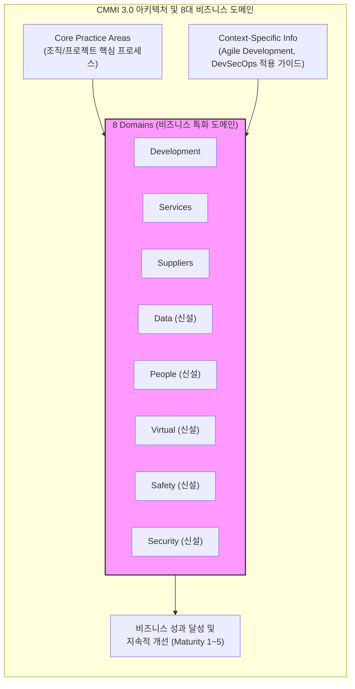

# CMMI 3.0

---

## I. 비즈니스 성과 중심의 융합 프로세스 프레임워크, CMMI 3.0의 개요

* **정의**: 기존 소프트웨어 개발 및 서비스 중심의 [[CMMI]] V2.0을 확장하여, 데이터, 인력, [[가상화]](Virtual), 안전(Safety), 보안(Security) 등 총 8개 도메인으로 통합하고 조직의 비즈니스 성과 향상을 지원하는 ISACA의 [[프로세스]] 성숙도 평가 모델 (2023년 제정)
* **등장배경/필요성**: 팬데믹 이후 원격 근무(Virtual Work)의 일상화, AI 및 데이터 자산의 중요성 증대, 글로벌 컴플라이언스(사이버 보안, 제품 안전) 강화에 대응하는 포괄적 거버넌스 요구 증가
* **특징**: 8대 비즈니스 도메인 체계 확립, 성숙도 레벨 2(ML2) 평가 구조 개편을 통한 전 프로세스의 병렬적 개선, 애자일([[Agile]]) 및 [[DevSecOps]] 컨텍스트의 전면 수용

---

## II. CMMI 3.0의 개념도 및 핵심 구성 요소

### 가. CMMI 3.0의 아키텍처 및 도메인 확장 개념도

* 공통 핵심 프로세스(Core PA)에 최신 IT 환경(Agile, DevSecOps)을 결합하고, 기업의 요구사항에 맞춰 8개의 확장된 도메인을 유연하게 테일러링하여 조직의 성숙도를 측정함

### 나. CMMI 3.0의 핵심 기술 및 구성 요소

| 구분 | 핵심 요소 (키워드) | 세부 설명 |
| --- | --- | --- |
| **도메인 확장** | 8대 도메인 체계 | 기존(개발, 서비스, 공급자) 영역에 **Data, People, Virtual, Safety, Security** 5개 영역을 신규 편입 |
| **평가 구조** | ML2 아키텍처 개편 | Maturity Level 2에서 특정 PA 위주가 아닌, **모든 Practice Area가 Capability Level 2를 충족**하도록 병렬적 개선 철학 적용 |
| **컨텍스트** | Agile Development | 기존 'Agile with [[SCRUM|Scrum]]' 가이드를 개편하여, 다양한 애자일 방법론 환경에서의 프로세스 적용 지침 강화 |
| **컨텍스트** | DevSecOps 통합 | 보안이 내재화된 개발 및 운영 자동화(CI/CD) 환경에서의 실무 적용 가이드(Context-Specific) 신설 |
| **도메인 특화** | Data & People | 엔터프라이즈 데이터 품질/관리 체계 및 인적 자원 역량 강화(Workforce Empowerment) 기준 제시 |
| **도메인 특화** | Virtual & Security | 지리적으로 분산된 원격 인력 관리(Virtual)와 제품/서비스의 사이버 보안(Security) 및 물리적 안전(Safety) 기준 신설 |
| **성과 측정** | Benchmark Appraisal | 단순 프로세스 규정 준수(Compliance)를 넘어 실질적 비즈니스 성과 지표(KPI)와 연계한 벤치마크 평가 방식 고도화 |
| **도입 유연성** | 모듈형 [[테일러링]] | 조직이 당면한 과제(예: 보안 컴플라이언스)에 맞춰 특정 도메인만 우선 평가받고 점진적으로 확장 가능한 구조 제공 |

---

## III. CMMI 2.0과 CMMI 3.0의 비교 및 향후 전망

### 가. CMMI 2.0과 CMMI 3.0의 상세 비교

| 비교 항목 | CMMI 2.0 | CMMI 3.0 |
| --- | --- | --- |
| **제정 연도/기관** | 2018년 (CMMI Institute) | 2023년 (ISACA) |
| **적용 도메인** | 3개 영역(Development, Services, Supplier) | **8개 영역**(기존 3개 + Data, People, Virtual, Safety, Security) |
| **ML2 평가 사상** | 기본적 프로젝트 관리(PM) 중심의 순차적 선행 평가 | **모든 PA에 대한 병렬적 성숙도**(Capability Level 2) 확보 요구 |
| **특화 적용 지침** | Agile with Scrum 가이드 중심 | **Agile Development, DevSecOps** 등 최신 IT 딜리버리 환경 포괄 |
| **주요 목적** | 프로세스 간소화 및 성과 측정 체계 도입 | 원격 근무, 데이터/보안 리스크 대응 등 **총체적 비즈니스 거버넌스 확립** |

### 나. CMMI 3.0의 실무 적용 및 향후 전망

* **글로벌 보안 규제 준수 프레임워크로 격상**: 미국 국방부의 사이버보안 성숙도 인증(CMMC) 및 글로벌 의료기기 규정(FDA, ISO 13485) 등 고위험/고규제 산업군에서, 새롭게 추가된 Safety 및 Security 도메인을 결합한 CMMI 인증 채택이 급속히 확대될 전망임
* **AI 및 [[데이터 거버넌스]] 내재화의 척도**: Data 도메인을 기반으로 기업의 데이터 파이프라인 무결성을 통제하고, 나아가 생성형 AI 도입 시 모델의 신뢰성을 검증하는 [[AI 거버넌스]](CMMI AIM 연계 등)의 전사적 기반 아키텍처로 진화 중임

---

### 🔗 연관 토픽

- **소속 도메인**: [[00_소프트웨어공학_MOC|🏗️ 소프트웨어공학]]
- **세부 분류**: `4. 아키텍처 스타일 & 객체지향 설계 원리`
- **핵심 연관 토픽**:
  - [[테일러링|테일러링 (Tailoring)]]
  - [[CMMI]]
  - [[Agile]]
  - [[AI 거버넌스|AI 거버넌스 (AI Governance)]]
  - [[프로세스]]
