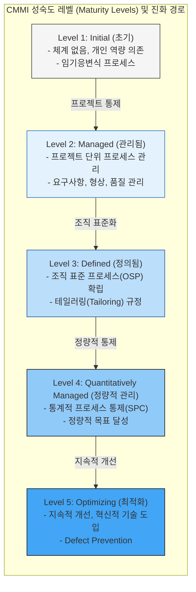

# CMMI (Capability Maturity Model Integration)

---

## I. 조직의 프로세스 성숙도 평가 모델, CMMI의 개요

* **정의**: 소프트웨어 개발, 시스템 엔지니어링 등 조직의 [[프로세스]] 개선과 성숙도 향상을 위해 미국 카네기멜론 대학(SEI)에서 개발하여 현재 ISACA가 관리하는 통합 프로세스 개선 평가 모델
* **배경 및 필요성**: 기존 CMM의 프로세스 영역별 중복성 및 단일 모델의 한계를 극복하고, 조직 전체의 비즈니스 목표 달성과 품질 향상을 위한 통합된 가이드라인 필요성 증대
* **특징**:
* **다중 모델 통합**: SW-CMM, SE-CMM, IPD-CMM 등 다양한 CMM 모델을 하나로 통합
* **두 가지 접근법**: 조직 전체의 성숙도를 평가하는 '단계적 표현(Staged)'과 특정 프로세스 영역의 역량을 평가하는 '연속적 표현(Continuous)' 제공

---

## II. CMMI의 핵심 구조 및 성숙도 레벨

### 가. CMMI의 성숙도 5단계 아키텍처 (단계적 표현 방식)

* 초기 개인 역량에 의존하던 1단계에서 출발하여, 프로젝트 관리(2단계) $\rightarrow$ 조직 표준화(3단계) $\rightarrow$ 정량적 통제(4단계) $\rightarrow$ 지속적 혁신([[PMBOK 프로세스 그룹 (5단계)|5단계]])으로 조직 프로세스 역량이 진화함

### 나. CMMI의 핵심 구성 요소 및 레벨별 특징

| 구분 | 요소기술/레벨 | 세부 설명 (핵심 키워드) |
| --- | --- | --- |
| **표현 방식** | 단계적 (Staged) | 조직 전체의 성숙도(Maturity Level)를 1~5단계로 진단하여 종합적인 개선 경로 제시 |
| **표현 방식** | 연속적 (Continuous) | 개별 프로세스 영역(Process Area)별로 역량 수준(Capability Level 0~3)을 세부적으로 진단 |
| **성숙도** | Level 1 (Initial) | 프로세스가 예측 불가능하고 통제되지 않음 (영웅적 개인 역량에 의존) |
| **성숙도** | Level 2 (Managed) | 프로젝트 단위의 프로세스가 계획 및 통제됨 (요구사항 관리, 프로젝트 계획 수립) |
| **성숙도** | Level 3 (Defined) | 조직 전체의 표준 프로세스(OSP)가 확립되고 프로젝트 특성에 맞게 [[테일러링]] 적용 |
| **성숙도** | Level 4 (Quantitatively) | 통계적 기법(SPC)을 활용하여 프로세스 성과를 정량적으로 측정하고 통제 |
| **성숙도** | Level 5 (Optimizing) | 정량적 피드백 및 혁신 기술 도입을 바탕으로 프로세스를 지속적으로 개선하고 최적화 |
| **구조 체계** | PA (Process Area) | 목표(Goal)를 달성하기 위해 수행되어야 하는 연관된 실무 활동(Practice)들의 집합 |

---

## III. CMMI와 SPICE 비교 및 최신 동향 (CMMI V2.0)

### 가. 조직 프로세스 평가 국제 표준, CMMI와 SPICE 비교

| 비교 항목 | CMMI | [[SPICE]] (ISO/IEC 15504 $\rightarrow$ 33000) |
| --- | --- | --- |
| **주관 기관** | ISACA (과거 미국 국방부 / 카네기멜론 대학 SEI) | ISO/IEC JTC1 SC7 (국제표준화기구) |
| **주요 목적** | 조직의 전체적인 프로세스 개선 및 성숙도 가이드 제공 | 소프트웨어 프로세스 역량 심사 및 평가 (표준 규격) |
| **평가 차원** | 1차원 (성숙도 또는 역량 중심) | 2차원 (프로세스 차원 + 역량 차원) |
| **레벨 체계** | Maturity Level: 1 ~ 5단계 | Capability Level: 0 ~ 5단계 (불안정 ~ 최적화) |
| **주요 활용** | 미국 정부/국방 사업 및 글로벌 IT 엔터프라이즈 중심 | 유럽 연합 중심 및 자동차(Automotive SPICE) 분야 특화 |

### 나. CMMI V2.0 및 실무 적용 전망

* **비즈니스 성과 중심 및 [[Agile]] 통합**: 최신 규격인 CMMI V2.0은 기존의 프로세스 준수율(Compliance) 중심에서 벗어나 실질적인 비즈니스 성과 향상에 초점을 맞추고 있으며, [[스크럼]]([[SCRUM|Scrum]]) 등 애자일(Agile) 프랙티스와의 결합을 기본 구조로 채택함
* **PA(Process Area)에서 Practice Area로 변경**: 영역의 구조를 비즈니스 역량(Business Capability) 중심으로 재편하여, 기업이 맹목적으로 레벨 인증을 취득하는 것을 넘어 실무적 가치 창출과 [[DevOps]] 환경에 유연하게 대응할 수 있도록 발전하고 있음

---

### 🔗 연관 토픽

- **소속 도메인**: [[00_소프트웨어공학_MOC|🏗️ 소프트웨어공학]]
- **세부 분류**: `6. 소프트웨어 테스팅 & 품질 보증 (QA/QC)`
- **핵심 연관 토픽**:
  - [[테일러링|테일러링 (Tailoring)]]
  - [[SPICE]]
  - [[Agile]]
  - [[PMBOK 프로세스 그룹 (5단계)]]
  - [[스크럼|스크럼 (SCRUM)]]
