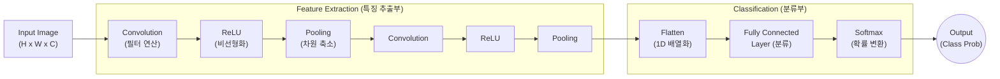

# CNN (Convolutional Neural Network)

---

## I. 시각적 공간 정보 인식의 핵심, CNN의 개요

* **정의**: 이미지, 영상 등 다차원 격자형(Grid) 데이터의 공간적 [[지역성]](Locality)을 유지하며 특징을 추출하여 분류, 객체 탐지 등을 수행하는 [[딥러닝]] 인공신경망 아키텍처
* **등장배경**: 기존 완전연결 신경망(FCN)에 2차원 이미지를 1차원으로 펴서(Flatten) 입력할 경우 공간적/지역적 정보가 손실되고, 막대한 가중치 파라미터로 인해 과적합 및 연산량 폭발 문제가 발생함
* **특징**: 필터(Filter)를 이용한 가중치 공유(Weight Sharing)와 지역적 연결(Local Connectivity)을 통해 파라미터를 최소화하고, 사물의 위치가 변해도 인식할 수 있는 병진 불변성(Translation Invariance)을 제공함

---

## II. CNN의 아키텍처 개념도 및 핵심 기술 요소

### 가. CNN의 아키텍처 및 동작 원리

* 입력 이미지는 합성곱과 풀링 계층을 반복 통과하며 특징 맵(Feature Map)으로 추상화되고, 최종적으로 1차원 벡터로 변환되어 완전연결 계층을 통해 객체의 클래스를 예측함

### 나. CNN의 핵심 구성 요소

| 구분 | 요소기술(키워드) | 세부 설명 |
| --- | --- | --- |
| **특징 추출** | 합성곱 (Convolution) | 입력 데이터에 필터([[커널]])를 슬라이딩 곱셈 연산하여 시각적 특징([[EDGE|Edge]], Texture 등) 맵(Feature Map) 생성 |
| **특징 추출** | 스트라이드 ([[STRIDE|Stride]]) | 필터가 이동하는 보폭 크기로, 값을 크게 설정하면 출력 특징 맵의 공간적 크기가 감소함 |
| **특징 추출** | 패딩 (Padding) | 연산 후 이미지 크기가 축소되고 가장자리 정보가 유실되는 것을 방지하기 위해 외곽을 0(Zero-padding) 등으로 채움 |
| **비선형성** | 활성화 함수 (ReLU) | 기울기 소실(Gradient Vanishing) 문제를 해결하기 위해 도입된 비선형 함수 ($x < 0$이면 $0$, $x \ge 0$이면 $x$) |
| **[[차원 축소]]** | 풀링 (Pooling) | 지정된 영역 내에서 최대값(Max Pooling)이나 평균값(Average Pooling)을 추출하여 공간 해상도 축소 및 노이즈 상쇄 |
| **분류 예측** | 완전연결 (Fully Connected) | 추출된 고차원 특징들을 1차원 벡터로 변환(Flatten)한 후, 가중치를 곱하여 최종 분류 수행 |
| **분류 예측** | 소프트맥스 (Softmax) | 최종 출력단의 값을 각 클래스에 속할 확률값(0~1 사이, 총합 1)으로 변환하는 활성화 함수 |
| **유도 [[편향]]** | 병진 불변성 (Translation Invariance) | 피사체가 이미지 내 다른 위치로 이동하더라도 풀링 연산 등을 통해 동일한 객체로 인식하는 CNN의 고유 특성 |

---

## III. 최신 비전 아키텍처 비교 및 CNN의 향후 전망

### 가. CNN과 Vision Transformer(ViT)의 아키텍처 비교

| 비교 항목 | CNN (Convolutional Neural Network) | ViT (Vision Transformer) |
| --- | --- | --- |
| **주요 연산 기법** | 합성곱(Convolution) 기반 로컬 특징 추출 | Self-Attention 기반 패치(Patch) 간 전역적(Global) 문맥 파악 |
| **유도 편향(Inductive Bias)** | 높음 (지역성, 공간적 구조에 대한 강한 가정 내재) | 낮음 (데이터 자체의 패턴에 전적으로 의존) |
| **데이터 요구량** | 중소규모 데이터셋에서도 효율적 학습 가능 | 매우 방대한 대규모(Large-scale) 데이터셋 필수 |
| **연산량 / 하드웨어** | 엣지 디바이스 등 리소스 제한 환경에 적합 (효율적) | 메모리 사용량 및 컴퓨팅 자원 요구량이 큼 (O($N^2$)) |
| **주요 발전 모델** | ResNet, EfficientNet, **ConvNeXt** | ViT, Swin Transformer, MAE |

### 나. 향후 활용 전망 및 시사점

* **ViT의 장점을 수용한 ConvNeXt의 부상**: ViT의 성능 우위에 대응하여, 패치화(Patchify) 스템(Stem) 도입, Inverted Bottleneck 구조, 활성화 함수 최적화(GELU) 등 트랜스포머의 설계 기법을 합성곱에 결합한 **ConvNeXt**가 등장하며 CNN의 성능 한계를 극복하고 있음
* **하이브리드(Hybrid) 및 엣지 AI 최적화**: 향후 컴퓨터 비전 분야는 대규모 서버 환경의 글로벌 맥락 인식(Transformer)과 엣지(Edge) 환경의 고효율 로컬 특징 추출(CNN)을 결합한 하이브리드 아키텍처로 진화하며, 의료 영상 및 [[Smart Car(자율주행)|자율주행]] 등 실시간성이 중요한 산업에 폭넓게 적용될 전망임

---

### 🔗 연관 토픽

- **소속 도메인**: [[00_인공지능_MOC|🤖 인공지능]]
- **세부 분류**: `1. 수학 · 통계학 & 데이터 전처리`
- **핵심 연관 토픽**:
  - [[딥러닝]]
  - [[차원 축소|차원 축소(Dimensionality Reduction)]]
  - [[표현 학습]]
  - [[이상 감지]]
  - [[Network Dessection]]
