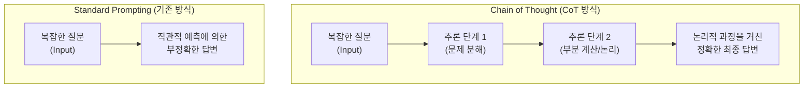

# CoT (Chain of Thought)

---

## I. 대규모 언어 모델의 복잡한 추론 능력 향상 기법, CoT(Chain of Thought)의 개요

* **가. CoT(Chain of Thought)의 정의**: 대규모 언어 모델([[초거대 언어 모델|LLM]])이 복잡한 문제를 해결할 때, 최종 답을 도출하기 전 중간 추론 과정(Reasoning Steps)을 명시적으로 생성하도록 유도하여 답변의 정확도와 신뢰성을 높이는 [[프롬프트 엔지니어링]] 기법
* **나. CoT의 필요성 및 특징**:
* **필요성**: 기존 LLM의 복잡한 수학 연산, 상식 추론 영역에서의 한계 및 환각(Hallucination) 현상 극복 필요
* **특징**:
* **설명 가능성 확보(Explainability)**: 문제 해결의 중간 단계 노출을 통해 결과에 대한 논리적 해석 가능
* **Test-Time Compute 확장**: 생성되는 토큰 수를 늘려 추론(Inference) 단계에서 더 많은 연산 자원 활용
* **System 2 사고 모방**: 직관적이고 즉각적인 답변(System 1) 대신, 논리적이고 단계적인 분석(System 2) 수행

---

## II. CoT의 개념도 및 핵심 기술 요소

### 가. CoT의 개념도 및 동작 원리

* 사용자의 입력에 대해 단번에 결과를 예측하는 기존 방식과 달리, 문제 해결을 위한 중간 논리 사슬(사고 과정)을 차례대로 전개한 후 최종 결론에 도달함

### 나. CoT의 핵심 기술 및 구성 요소

| 구분 | 요소기술(키워드) | 세부 설명 |
| --- | --- | --- |
| **프롬프트 기법** | Few-Shot CoT | 입력 프롬프트에 문제와 함께 '단계별 추론 과정이 포함된 예시(Exemplar)'를 제공하는 방식 |
| **프롬프트 기법** | Zero-Shot CoT | 예시 없이 프롬프트 끝에 "Let's think step by step" 등의 트리거 문구를 추가하여 자발적 추론을 유도 |
| **성능 향상** | Self-Consistency (자기 일관성) | 동일한 문제에 대해 여러 개의 다양한 CoT 경로를 생성한 후, 다수결(Majority Vote)로 최종 정답을 도출 |
| **구조적 확장** | [[ToT]] (Tree of Thoughts) | 선형적 추론을 넘어, 여러 대안적 추론 경로를 트리 구조로 탐색(BFS/DFS)하고 평가(Heuristic)하는 기법 |
| **구조적 확장** | [[Graph of Thought (GoT)|GoT]] (Graph of Thoughts) | 추론 노드 간의 결합(Aggregation) 및 분리(Refinement)를 허용하여 복잡한 네트워크 형태의 사고 모델링 |
| **검증 체계** | PRM (Process Reward Model) | 최종 결과만 평가하는 ORM과 달리, 중간 추론 단계(Step)별로 논리적 오류를 검증하고 보상을 부여하는 모델 |
| **지식 융합** | ReAct (Reasoning and Acting) | CoT의 추론 과정과 외부 도구(API, 검색 등) 활용을 결합하여 환각을 줄이고 동적 정보 획득 |
| **최신 동향** | Internal CoT (Hidden CoT) | OpenAI o1 모델 등에서 사용되는 방식으로, 사용자에게 프롬프트를 노출하지 않고 모델 내부적으로 [[강화학습]] 기반의 심층 추론 수행 |

---

## III. CoT의 발전 모델 비교 및 향후 전망

### 가. LLM 추론 기법(Prompting)의 발전 단계 비교

| 비교 항목 | Standard Prompting | CoT (Chain of Thought) | ToT (Tree of Thoughts) |
| --- | --- | --- | --- |
| **추론 구조** | 단일 단계 (Direct) | 선형적 순차 경로 (Linear) | 다중 경로 탐색 (Tree/Branching) |
| **인지 모델** | System 1 (빠르고 직관적) | System 2 (느리고 논리적) | System 2 + Search (탐색적 사고) |
| **주요 특징** | 입력에 대한 즉각적 출력 반환 | 중간 사고 과정 명시적 전개 | 상태 평가(Evaluation) 및 백트래킹(Backtracking) |
| **적용 분야** | 단순 질의응답, 번역, 요약 | 수학 연산, 논리 퍼즐, 코드 작성 | 체스, 전략 수립, 복잡한 창의적 문제 해결 |

### 나. 향후 전망 및 시사점

* **Test-time Compute의 극대화**: 사전 학습(Pre-training) 모델 크기를 키우는 스케일링 법칙(Scaling Law)의 한계를 극복하기 위해, 추론 단계에서 연산량을 늘리는 CoT 기반 기법이 LLM 성능 경쟁의 핵심으로 대두됨
* **자체 강화학습 기반 추론(RL-based Reasoning)**: 사람이 작성한 CoT 예시(Few-shot)에 의존하던 방식에서 벗어나, 강화학습을 통해 모델 스스로 최적의 추론 경로를 탐색하고 자체 교정(Self-Correction)하는 형태(예: OpenAI o1)로 진화 중임

---

### 🔗 연관 토픽

- **소속 도메인**: [[00_인공지능_MOC|🤖 인공지능]]
- **세부 분류**: `4. 거대언어모델 (LLM) & 생성형 AI`
- **핵심 연관 토픽**:
  - [[프롬프트 엔지니어링|프롬프트 엔지니어링(Prompt Engineering)]]
  - [[ToT|tot Tree of thought]]
  - [[Graph of Thought (GoT)|got Graph of thought]]
  - [[대규모 언어 모델 성능 향상 기술|대규모 언어 모델(LLM) 성능 향상 기술]]
  - [[테스트 타임 스케일링|테스트 타임 스케일링(Test-Time Scaling, TTS)]]
