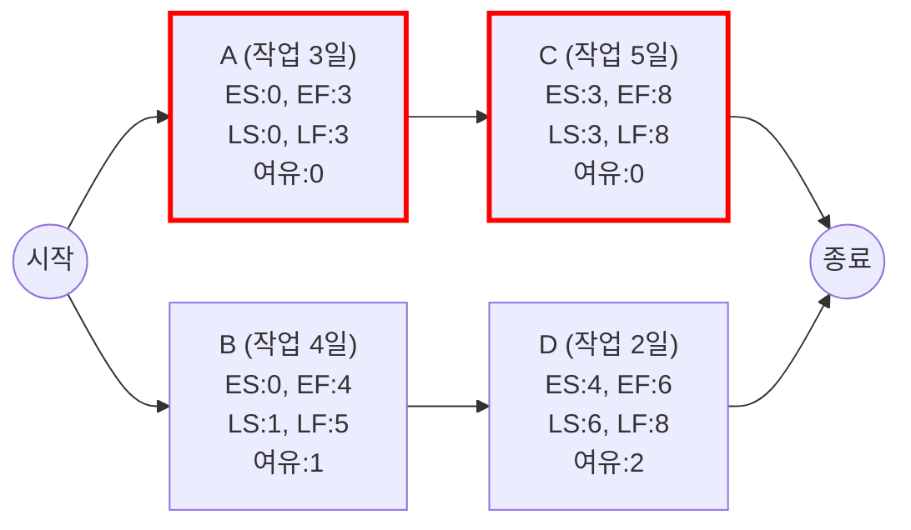

# CPM (Critical Path Management)

---

## I. 프로젝트 최적 일정 관리 기법, CPM의 개요

* **가. CPM(Critical Path Method/Management)의 정의**: 프로젝트 완료를 위한 최소 소요 시간(임계 경로)을 산출하기 위해, 액티비티 간 선후행 관계와 소요 기간을 네트워크 다이어그램으로 분석하는 확정적 일정 관리 기법
* **나. CPM의 필요성 및 특징**:
* **필요성**: 한정된 자원 내 최단 완료일 도출, 지연 발생 시 병목 구간 파악 및 자원의 최적화된 재배치
* **특징**: 단일 시간 추정(Deterministic), AON(Activity-on-Node) 기반 네트워크 다이어그램 활용, 여유 시간(Float/Slack) 관리 기반의 직관적 통제

---

## II. CPM의 개념도 및 핵심 기술 요소

### 가. CPM의 개념도 및 동작 원리

* Forward Pass(전진 계산)로 가장 빠른 시작/종료(ES/EF)를 구하고, Backward Pass(후진 계산)로 늦은 시작/종료(LS/LF)를 산출함
* 산출된 여유 시간(Float)이 '0'인 경로(A → C)를 임계 경로(Critical Path)로 식별하여 집중 관리함

### 나. CPM의 핵심 기술 요소

| 구분 | 요소기술(키워드) | 세부 설명 |
| --- | --- | --- |
| **일정 계산** | Forward Pass | 프로젝트 시작 지점부터 전진하며 가장 빠른 일정 산출 (ES, EF) |
| **일정 계산** | Backward Pass | 프로젝트 종료 지점에서 역산하여 지연 허용치 내 가장 늦은 일정 산출 (LS, LF) |
| **여유 시간** | Total Float (총 여유) | 프로젝트 전체 완료일을 지연시키지 않고 특정 액티비티가 지연될 수 있는 시간 (LS - ES 또는 LF - EF) |
| **여유 시간** | Free Float (자유 여유) | 후행 액티비티의 가장 빠른 시작(ES)을 지연시키지 않는 범위 내에서의 여유 시간 |
| **일정 지표** | ES / EF | Earliest Start(가장 빠른 시작 시간), Earliest Finish(가장 빠른 종료 시간) |
| **일정 지표** | LS / LF | Latest Start(가장 늦은 시작 시간), Latest Finish(가장 늦은 종료 시간) |
| **경로 분석** | Critical Path | 전체 네트워크 중 소요 기간이 가장 긴 경로(Float=0), 해당 경로 지연 시 프로젝트 전체가 지연됨 |
| **자원 통제** | Crashing / Fast Tracking | 임계 경로 단축을 위해 비용을 들여 자원을 집중 투입하거나(Crashing), 선후행 작업을 병행(Fast Tracking)함 |

---

## III. CPM과 PERT의 비교 및 최신 관리 동향

### 가. 유사 기술(PERT)과의 비교 및 전망

| 비교 항목 | CPM (Critical Path Method) | PERT (Program Eval. & Review Tech.) |
| --- | --- | --- |
| **추정 방식** | 확정적 (1점 추정, Deterministic) | 확률적 (3점 추정: 낙관, 비관, 최빈) |
| **관리 초점** | 비용 및 일정 중심 (최소 비용으로 일정 단축) | 시간 및 리스크 중심 (프로젝트 완료 확률 분석) |
| **주요 대상** | 과거 경험/데이터가 충분한 프로젝트 (건설, 제조 등) | 불확실성이 높고 선례가 없는 프로젝트 (R&D, 신제품) |
| **네트워크** | Activity on Node (AON) 주로 사용 | Activity on Arrow (AOA) 주로 사용 |

* **전망 및 동향**: 최근 IT 및 SW 개발 환경에서는 불확실성과 자원 제약을 동시에 극복하기 위해 기존 CPM 기법에 CCPM(Critical Chain Project Management, 자원 제약 고려)을 결합하거나, **[[Agile]]/[[SCRUM|Scrum]]의 타임박싱(Timeboxing) 기법**과 융합하여 하이브리드 형태의 일정 관리 기법으로 발전하는 추세임.

---

### 🔗 연관 토픽

- **소속 도메인**: [[00_프로젝트관리_MOC|📋 프로젝트관리]]
- **세부 분류**: `2. 프로젝트 범위 & 일정 관리 (Scope & Schedule)`
- **핵심 연관 토픽**:
  - [[비용산정 일정관리 모델]]
  - [[프로젝트 일정관리|프로젝트 일정관리(Project Schedule Management)에 대하여 설명하시오]]
  - [[SCRUM]]
  - [[Agile]]
  - [[프로젝트 관리 계획서]]
