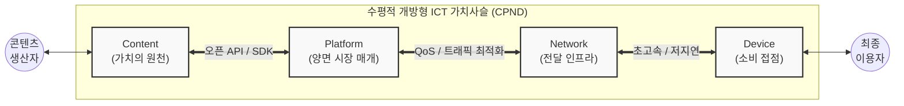

# CPND (Content, Platform, Network, Device)

---

## I. 수평적 개방형 ICT 가치사슬, CPND 생태계의 개요

* **가. CPND 생태계의 정의**: 통신 네트워크 위에서 양쪽 끝의 콘텐츠 생산자와 최종 이용자를 매개하기 위해 **C**ontent, **P**latform, **N**etwork, **D**evice의 4대 핵심 요소가 유기적으로 연결된 수평적 ICT 융합 [[가치사슬]] 시스템
* **나. CPND의 등장배경 및 특징**:
* **등장배경**: 스마트폰(iPhone 등)의 등장, 통신사 주도의 수직적 폐쇄형 구조(Walled Garden) 한계 도달, 개방형 혁신(Open Innovation) 기반의 글로벌 서비스화 요구 증대
* **특징**: 각 요소 간의 **공진화(Co-evolution)** 수행, 플랫폼(P) 중심의 생태계 주도권 확보, 롱테일(Long Tail) 법칙 기반의 콘텐츠 경제 창출, 산업 간 경계 붕괴(Big Blur)

---

## II. CPND 생태계의 개념도 및 핵심 구성 요소

### 가. CPND 생태계의 개념도 및 동작 원리

* 양방향 소통 및 N-Screen 서비스를 기반으로 콘텐츠가 플랫폼을 통해 유통되고, 네트워크를 거쳐 다양한 디바이스에서 소비되는 상호 의존적 순환 구조

### 나. CPND의 핵심 구성 요소

| 구분 | 생태계 역할 | 요소기술 및 주요 사례 (키워드) | 세부 설명 |
| --- | --- | --- | --- |
| **C**ontent | 가치 원천 | VOD, 웹툰, [[메타버스]] 에셋, 게임 | 통신망을 통해 제공되는 디지털 재화, 롱테일 및 네트워크 효과 창출의 핵심 동력 |
| **P**latform | 생태계 주도 | OS, App Store, 클라우드(AWS) | 공급자와 수요자를 연결하는 양면 시장, 표준화된 API 제공으로 다수 사업자 참여 유도 |
| **N**etwork | 전송 매체 | 5G/6G, [[SDN(Software Defined Network)|SDN]]/[[NFV]], [[Wi-Fi 7]] | 콘텐츠를 단말로 전달하는 핵심 전송망, 초저지연·초고속 대용량 트래픽 처리 인프라 |
| **D**evice | 사용자 접점 | 스마트폰, IoT 기기, AR/VR 단말 | 사용자가 플랫폼에 접속하고 콘텐츠를 직접 소비하는 물리적 단말 및 인터페이스 |

---

## III. ICT 생태계 패러다임 변화 및 진화 방향

### 가. 기존 통신망 생태계와 CPND 생태계 비교

| 비교 항목 | 전통적 통신 생태계 (과거) | 스마트 CPND 생태계 (현재/미래) |
| --- | --- | --- |
| **가치사슬 구조** | 수직적 통합 구조 (Silo) | 수평적 분업 및 융합 구조 |
| **생태계 특성** | 폐쇄형 (Walled Garden) | 개방형 (Open API, Open Source) |
| **주도권 (Hegemony)** | 네트워크(N) 기반 통신 사업자 중심 | 플랫폼(P) 및 디바이스(D) 빅테크 중심 |
| **핵심 수익 모델** | 통신 요금 (Voice, Data Usage) | 플랫폼 수수료, 구독 경제, 타겟팅 광고 |
| **서비스 확산** | 제한적 단말, 통신사 종속적 서비스 | N-Screen 기반 글로벌 Seamless 서비스 |

### 나. CPND 생태계의 최근 진화 및 향후 전망

* **CPND + S (Security / Service)로의 확장**: 정보보호의 중요성이 대두되면서 생태계 전반을 아우르는 **S(Security)** 요소가 필수 기반으로 편입되거나, 클라우드 기반의 **[[XaaS]](서비스형)** 비즈니스 모델로의 확장이 진행 중임
* **AI-CPND ([[인공지능]] 융합)**: 전 단계에 걸쳐 생성형 AI(GenAI)와 엣지 AI([[EDGE|Edge]] AI)가 결합되어 지능형 맞춤형 콘텐츠 자동 생성 및 네트워크 트래픽 자율 제어 수행
* **산업 간 경계 붕괴(Big Blur) 가속화**: 넷플릭스와 같은 플랫폼(P) 사업자가 오리지널 콘텐츠(C)를 직접 제작하거나, 구글·애플 등 플랫폼/디바이스(P/D) 기업이 자체 칩셋 및 기기를 수직 통합하는 등 가치사슬 영역의 교차 침투가 활발히 발생함

---

### 🔗 연관 토픽

- **소속 도메인**: [[00_경영전략_MOC|📈 경영전략]]
- **세부 분류**: `1. 경영 환경 분석 & 전략 수립 프레임워크`
- **핵심 연관 토픽**:
  - [[가치사슬|가치사슬(Value Chain)]]
  - [[SDN(Software Defined Network)]]
  - [[NFV]]
  - [[Wi-Fi 7|WI-FI 7 (IEEE 802.11be)]]
  - [[XaaS|XaaS(Everything as a Service)]]
