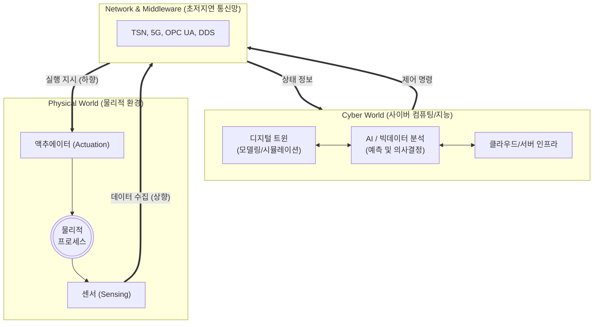

# CPS (Cyber-Physical System)

---

## I. 사이버와 물리 세계의 실시간 융합, CPS의 개요

* **가. CPS(Cyber-Physical System)의 정의**: 컴퓨터 연산(Cyber)과 통신 기술을 물리적 [[프로세스]](Physical)와 긴밀하게 통합하여, 물리 세계를 실시간으로 모니터링, 분석 및 자율 제어하는 복합 시스템
* **나. CPS의 필요성 및 특징**:
* **필요성**: 4차 산업혁명(Industry 4.0), 스마트 팩토리, 자율주행차 등 고도의 정밀성과 실시간성을 요구하는 지능형 시스템 수요 급증
* **특징**:
* **폐루프 제어(Closed-loop Control)**: 센싱-분석-제어의 지속적인 피드백 루프 형성
* **실시간성 및 고신뢰성**: 물리적 변화에 대한 즉각적 대응 및 장애 허용(Fault-Tolerance)
* **상호운용성**: 이기종 시스템 간의 [[데이터 표준화]] 및 통신(SoS: System of Systems 형태)

---

## II. CPS의 개념도 및 핵심 기술 요소

### 가. CPS의 개념도 및 동작 원리

* 물리 세계에서 **센서**가 데이터를 수집하여 네트워크를 통해 사이버 세계로 전달하면, 사이버 세계는 **분석 및 최적화**를 거쳐 다시 **액추에이터**를 통해 물리 세계를 실시간 제어함

### 나. CPS의 핵심 기술 요소

| 구분 | 요소기술(키워드) | 세부 설명 |
| --- | --- | --- |
| **물리 계층** | 스마트 센서 / 액추에이터 | 물리적 상태(온도, 압력, 위치 등)의 디지털화 수집 및 물리적 구동을 수행하는 하드웨어 |
| **통신 계층** | TSN (Time-Sensitive Networking) | 이더넷 환경에서 데이터 전송의 지연 시간을 보장하고 실시간성을 확보하는 통신 표준 |
| **통신 계층** | OPC UA / DDS | 이기종 산업용 디바이스 간 상호운용성 및 실시간 데이터 공유를 위한 미들웨어 [[프로토콜]] |
| **컴퓨팅 계층** | 엣지 컴퓨팅 ([[EDGE|Edge]] Computing) | 발생지 인근에서 데이터를 즉각 처리하여 클라우드 병목 현상 해소 및 초저지연 제어 확보 |
| **사이버 계층** | [[디지털 트윈|디지털 트윈 (Digital Twin)]] | 물리적 자산의 상태를 가상 공간에 동일하게 동기화하여 시뮬레이션 및 모니터링 수행 |
| **사이버 계층** | AI 및 빅데이터 분석 | 머신러닝, [[딥러닝]] 알고리즘을 활용한 예지 보전(PdM), 이상 탐지 및 자율 의사결정 |
| **안전/보안** | OT 보안 / 제로 트러스트 | 산업 제어 시스템(ICS) 대상 사이버 위협 방어, 망분리 및 기능 안전(Functional Safety) 확보 |
| **참조 모델** | 5C 아키텍처 | CPS 구현의 [[PMBOK 프로세스 그룹 (5단계)|5단계]] 모델: Connection(연결) - Conversion(변환) - Cyber(사이버) - Cognition(인지) - Configuration(구성 및 자율제어) |

---

## III. CPS, 사물인터넷(IoT), 디지털 트윈의 비교 및 발전 동향

### 가. 연관 기술(IoT, Digital Twin)과의 비교

| 비교 항목 | IoT (사물인터넷) | Digital Twin (디지털 트윈) | CPS (사이버 물리 시스템) |
| --- | --- | --- | --- |
| **핵심 목적** | 초연결을 통한 **데이터 수집/모니터링** | 물리적 대상의 **[[가상화]] 및 시뮬레이션** | 사이버-물리 융합을 통한 **자율 제어** |
| **데이터 흐름** | 단방향 위주 (센서 → 서버) | 양방향 동기화 (주기적/실시간) | 양방향 폐루프 (지속적 실시간 제어 루프) |
| **물리적 제어** | 상대적으로 약함 (정보 제공 위주) | 가상 환경 분석 결과를 통한 간접 제어 | 액추에이터를 통한 직접적, 즉각적 제어 |
| **주요 적용** | 스마트홈, 웨어러블, 스마트 물류 | 제품 설계 시뮬레이션, 공정 가상 검증 | 스마트 팩토리 융합 공정, [[Smart Car(자율주행)|자율주행]], 로보틱스 |

### 나. 향후 전망 및 동향

* **SoS (System of Systems)로의 진화**: 개별 CPS 기기들이 모여 상호 협력하는 거대 시스템(예: 스마트 시티의 지능형 교통 제어망)으로 확장 발전 중임
* **AI-CPS 패러다임 도래**: 기존의 정해진 규칙 기반(Rule-based) 제어를 넘어, 생성형 AI 및 [[강화학습]] 기반의 자율 최적화와 예기치 않은 상황에 적응하는 지능형 CPS로 고도화되고 있음

---

### 🔗 연관 토픽

- **소속 도메인**: [[00_디지털서비스_MOC|🚀 디지털서비스]]
- **세부 분류**: `3. 사물인터넷 (IoT) & 스마트 플랫폼 · 메타버스`
- **핵심 연관 토픽**:
  - [[Smart Car(자율주행)]]
  - [[Smart Factory|Smart Factory/스마트 팩토리(공장)]]
  - [[물리적 AI]]
  - [[디지털 트윈|디지털 트윈 (Digital Twin)]]
  - [[인더스트리 4.0 5.0|인더스트리 4.0 5.0 (Industry 4.0 5.0)]]
