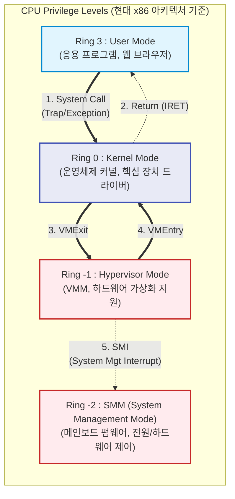

# CPU Ring Level

---

## I. 무결성 보장을 위한 하드웨어 권한 보호 모델, CPU Ring Level의 개요

* **가. [[CPU]] Ring Level의 정의**: 악의적인 코드나 오류로부터 시스템의 핵심 자원(메모리, I/O 등)과 운영체제를 보호하기 위해, 프로세서에 하드웨어적으로 부여된 논리적 권한 및 접근 제어 계층 모델
* **나. CPU Ring Level의 필요성 및 특징**:
* **필요성**: 응용 프로그램의 잘못된 연산으로 인한 시스템 전체의 패닉(Panic) 방지, [[OS(운영체제)|운영체제]] 커널의 [[무결성]] 확보 및 다중 사용자 환경에서의 자원 격리
* **특징**:
* **권한 분리(Privilege Separation)**: 숫자가 낮을수록 높은 권한을 가지며(Ring 0), 최하위 권한(Ring 3)에서는 하드웨어 직접 접근 불가
* **명시적 상태 전환**: 하위 권한에서 상위 권한의 자원 접근 시 시스템 콜(System Call)과 [[인터럽트]](Trap)를 통한 엄격한 [[게이트웨이]] 통과 요구

---

## II. CPU Ring Level의 개념도 및 핵심 구성 요소

### 가. CPU Ring Level의 개념도 및 권한 전환 원리

* 현대 범용 OS(Windows, Linux)는 Ring 1, 2를 생략하고 Ring 0(커널)과 Ring 3(유저) 구조로 단순화하여 운영함
* [[가상화]] 및 클라우드 기술의 발전에 따라 하드웨어 레벨에서 통제하는 마이너스 링(Ring -1, Ring -2) 계층이 핵심 보안 영역으로 등장함

### 나. CPU Ring Level의 핵심 기술 및 구성 요소

| 구분 | 요소기술(키워드) | 세부 설명 |
| --- | --- | --- |
| **운영 계층** | Ring 3 (User Space) | 응용 프로그램이 실행되는 영역, 메모리 할당 및 I/O 직접 제어가 차단된 최소 권한 계층 |
| **운영 계층** | Ring 0 ([[커널|Kernel]] Space) | OS 커널 및 장치 드라이버 실행 영역, 모든 CPU 명령어(Privileged Instruction) 실행 가능 |
| **가상화 계층** | Ring -1 ([[Hypervisor (VMM)|Hypervisor]]) | Intel VT-x, AMD-V 등 하드웨어 지원 가상화 계층, 여러 개의 Ring 0(게스트 OS)를 통제 및 격리 |
| **펌웨어 계층** | Ring -2 (SMM) | 전원 관리, 하드웨어 오류 처리 등 OS보다 높은 권한을 가지며, SMI(System Mgmt Interrupt)로 진입 |
| **상태 전환** | System Call | Ring 3 애플리케이션이 Ring 0의 서비스를 요청하기 위해 발생시키는 소프트웨어 인터럽트(Trap) |
| **권한 레지스터** | CPL (Current Privilege Level) | 현재 실행 중인 코드의 권한 수준을 나타내며, CPU의 CS(Code Segment) 레지스터 하위 비트에 저장됨 |
| **권한 검증** | DPL (Descriptor Privilege Level) | 메모리 세그먼트나 특정 자원에 접근하기 위해 요구되는 대상 객체의 보안 권한 수준 |
| **권한 검증 규칙** | CPL ≤ DPL 검사 | 자원 접근 시 현재 권한(CPL)의 숫자가 자원의 요구 권한(DPL) 숫자보다 작거나 같아야 접근 허용 |

---

## III. 프로세서 아키텍처별 권한 계층 비교 및 향후 전망

### 가. x86 Ring Level과 ARM Exception Level(EL) 비교

| 비교 항목 | x86 Architecture (Intel / AMD) | ARM Architecture (Cortex-A) |
| --- | --- | --- |
| **계층 명칭** | **Ring Level** (Ring 3 ~ Ring -3) | **Exception Level** (EL0 ~ EL3) |
| **유저 모드** | Ring 3 (User Mode) | EL0 (User Mode) |
| **운영체제(커널)** | Ring 0 (Kernel Mode) | EL1 (Kernel / OS Mode) |
| **가상화(VMM)** | Ring -1 (Hypervisor / VMM) | EL2 (Hypervisor Mode) |
| **최상위 보안/제어** | Ring -2 (SMM), Ring -3 (ME/PSP) | EL3 (Secure Monitor / TrustZone) |
| **권한 방향** | **숫자가 작을수록** 최상위 권한 (0 이하) | **숫자가 클수록** 최상위 권한 (EL3) |

### 나. 향후 전망 및 동향

* **마이너스 링(Negative Rings) 기반의 보안 위협과 방어**: 최근 Ring -3(Intel ME, AMD PSP 등 프로세서 내장 독립 서브시스템) 및 Ring -2(SMM)의 취약점을 노리는 [[루트킷|루트킷(Rootkit)]] 및 펌웨어 레벨의 해킹 공격이 증가하고 있어, 하드웨어 공급망 보안(Supply Chain Security)의 중요성이 극대화됨
* **기밀 컴퓨팅([[기밀컴퓨팅|Confidential Computing]]) 기반 격리**: 클라우드 환경에서 Hypervisor(Ring -1)가 침해당하더라도 고객의 데이터를 보호하기 위해, CPU 하드웨어 단에서 암호화된 메모리 격리 영역을 제공하는 TEE(Trusted Execution Environment, 예: Intel SGX/TDX) 적용이 클라우드 인프라의 표준으로 자리매김하고 있음

---

### 🔗 연관 토픽

- **소속 도메인**: [[00_운영체제_MOC|⚙️ 운영체제]]
- **세부 분류**: `1. 프로세스 & 스레드 관리`
- **핵심 연관 토픽**:
  - [[커널|커널(Kernel)]]
  - [[인터럽트|인터럽트 (Interrupt)]]
  - [[OS(운영체제)]]
  - [[가상화]]
  - [[Hypervisor (VMM)]]
