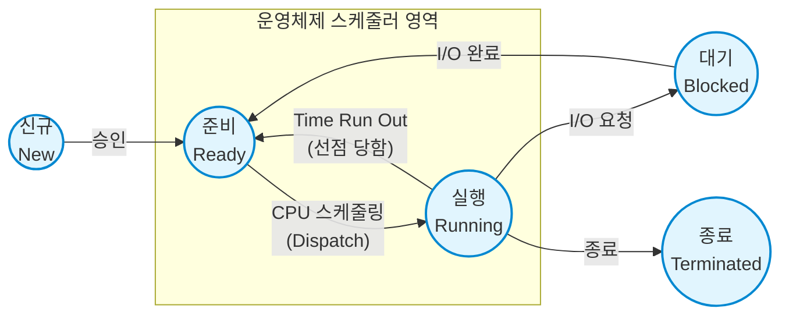

# CPU Scheduling

---

## I. 다중 프로그래밍 환경의 자원 할당 핵심, CPU 스케줄링의 개요

* **가. [[CPU]] [[스케줄링]](CPU Scheduling)의 정의**: 다중 프로그래밍 환경에서 시스템의 성능을 극대화하기 위해, 준비 큐(Ready [[Queue]])에 있는 [[프로세스]] 중 어떤 프로세스에게 CPU를 할당할지 결정하는 [[OS(운영체제)|운영체제]] 핵심 메커니즘
* **나. CPU 스케줄링의 목적 및 특징**:
* **목적**: CPU 이용률(Utilization) 및 [[처리량]](Throughput) 최대화, 응답/대기/반환 시간 최소화, [[기아|기아(Starvation)]] 방지 및 공평성 보장
* **특징**: 프로세스의 상태 전이(State Transition) 시점에 발생하며, CPU를 강제로 뺏을 수 있는지에 따라 선점형(Preemptive)과 비선점형(Non-preemptive)으로 구분됨

---

## II. CPU 스케줄링의 개념도 및 핵심 알고리즘

### 가. CPU 스케줄링의 상태 전이 개념도 및 동작 원리

* 단기 [[스케줄러]](Short-term Scheduler)가 준비 상태의 프로세스 중 하나를 선택하면, 디스패처(Dispatcher)가 [[문맥 교환]](Context Switching)을 통해 해당 프로세스에 CPU 제어권을 넘겨 실행(Running) 상태로 전이함

### 나. CPU 스케줄링의 핵심 알고리즘 (분류별)

| 구분 | 요소기술([[알고리즘]]) | 세부 설명 |
| --- | --- | --- |
| **비선점형** | FCFS (First-Come, First-Served) | 준비 큐에 도착한 순서대로 CPU를 할당, 호위 효과(Convoy Effect) 발생 가능 |
| **비선점형** | SJF (Shortest [[작업|Job]] First) | 실행 시간이 가장 짧은 프로세스를 우선 할당, 처리량은 높으나 기아 현상(Starvation) 우려 |
| **비선점형** | HRN (Highest Response-ratio Next) | 에이징(Aging) 기법을 적용하여 SJF의 기아 현상 보완, 우선순위 = `(대기시간 + 실행시간) / 실행시간` |
| **선점형** | RR (Round Robin) | FCFS 기반이나 정해진 시간 할당량(Time Quantum) 내에서만 실행 후 교대, 시분할 시스템에 적합 |
| **선점형** | SRTF (Shortest Remaining Time First) | 남아있는 실행 시간이 가장 짧은 프로세스에게 우선 할당 (SJF의 선점형 버전) |
| **선점형** | MLQ (Multi-Level Queue) | 프로세스 성격(시스템, 대화형, 배치)에 따라 준비 큐를 여러 개 분리하고 각 큐별 독립적 스케줄링 적용 |
| **선점형** | MLFQ (Multi-Level Feedback Queue) | MLQ에서 큐 간 프로세스 이동을 허용하여, 하위 큐로 갈수록 타임 퀀텀을 늘려 CPU 바운드 작업을 처리함 |

---

## III. CPU 스케줄링 방식의 비교 및 최신 동향

### 가. 선점형(Preemptive)과 비선점형(Non-preemptive) 스케줄링 비교

| 비교 항목 | 선점형 스케줄링 (Preemptive) | 비선점형 스케줄링 (Non-preemptive) |
| --- | --- | --- |
| **CPU 제어권 회수** | 실행 중인 프로세스로부터 OS가 강제 회수 가능 | 프로세스가 자발적으로 종료/대기할 때까지 유지 |
| **문맥 교환 오버헤드** | 빈번한 교환으로 인해 오버헤드가 큼 (높음) | 교환 횟수가 적어 오버헤드가 작음 (낮음) |
| **응답성 (Response)** | 대화형 및 시분할 시스템에 적합하여 응답성 뛰어남 | 긴 프로세스가 CPU를 독점할 경우 응답성 저하 |
| **기아 현상(Starvation)** | 동적 우선순위 조절 부재 시 발생 가능 | 수행 시간이 긴 프로세스로 인해 짧은 작업 지연 |
| **대표 알고리즘** | RR, SRTF, MLQ, MLFQ | FCFS, SJF, HRN |

### 나. CPU 스케줄링 최신 발전 동향

* **리눅스 CFS (Completely Fair Scheduler)의 표준화**: 각 프로세스에 가상 실행 시간(vruntime)을 부여하고 레드-블랙 트리(Red-Black Tree) 자료구조를 활용하여, 모든 작업이 공평하게 CPU 리소스를 분배받도록 스케줄링하는 기법 적용
* **멀티코어 및 이기종 아키텍처 스케줄링 (EAS)**: 스마트폰의 ARM big.LITTLE 구조 등에서 고성능 코어와 고효율 코어 간 작업 부하를 동적으로 분배하는 EAS(Energy Aware Scheduling) 기반의 전력 및 열 관리 최적화 스케줄링으로 진화 중임

---

### 🔗 연관 토픽

- **소속 도메인**: [[00_운영체제_MOC|⚙️ 운영체제]]
- **세부 분류**: `1. 프로세스 & 스레드 관리`
- **핵심 연관 토픽**:
  - [[OS(운영체제)]]
  - [[프로세스]]
  - [[스케줄링]]
  - [[문맥 교환|문맥 교환 (Context Switching)]]
  - [[스케줄러|스케줄러 (Scheduler)]]
