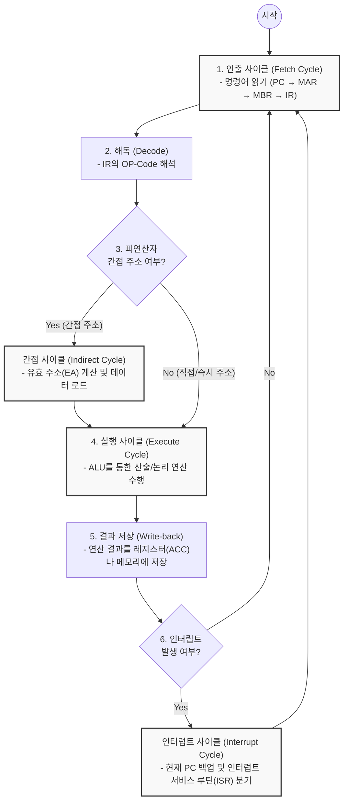

# CPU 처리과정 (Instruction Cycle)

---

## I. 프로그램 내장 방식의 핵심, CPU 처리과정의 개요

* **가. [[CPU]] 처리과정(Instruction Cycle)의 정의**: 폰 노이만 아키텍처 기반의 컴퓨터에서, 주기억장치에 저장된 명령어를 인출(Fetch), 해독(Decode), 실행(Execute), 저장(Write-back)하며 프로그램을 수행하는 일련의 기계어 동작 주기
* **나. CPU 처리과정의 특징**:
* **클럭 동기화**: CPU 내부 클럭 펄스(Clock Pulse)에 맞추어 각 마이크로 오퍼레이션(Micro-operation)이 순차적으로 작동함
* **메이저 상태(Major State) 전이**: 인출, 간접, 실행, 인터럽트의 4가지 주요 상태를 전이하며 시스템을 제어함
* **명령어 수준 병렬성(ILP)**: 처리 속도 향상을 위해 파이프라이닝(Pipelining) 기법을 적용하여 여러 사이클을 중첩 실행함

---

## II. CPU 처리과정의 흐름도 및 핵심 구성 요소

### 가. CPU 명령어 처리과정 흐름도 및 메이저 상태 전이

* CPU는 명령어 수행 시 하나의 인출-실행 사이클을 마치면 반드시 인터럽트 발생 여부를 확인한 후 다음 사이클(PC 갱신)로 전이함

### 나. CPU 처리과정의 세부 단계 및 레지스터 동작 (마이크로 오퍼레이션)

| 구분 (메이저 상태) | 요소기술(키워드) | 세부 설명 (레지스터 동작 흐름) |
| --- | --- | --- |
| **인출 (Fetch)** | 주소 전달 | `MAR ← PC` (다음에 실행할 명령어 주소를 메모리 주소 레지스터로 이동) |
| **인출 (Fetch)** | 명령어 적재 | `MBR ← M[MAR]`, `PC ← PC + 1` (메모리에서 명령어를 가져와 버퍼에 넣고 PC 증가) |
| **인출 (Fetch)** | 명령어 해독 준비 | `IR ← MBR` (MBR의 명령어를 명령어 레지스터로 이동하여 해독(Decode) 수행) |
| **간접 (Indirect)** | 유효 주소 산출 | `MAR ← IR(Address)` (오퍼랜드가 가리키는 실제 데이터의 주소를 구하기 위해 메모리 재참조) |
| **실행 (Execute)** | 연산 수행 (ALU) | 해독된 OP-Code에 따라 산술/논리 연산 수행 (예: `ACC ← ACC + MBR` 등 명령어별 상이) |
| **실행 (Execute)** | 상태 플래그 갱신 | 연산 결과에 따라 Status Register(상태 플래그: 오버플로우, 제로, 부호 등) 갱신 |
| **실행 (Execute)** | 결과 저장 (Write-back) | 최종 연산 결과를 누산기(ACC)에 유지하거나, 주기억장치의 특정 주소(`M[MAR] ← ACC`)에 저장 |
| **[[인터럽트|인터럽트 (Interrupt)]]** | 복귀 주소 백업 | `MBR ← PC`, `PC ← ISR 주소` (현재 실행 위치를 스택/메모리에 저장하고 인터럽트 루틴으로 이동) |

---

## III. CPU 처리과정 최적화 및 ILP(명령어 수준 병렬성) 발전 동향

### 가. CPU 사이클 병목 해소를 위한 처리 방식 비교

| 비교 항목 | 순차 처리 (Sequential) | 파이프라이닝 (Pipelining) | 슈퍼스칼라 (Superscalar) |
| --- | --- | --- | --- |
| **동작 방식** | 한 명령어의 전체 사이클(Fetch~Store) 완료 후 다음 명령어 처리 | 처리 단계를 분할(예: 4단/5단)하여 여러 명령어를 시분할로 중첩 실행 | CPU 내에 여러 개의 실행 유닛(ALU 등)을 두어 동시에 다수 명령어 실행 |
| **클럭당 명령어 (CPI)** | CPI ≥ 1 (보통 4~5 클럭 소요) | 이상적 환경에서 CPI ≒ 1 근접 | 이론적으로 CPI < 1 달성 가능 (다중 발행) |
| **발생 가능한 문제(해결)** | 시스템 자원 유휴 상태 발생 | 파이프라인 해저드(구조, 데이터, 제어) | 하드웨어 복잡도 증가, 데이터 의존성 문제 |
| **주요 적용 대상** | 초창기 컴퓨팅 환경 (단순 제어) | 대부분의 현대 RISC/CISC 프로세서 기본 적용 | 고성능 데스크탑 및 서버용 프로세서 |

### 나. 최근 프로세서 처리과정의 진화 동향

* **Out-of-Order Execution (비순차적 실행)**: 프로그램에 작성된 명령어 순서와 상관없이, 실행 준비(데이터 의존성 해결)가 완료된 명령어부터 먼저 Execute 단계로 투입하여 CPU 파이프라인 스톨(Stall)을 최소화함
* **고도화된 분기 예측(Branch Prediction)**: 제어 해저드(Control Hazard)로 인한 파이프라인 플러시(Flush) 손실을 막기 위해 [[인공지능]] 알고리즘이 결합된 동적 분기 예측기(Dynamic Branch Predictor)를 도입하여 예측 정확도를 95% 이상으로 끌어올림

---

### 🔗 연관 토픽

- **소속 도메인**: [[00_컴퓨터구조_MOC|💻 컴퓨터구조]]
- **세부 분류**: `1. CPU 프로세서 & 마이크로아키텍처`
- **핵심 연관 토픽**:
  - [[CPU]]
  - [[알고리즘]]
  - [[인터럽트|인터럽트 (Interrupt)]]
  - [[DMA(Direct Memory Access)]]
  - [[TPU (Tensor Processing Unit)]]
