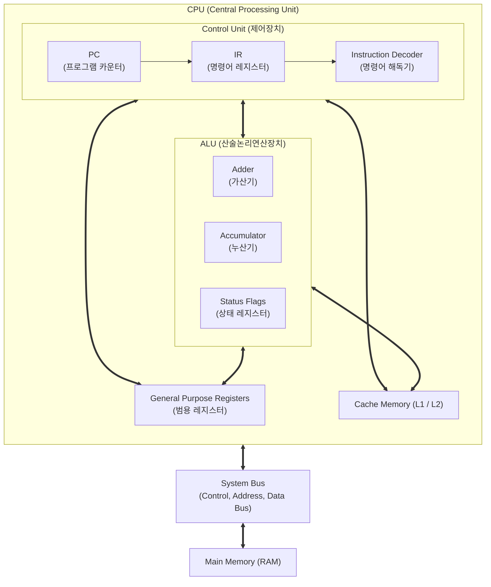

# CPU (Central Processing Unit)

---

## I. 컴퓨터 시스템의 두뇌, CPU의 개요

* **가. CPU(Central Processing Unit)의 정의**: 주기억장치에 저장된 명령어를 순차적으로 인출(Fetch), 해독(Decode), 실행(Execute)하여 데이터를 처리하고 시스템 전체를 제어하는 핵심 하드웨어 장치
* **나. CPU의 특징**:
* **직렬 처리 중심**: 단일 스레드의 복잡한 논리 제어 및 분기 처리에 최적화된 저지연(Low Latency) 구조
* **계층적 메모리 구조**: L1/L2/L3 캐시를 내장하여 프로세서와 메인 메모리 간의 속도 차이 극복
* **범용성 보장**: [[OS(운영체제)|운영체제]](OS) 구동 및 범용 애플리케이션 실행을 위한 포괄적 명령어 세트(CISC/RISC) 지원

---

## II. CPU의 아키텍처 및 핵심 구성요소

### 가. CPU의 내부 개념도 및 동작 원리

* **동작 흐름**: PC가 가리키는 주소의 명령어를 Fetch(인출) → IR에 저장 후 Decoder가 Decode(해독) → ALU가 제어 신호에 따라 Execute(실행) → 결과를 레지스터나 메모리에 Write-back(저장)

### 나. CPU의 핵심 기술 및 구성 요소

| 구분 | 요소기술(키워드) | 세부 설명 |
| --- | --- | --- |
| **핵심 장치** | ALU (산술논리연산장치) | 사칙연산(산술) 및 AND, OR, NOT 등의 논리 연산을 실제 수행하는 하드웨어 유닛 |
| **핵심 장치** | CU (제어장치) | 명령어를 해독하여 시스템 내 각 장치(ALU, 메모리, I/O 등)에 적절한 제어 신호를 발생 |
| **핵심 장치** | Register (레지스터) | CPU 내부에 위치하며 가장 처리 속도가 빠른 임시 기억장치 (PC, IR, ACC, MAR, MBR 등) |
| **성능 향상** | Pipelining (파이프라이닝) | 명령어 처리 단계를 분할하여, 여러 명령어를 중첩(Overlapping) 실행함으로써 처리율(Throughput) 향상 |
| **성능 향상** | Branch Prediction (분기 예측) | 조건 분기 명령어의 실행 경로를 미리 예측하여 파이프라인 스톨(Stall)을 최소화하는 기법 |
| **성능 향상** | Out-of-Order Execution | 프로그램의 원래 순서와 무관하게, 실행 준비가 완료된 명령어부터 먼저 비동기적으로 처리(순서 밖 실행) |
| **기억 장치** | Cache Memory (캐시) | 공간적/시간적 [[지역성]](Locality)을 활용하여 자주 사용하는 데이터를 SRAM 기반으로 빠르게 제공 |
| **연결 통로** | System Bus (시스템 버스) | CPU와 메모리, I/O 장치 간 데이터, 주소, 제어 신호를 전달하는 물리적 통로 (Data, Address, Control Bus) |

---

## III. CPU와 GPU의 비교 및 프로세서 발전 동향

### 가. CPU와 GPU의 구조적 특성 비교

| 비교 항목 | CPU (Central Processing Unit) | [[GPU]] (Graphics Processing Unit) |
| --- | --- | --- |
| **설계 철학** | **Low Latency** (저지연, 빠른 응답성) | **High Throughput** (고대역폭, 대량 처리) |
| **코어 구조** | 소수의 강력하고 복잡한 코어 (ALU 비중 낮음) | 수천 개의 단순 코어 집적 (ALU 비중 매우 높음) |
| **제어 로직** | 분기 예측 등 복잡한 제어 로직 탑재 | 제어 로직이 단순하며 연산 유닛에 면적 집중 |
| **실행 모델** | 직렬 처리 (Sequential Execution) 중심 | 대규모 병렬 처리 (SIMT/SIMD) 중심 |
| **주요 용도** | 운영체제 제어, [[데이터베이스]] 처리, 복잡한 비즈니스 로직 | 3D 그래픽 렌더링, [[딥러닝]](AI) 모델 학습/추론, 암호 화폐 |

### 나. CPU 패키징 및 아키텍처 발전 동향

* **하이브리드 코어 아키텍처 (big.LITTLE)**: 고성능(P-Core)과 고효율(E-Core) 코어를 하나의 다이(Die)에 통합하여 전력 소모와 성능을 유동적으로 최적화
* **Chiplet([[칩렛]]) 기반 2.5D/3D 패키징**: 단일 모놀리식(Monolithic) 칩 설계의 수율 한계를 극복하기 위해, 기능별 다이(Die)를 분할 생산 후 TSV, 인터포저 등을 통해 고속으로 연결하는 이종 집적 기술(Heterogeneous Integration) 적용 가속화
* **SoC(System on Chip) 진화**: 단순 연산을 넘어 CPU, GPU, [[NPU]](신경망 처리장치)를 단일 칩에 통합하여 [[온디바이스 AI]](On-Device AI) 처리에 최적화된 형태로 진화 중

---

### 🔗 연관 토픽

- **소속 도메인**: [[00_컴퓨터구조_MOC|💻 컴퓨터구조]]
- **세부 분류**: `1. CPU 프로세서 & 마이크로아키텍처`
- **핵심 연관 토픽**:
  - [[GPU]]
  - [[OS(운영체제)]]
  - [[지역성|지역성(Locality)]]
  - [[딥러닝]]
  - [[온디바이스 AI]]
