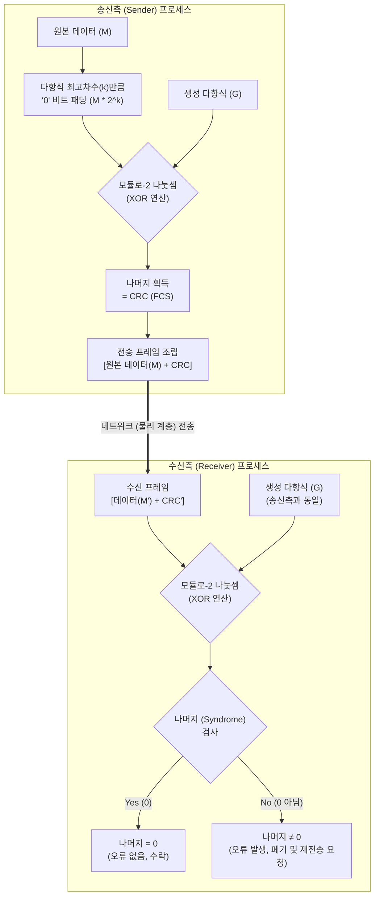

# CRC (Cyclic Redundancy Check)

---

## I. 네트워크 데이터 전송 무결성 보장, CRC의 개요

* **가. CRC(순환 중복 검사)의 정의**: 데이터 전송 과정에서 발생하는 오류를 검출하기 위해, 송신측에서 생성 다항식(Generator Polynomial)을 이용한 모듈로-2(Modulo-2) 나눗셈 기반의 오류 검출 코드를 생성하고 확인하는 기법
* **나. CRC의 필요성 및 특징**:
* **필요성**: 단일 비트 오류뿐만 아니라 네트워크 통신 중 흔히 발생하는 군집 오류(Burst Error)에 대한 높은 검출 [[신뢰성]] 요구
* **특징**:
* **다항식 연산**: 0과 1의 비트열을 다항식의 계수로 취급하여 연산 수행
* **하드웨어 구현 용이성**: 시프트 레지스터(Shift Register)와 XOR 게이트만으로 간단하고 빠른 하드웨어(NIC 등) 구현 가능
* **오류 제어 오버헤드 최소화**: 추가되는 FCS(Frame Check Sequence) 비트 길이가 짧아 전송 효율 우수

---

## II. CRC의 개념도 및 핵심 기술 요소

### 가. CRC의 생성 및 무결성 검증 개념도

* 송신측은 데이터를 생성 다항식으로 나눈 나머지(CRC)를 데이터 끝에 덧붙여 전송하고, 수신측은 동일한 다항식으로 나누어 **나머지가 0인지 확인**하여 오류를 검출함

### 나. CRC의 핵심 기술 및 구성 요소

| 구분 | 요소기술(키워드) | 세부 설명 |
| --- | --- | --- |
| **연산 기반** | 모듈로-2 연산 (Modulo-2) | 덧셈과 뺄셈 과정에서 올림(Carry)이나 빌림(Borrow)이 발생하지 않는 이진 연산 |
| **연산 기반** | XOR (배타적 논리합) | 모듈로-2 연산을 하드웨어로 구현하기 위한 핵심 논리 게이트 (입력이 다를 때만 1) |
| **핵심 매개변수** | 생성 다항식 (Generator Polynomial) | 제수(Divisor) 역할을 하는 다항식 (예: CRC-16, CRC-32 등), 송수신측이 사전 합의함 |
| **오류 검증값** | FCS (Frame Check Sequence) | 원본 데이터의 오류 검출을 위해 프레임의 트레일러 영역에 덧붙이는 잉여 비트(CRC 값) |
| **오류 판단** | 신드롬 (Syndrome) | 수신측에서 수신된 프레임을 생성 다항식으로 나누었을 때 도출되는 나머지 값 (0이면 정상) |
| **하드웨어 구현** | Shift Register (이동 레지스터) | 다항식 나눗셈의 비트 이동 및 처리를 고속으로 수행하기 위한 직렬 레지스터 회로 |
| **오류 유형** | 단일 비트 오류 (Single-bit) | 1개의 비트 값만 손상된 오류로, CRC는 모든 단일 비트 오류를 100% 검출 가능함 |
| **오류 유형** | 군집 오류 (Burst Error) | 연속된 2개 이상의 비트가 손상된 오류, 다항식 차수 이하 길이의 버스트 오류 완벽 검출 |

---

## III. 다른 오류 검출 기법과의 비교 및 활용 전망

### 가. 오류 검출 기법 비교 (Parity, Checksum, CRC)

| 비교 항목 | Parity Bit (패리티 비트) | Checksum (체크섬) | CRC (순환 중복 검사) |
| --- | --- | --- | --- |
| **동작 원리** | 1의 개수를 홀/짝수로 맞춤 | 데이터를 블록 단위로 더한 합(Sum) | 다항식을 이용한 모듈로-2 나눗셈 |
| **검출 대상** | 단일 비트 오류 중심 | 복수 비트 오류 (단순 덧셈 구조) | 단일 비트 및 버스트 오류 (가장 우수) |
| **구현 방식** | 하드웨어 / 소프트웨어 | 주로 소프트웨어 구현 | 하드웨어 (Shift Register 기반 고속) |
| **검출 신뢰도** | 낮음 (짝수 개 오류 발생 시 검출 불가) | 보통 (순서가 바뀐 오류 등 검출 한계) | 매우 높음 (거의 모든 오류 검출) |
| **주요 적용** | 직렬 통신(UART), 비동기 통신 | [[TCP]], UDP, IP [[프로토콜]] 헤더 [[무결성]] | 이더넷([[MAC]]), 무선랜(Wi-Fi), USB, 스토리지 |

### 나. CRC 기술의 활용 및 동향

* **하드웨어 오프로딩(HW Offloading)의 표준화**: 기가비트 및 10G 이상의 초고속 이더넷 네트워크에서는 [[CPU]] 부하를 줄이기 위해 네트워크 인터페이스 카드(NIC)에서 CRC 연산을 전담(Offloading)하는 구조가 필수적으로 사용됨
* **통신 및 스토리지 분야의 무결성 핵심 기술**: 신뢰성이 생명인 5G/6G 이동통신망, NVMe SSD 스토리지 에러 검출, 산업용 IoT 통신 등에서 데이터 변조 방지 및 무결성 검증의 표준 기법으로 지속 활용 중임

---

### 🔗 연관 토픽

- **소속 도메인**: [[00_네트워크_MOC|🌐 네트워크]]
- **세부 분류**: `1. OSI 7계층 & 데이터링크 계층 (L1/L2)`
- **핵심 연관 토픽**:
  - [[프로토콜]]
  - [[TCP]]
  - [[데이터 링크 계층|데이터 링크 계층 (Data Link Layer)]]
  - [[Data Link(2) 레이어]]
  - [[순환중복검사|순환중복검사 (CRC Cyclic Redundancy Check)]]
