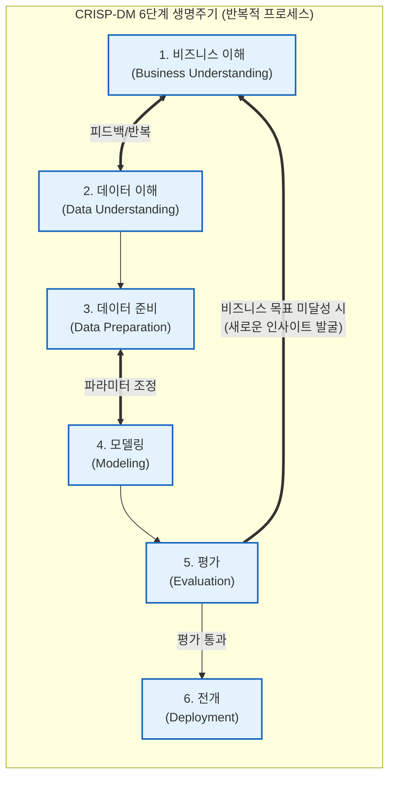

# CRISP-DM (Cross Industry Standard Process for Data Mining)

---

## I. 데이터 마이닝의 범용 표준 프로세스, CRISP-DM의 개요

* **가. CRISP-DM의 정의**: 비즈니스의 이해를 바탕으로 데이터 마이닝 프로젝트의 전체 생명주기를 6단계로 정의한 계층적이고 반복적인 산업 교차 표준 방법론
* **나. CRISP-DM의 필요성 및 특징**:
* **필요성**: 도메인 및 특정 툴에 종속되지 않는 개방형 표준 [[프로세스]] 확립, 데이터 분석 프로젝트의 성공률 제고 및 비용/시간 절감
* **특징**:
* **반복성(Iterative)**: 단계 간 양방향 피드백 및 프로젝트 전체 주기의 순환 수행
* **계층성(Hierarchical)**: 4레벨(단계 -> 일반 과제 -> 특수 과제 -> 프로세스 실행)의 하향식(Top-Down) 구조
* **비즈니스 중심**: 단순 데이터 분석이 아닌 비즈니스 목표 달성에 초점을 맞춤

---

## II. CRISP-DM의 개념도 및 핵심 구성 요소

### 가. CRISP-DM의 수행 프로세스 개념도

* 프로세스는 단방향으로 흐르지 않고, 특정 단계(예: 비즈니스 이해 ↔ 데이터 이해, 데이터 준비 ↔ 모델링)에서 필요에 따라 이전 단계로 돌아가는 강한 피드백 루프(Feedback Loop)를 가짐

### 나. CRISP-DM의 핵심 프로세스 및 구조 (6단계)

| 구분 (단계) | 요소기술(키워드) | 세부 설명 |
| --- | --- | --- |
| **1. 비즈니스 이해** | 프로젝트 목표 설정 | 현업의 요구사항을 파악하고, 비즈니스 관점의 목표를 데이터 마이닝 목표로 변환 |
| **1. 비즈니스 이해** | 프로젝트 계획 수립 | 초기 가설 설정, 필요한 자원 평가 및 단계별 수행 계획(Project Plan) 수립 |
| **2. 데이터 이해** | 데이터 탐색 ([[EDA]]) | 초기 데이터를 수집하고 속성을 파악하며, 데이터 품질 및 인사이트 사전 검증 |
| **3. 데이터 준비** | 데이터 정제 및 변환 | 분석 기법에 적합하도록 [[결측치]]/[[이상치]] 제거, 파생 변수 생성 및 포맷팅 (전체 프로젝트의 70~80% 시간 소요) |
| **4. 모델링** | [[알고리즘]] 선택/튜닝 | 머신러닝/통계 기반의 최적 모델링 기법 선택 및 하이퍼파라미터 조정을 통한 모델 학습 |
| **4. 모델링** | 모델 평가 (기술적) | 과적합(Overfitting) 방지 및 모델의 정확도, 재현율 등 데이터 마이닝 관점의 성능 평가 |
| **5. 평가** | 비즈니스 목표 부합성 | 모델링 결과가 최초 '비즈니스 이해' 단계에서 설정한 목적과 비즈니스 기대효과를 충족하는지 종합 검토 |
| **6. 전개** | 시스템 적용 및 모니터링 | 완성된 모델을 실제 운영(Production) 환경에 적용하고, 성능 저하 감시 및 [[유지보수]] 계획 수립 |

---

## III. CRISP-DM과 유사 데이터 마이닝 방법론 비교

### 가. 3대 데이터 분석 방법론(CRISP-DM, SEMMA, KDD) 비교

| 비교 항목 | CRISP-DM | SEMMA | KDD (Knowledge Discovery in DB) |
| --- | --- | --- | --- |
| **제창 기관** | 5개사 컨소시엄 (SPSS, NCR 등) | SAS Institute | Fayyad (학계 중심) |
| **접근 관점** | **비즈니스 목적 달성** 중심 | **통계적 모델링 및 분석** 중심 | **[[데이터베이스]] 프로파일링** 중심 |
| **프로세스 수** | 6단계 (계층적, 반복적) | [[PMBOK 프로세스 그룹 (5단계)|5단계]] (순차적 중심) | 5단계 (순차적, 반복적) |
| **단계 구성** | 비즈니스 이해 → 데이터 이해 → 데이터 준비 → 모델링 → 평가 → 전개 | Sample(추출) → Explore(탐색) → Modify(수정) → Model(모델링) → Assess(평가) | Selection(선택) → Preprocessing(전처리) → Transformation(변환) → [[데이터 마이닝|Data Mining]](마이닝) → Interpretation(해석/평가) |
| **주요 특징** | 산업 중립적, 피드백 루프 강조, 가장 널리 사용되는 범용적 표준 | SAS 솔루션(Enterprise Miner)에 최적화, 전개(Deployment) 단계 명시 안됨 | 학술적 데이터 마이닝 연구의 근간, 패턴 인식 및 해석에 집중 |

* **활용 전망**: 최근 빅데이터 및 [[인공지능]](AI) 프로젝트가 활성화됨에 따라, CRISP-DM은 단순 데이터 마이닝을 넘어 [[MLOps]](Machine Learning Operations) 구축을 위한 프로세스 표준 및 애자일([[Agile]]) 분석 방법론과 결합하여 비즈니스 가치 창출의 핵심 프레임워크로 지속 발전 중임.

---

### 🔗 연관 토픽

- **소속 도메인**: [[00_인공지능_MOC|🤖 인공지능]]
- **세부 분류**: `2. 머신러닝 기초 & 핵심 알고리즘`
- **핵심 연관 토픽**:
  - [[결측치]]
  - [[이상치]]
  - [[데이터 마이닝|Data Mining (데이터 마이닝)]]
  - [[인공지능]]
  - [[MLOps]]
