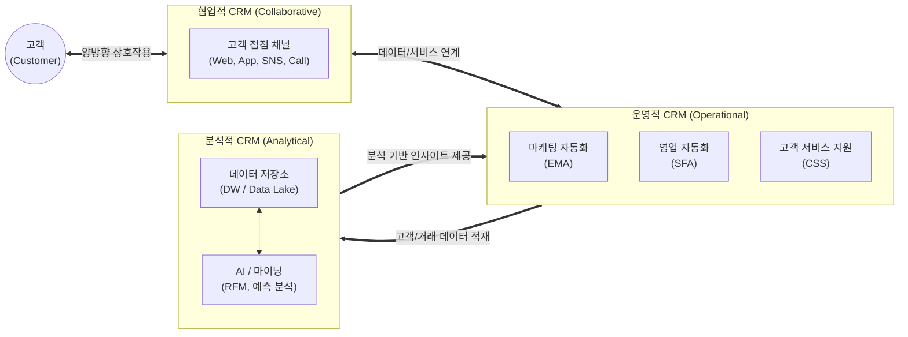

# CRM (Customer Relationship Management)

---

## I. 고객 생애 가치(LTV) 극대화를 위한 경영 전략, CRM의 개요

* **가. CRM(Customer Relationship Management)의 정의**: 기업이 고객과의 모든 상호작용(접점)을 통합 관리하고, 수집된 데이터를 분석하여 고객 획득, 유지, 수익성 증대 및 고객 생애 가치(LTV)를 극대화하는 경영 전략이자 IT 시스템
* **나. CRM의 등장배경 및 특징**:
* **등장배경**: 신규 고객 유치 비용의 급증에 따른 기존 고객 유지(Retention)의 중요성 대두, 다품종 소량 생산 및 고객 중심(Customer-Centric) 시장으로의 패러다임 변화
* **특징**:
* **LTV(Life Time Value) 극대화**: 고객 관계의 장기적 유지를 통한 지속적 수익 창출
* **초개인화(Hyper-personalization)**: 데이터 분석을 통한 맞춤형 마케팅 및 서비스 제공
* **옴니채널(Omni-channel) 통합**: 온·오프라인의 다양한 접점에서 일관된 고객 경험(CX) 제공

---

## II. CRM의 아키텍처 및 핵심 구성요소

### 가. CRM의 개념도 및 동작 원리

* 고객 접점을 담당하는 **협업적 CRM**에서 수집된 정보가 **운영적 CRM**의 실무 시스템을 거쳐 **분석적 CRM**으로 적재되며, 분석된 인사이트가 다시 운영 부서의 타겟 마케팅 및 영업 활동으로 피드백되는 선순환 구조를 가짐

### 나. CRM의 핵심 기술 및 구성 요소

| 구분 | 요소기술(키워드) | 세부 설명 |
| --- | --- | --- |
| **운영적 CRM** | SFA (Sales Force Auto) | 영업 기회 발굴부터 수주, 계약까지의 전체 영업 파이프라인 자동화 |
| **운영적 CRM** | EMA (Enterprise Mktg Auto) | 캠페인 기획, 타겟 고객 추출 및 다채널 마케팅 자동 실행 및 성과 측정 |
| **운영적 CRM** | CSS (Customer Service/Support) | 콜센터, 헬프데스크 등 고객 불만(VOC) 및 AS 요청에 대한 통합 대응 체계 |
| **분석적 CRM** | RFM 분석 모델 | 고객의 최근성(Recency), 구매 빈도(Frequency), 금액(Monetary) 기반 가치 산정 |
| **분석적 CRM** | [[데이터 마이닝|Data Mining]] / ML | 기계학습 기반 고객 이탈률(Churn) 예측, 교차 판매(Cross-sell) 및 상향 판매(Up-sell) 모델링 |
| **분석적 CRM** | DW / Data Lake | 사일로(Silo)화된 전사적 고객 데이터를 정제(Cleansing)하여 저장하는 통합 저장소 |
| **협업적 CRM** | Omni-Channel (옴니채널) | 매장, 모바일, 웹, 콜센터 등 다양한 접점 채널 간의 단절 없는 일관된 서비스 제공 |
| **인프라/플랫폼** | SaaS 기반 Cloud CRM | 멀티 테넌트 아키텍처 기반의 구독형 CRM 제공 (예: Salesforce, HubSpot 등) |

---

## III. CRM의 발전 패러다임 비교 및 최신 동향

### 가. CRM의 진화 단계별 비교

| 비교 항목 | 전통적 CRM (Operational/Analytical) | 소셜 CRM (Social CRM) | AI CRM (Intelligent CRM) |
| --- | --- | --- | --- |
| **핵심 목적** | 내부 업무 자동화 및 거래 데이터 분석 | 고객과의 소통 및 평판 관리 | 고객 행동 예측 및 초개인화 자동화 |
| **[[데이터 유형]]** | 정형 데이터 (구매 이력, 인적 사항) | 비정형 데이터 (SNS 댓글, 리뷰, 텍스트) | 멀티모달 빅데이터 (음성, 영상, 텍스트) |
| **의사소통 방식** | 단방향 (기업 → 고객 푸시 마케팅) | 양방향 (고객 참여형 상호작용) | 실시간 반응형 (상황 인지 기반 선제적 대응) |
| **핵심 기술** | RDBMS, 기초 통계 (RFM) | 텍스트 마이닝, 소셜 네트워크 분석(SNA) | 생성형 AI, [[딥러닝]] 기반 예측 분석 |

### 나. 향후 전망 및 동향

* **생성형 AI(Generative AI)와의 융합**: 세일즈포스의 아인슈타인(Einstein), 마이크로소프트의 코파일럿(Copilot) 등 CRM 내부에 [[초거대 언어 모델|LLM]]을 내장하여, 고객 응대 이메일 자동 초안 작성 및 캠페인 콘텐츠 생성을 자율적으로 수행하는 AI 비서 형태로 진화 중임
* **CDP(Customer Data Platform)로의 확장**: 제3자 [[쿠키]](3rd-party cookie) 지원 중단에 대비하여 기업이 자체 수집한 1자 데이터(1st-party data)를 실시간으로 수집, 통합, 관리하여 CRM의 마케팅 정밀도를 높이는 CDP 솔루션 도입이 가속화되고 있음

---

### 🔗 연관 토픽

- **소속 도메인**: [[00_경영전략_MOC|📈 경영전략]]
- **세부 분류**: `1. 경영 환경 분석 & 전략 수립 프레임워크`
- **핵심 연관 토픽**:
  - [[의도 경제|의도 경제(Intention Economy)]]
  - [[데이터 마이닝|Data Mining (데이터 마이닝)]]
  - [[초거대 언어 모델|초거대 언어 모델(Large Language Model)]]
  - [[딥러닝]]
  - [[데이터 유형]]
