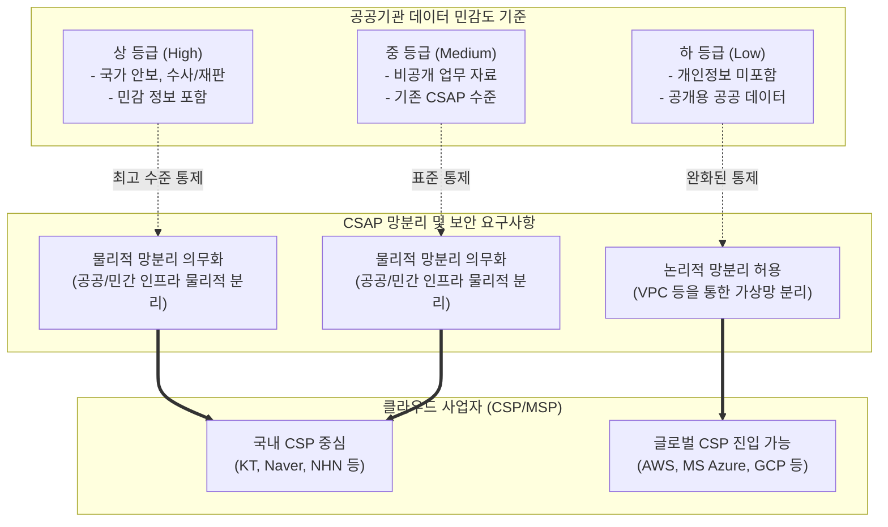

# CSAP (Cloud Security Assurance Program)

---

## I. 공공 클라우드 도입의 신뢰성 확보, CSAP의 개요

* **가. CSAP(클라우드 보안인증제)의 정의**: 국가 및 공공기관에 안전성과 신뢰성이 검증된 민간 클라우드 서비스를 공급하기 위해, 한국인터넷진흥원(KISA)이 정보보호 기준 준수 여부를 평가하고 인증하는 제도
* **나. CSAP의 필요성 및 특징**:
* **필요성**: 공공부문의 민간 클라우드 도입(Cloud First) 활성화, 데이터 유출 방지 및 국가 정보보안 체계 확립
* **특징**:
* **등급제 기반 평가**: 데이터 민감도에 따라 상/중/하 등급으로 차등화된 보안 통제 기준 적용
* **망분리 요건 유연화**: 하 등급의 경우 물리적 망분리 대신 논리적 망분리 허용을 통한 글로벌 사업자 진입 허용
* **서비스 유형별 인증**: IaaS, SaaS(표준/간편), [[PaaS]], DaaS 등 서비스 모델별 맞춤형 평가 기준 적용

---

## II. CSAP의 개념도 및 핵심 평가 체계

### 가. CSAP 등급제 개편 및 보안 통제 개념도

* 데이터의 민감도와 중요도에 따라 3등급으로 분류하며, 특히 '하' 등급에 논리적 망분리를 허용함으로써 클라우드 인프라 구성의 유연성을 확보함

### 나. CSAP의 핵심 평가 기준 및 구성 요소

| 분류 | 요소기술(키워드) | 세부 설명 |
| --- | --- | --- |
| **인증 체계** | 상/중/하 등급제 | 시스템 중요도 및 데이터의 민감도에 따라 보안 통제 기준을 3단계로 차등화 적용 |
| **인프라 보안** | 논리적/물리적 망분리 | 하 등급은 [[가상화]] 기반 논리적 망분리 허용, 중/상 등급은 공공용 존(Zone)의 물리적 서버 분리 요구 |
| **평가 영역** | 관리적 보호조치 | 정보보호 정책 수립, 인적 보안 관리, 침해사고 대응 체계 및 자산 관리 절차 점검 |
| **평가 영역** | 물리적 보호조치 | 데이터센터(IDC) 출입 통제, 재해복구(DR) 센터 물리적 보안 및 설비 안정성 검증 |
| **평가 영역** | 기술적 보호조치 | 가상화 플랫폼 보안, 데이터 [[암호화]], 접근 통제, 네트워크 패킷 보안 및 취약점 점검 |
| **서비스 영역** | IaaS 인증 | 서버, 스토리지, 네트워크 자원의 격리 및 하이퍼바이저 기반 가상화 보안 통제 |
| **서비스 영역** | SaaS 인증 (표준/간편) | 응용 프로그램 레벨의 데이터 보안, 멀티 테넌트 환경에서의 고객 간 데이터 논리적 격리 확인 |
| **서비스 영역** | PaaS / DaaS 인증 | [[컨테이너]] 및 런타임 환경 보안(PaaS), 가상 데스크톱 환경에서의 단말 및 매체 제어(DaaS) |

---

## III. CSAP 등급제 비교 및 향후 전망

### 가. CSAP 상/중/하 등급 체계 세부 비교

| 비교 항목 | 하 등급 (Low) | 중 등급 (Medium) | 상 등급 (High) |
| --- | --- | --- | --- |
| **대상 정보** | 공개용 데이터, 개인정보 미포함 | 일반 비공개 업무 자료 | 국가 안보, 수사, 민감 정보 |
| **망분리 요건** | **논리적 망분리 허용** (VPC 등) | **물리적 망분리 의무화** | **물리적 망분리 의무화** |
| **데이터 현지화** | 국내 위치 의무화 (일부 예외) | 국내 위치 의무화 | 국내 위치 및 강화된 격리 |
| **보안 기준** | 완화 (기본적 보안 통제 위주) | 기존 CSAP 인증 기준 유지 | 최고 수준의 보안 및 추가 통제 |
| **시장 파급력** | 글로벌 [[CSP]](AWS, MS 등) 공공 진출 | 국내 토종 CSP 주력 시장 | 소수 특화 인프라 및 보안 집중 |

### 나. 향후 전망 및 동향

* **글로벌 클라우드 사업자의 공공 시장 진입 가속화**: 하 등급의 논리적 망분리 허용으로 인해 AWS, MS, 구글 등 글로벌 빅테크 기업들이 공공 클라우드 시장에 본격적으로 진출하며 경쟁이 심화되고 있음
* **[[클라우드 네이티브]](Cloud-Native) 전환 가속**: 공공기관의 정보시스템이 단순 리프트 앤 시프트(Lift & Shift) 방식에서 벗어나 [[MSA (Micro Service Architecture)|MSA]], 컨테이너 기반의 클라우드 네이티브로 전환됨에 따라, SaaS 및 PaaS 에 대한 CSAP 인증 수요가 폭발적으로 증가하는 추세임

---

### 🔗 연관 토픽

- **소속 도메인**: [[00_보안_MOC|🛡️ 보안]]
- **세부 분류**: `1. 정보보안 원칙 & 거버넌스 · 인증`
- **핵심 연관 토픽**:
  - [[CSP|CSP (Cloud Service Provider)]]
  - [[암호화|암호화 (Encryption)]]
  - [[컨테이너|컨테이너 (Container)]]
  - [[ISO 27017]]
  - [[클라우드 네이티브]]
