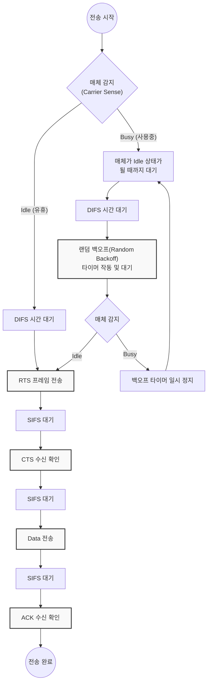

# CSMA/CA (Carrier Sense Multiple Access with Collision Avoidance)

---

## I. 무선 랜 환경의 충돌 회피 다중 접속 제어, CSMA/CA의 개요

* **가. CSMA/CA의 정의**: 무선 매체의 특성상 신호의 충돌 감지(Collision Detection)가 불가능한 점을 극복하기 위해, 전송 전 매체 상태를 확인하고 임의의 대기 시간과 예약 메커니즘을 통해 신호 충돌을 사전에 회피하는 IEEE 802.11 무선 랜(WLAN)의 매체 접근 제어([[MAC]]) [[프로토콜]]
* **나. CSMA/CA의 등장배경 및 특징**:
* **등장배경**: 무선 신호의 감쇠 및 반이중(Half-Duplex) 통신 특성으로 인한 송수신 동시 처리 불가 문제, 노드 간 서로를 인지하지 못해 발생하는 은닉 단말(Hidden Terminal) 문제 해결 필요
* **특징**:
* **충돌 회피(Avoidance)**: 랜덤 백오프(Random Backoff)와 IFS(Inter-Frame Space) 대기를 통한 동시 전송 확률 최소화
* **가상 캐리어 센싱(Virtual Carrier Sensing)**: NAV(Network Allocation Vector) 타이머를 이용한 매체 점유 상태 예측
* **[[신뢰성]] 확보**: 유선 환경과 달리 RTS/CTS 교환 및 명시적인 수신 확인(ACK) 프레임을 통해 전송 성공 여부를 검증

---

## II. CSMA/CA의 개념도 및 핵심 기술 요소

### 가. CSMA/CA의 동작 원리 및 알고리즘 흐름도

* 데이터를 전송하기 전 매체의 상태를 감지하고, 경쟁 윈도우(CW) 기반의 백오프 시간을 대기한 후 RTS/CTS 제어 프레임을 교환하여 채널을 예약하는 구조로 동작함

### 나. CSMA/CA의 핵심 기술 및 구성 요소

| 구분 | 요소기술(키워드) | 세부 설명 |
| --- | --- | --- |
| **감지 기술** | CCA (Clear Channel Assessment) | 물리 계층에서 신호 에너지 레벨을 측정하여 매체의 유휴(Idle) 또는 사용(Busy) 상태를 물리적으로 감지 |
| **감지 기술** | NAV (Network Allocation Vector) | 다른 노드의 프레임 헤더(Duration 필드)를 읽어 매체가 사용될 시간을 예측하는 가상 캐리어 센싱 타이머 |
| **시간 제어** | IFS (Inter-Frame Space) | 프레임 간 여유 대기 시간으로, 우선순위에 따라 SIFS(가장 짧음, ACK용), PIFS, DIFS(가장 긺, 일반 데이터용)로 구분됨 |
| **회피 제어** | Random Backoff | 매체가 Idle 상태로 전환된 후, 노드들이 동시에 전송하는 것을 막기 위해 임의로 부여된 슬롯 타임만큼 대기하는 기법 |
| **충돌 방지** | RTS / CTS | **RTS**(Request To Send)와 **CTS**(Clear To Send) 프레임을 교환하여, 데이터 전송 전 채널을 미리 예약하고 은닉 단말 문제를 방지 |
| **신뢰성 보장** | ACK (Acknowledgement) | 무선 환경의 높은 오류율을 극복하기 위해, 수신측이 데이터를 온전히 받았음을 송신측에 알리는 필수 응답 프레임 |
| **최적화** | CW (Contention Window) | 충돌 발생 시 백오프 시간을 선택하는 범위로, 재전송 시마다 윈도우 크기를 기하급수적으로 늘려 혼잡도를 제어함 |

---

## III. CSMA/CA와 CSMA/CD의 비교 및 향후 발전 동향

### 가. 이더넷(CSMA/CD)과 무선 랜(CSMA/CA) 매체 접근 제어 방식 비교

| 비교 항목 | [[CSMA CD|CSMA/CD]] (Collision Detection) | CSMA/CA (Collision Avoidance) |
| --- | --- | --- |
| **적용 네트워크** | 유선 이더넷 환경 (IEEE 802.3) | 무선 랜(WLAN) 환경 (IEEE 802.11) |
| **충돌 대응 방식** | 충돌 **발생 후 감지 및 복구** | 충돌 **사전 회피 및 예약** |
| **주요 메커니즘** | 충돌 감지 시 Jam Signal 발송 후 백오프 | IFS 대기, 랜덤 백오프, RTS/CTS, ACK 교환 |
| **오버헤드** | 상대적으로 낮음 (제어 프레임 적음) | 상대적으로 높음 (ACK, 제어 프레임 등 오버헤드 큼) |
| **해결 과제** | 근거리 케이블망에서의 브로드캐스트 제어 | 무선망에서의 은닉 단말(Hidden Terminal) 문제 해결 |

### 나. 향후 전망 및 기술 동향

* **무선 환경의 다중 접속 효율성 개선**: CSMA/CA는 노드가 많아질수록 제어 프레임 오버헤드와 채널 경쟁으로 인한 성능 저하(Throughput Degradation)가 심각해지는 한계가 존재함
* **OFDMA 및 MU-[[MIMO]]로의 진화**: 최신 Wi-Fi 6(802.11ax) 및 [[Wi-Fi 7]] 환경에서는 순수 CSMA/CA 방식에 의존하기보다, AP(Access Point)가 자원을 스케줄링하여 다수의 단말에 동시 할당하는 **OFDMA(직교 주파수 분할 다중 접속)** 기법과 융합하여 충돌 없는 고속 병렬 전송을 구현하는 방향으로 진화하고 있음

---

### 🔗 연관 토픽

- **소속 도메인**: [[00_네트워크_MOC|🌐 네트워크]]
- **세부 분류**: `1. OSI 7계층 & 데이터링크 계층 (L1/L2)`
- **핵심 연관 토픽**:
  - [[CSMA CD|CSMA/CD]]
  - [[데이터 링크 계층|데이터 링크 계층 (Data Link Layer)]]
  - [[Data Link(2) 레이어]]
  - [[프로토콜]]
  - [[MIMO]]
