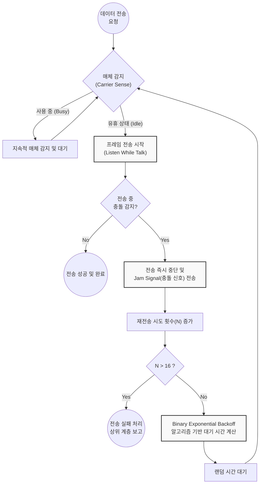

# CSMA/CD (Carrier Sense Multiple Access with Collision Detection)

---

## I. 유선 랜 환경의 충돌 감지 기반 다중 접속 제어, CSMA/CD의 개요

* **가. CSMA/CD의 정의**: 유선 이더넷(IEEE 802.3) 환경에서 각 노드가 통신 매체의 유휴 상태를 확인한 후 데이터를 전송하며, 전송 중 충돌이 감지되면 즉시 중단하고 임의의 시간 대기 후 재전송하는 매체 접근 제어([[MAC]]) [[프로토콜]]
* **나. CSMA/CD의 특징 및 동작 방식**:
* **LBT 및 LWT 구조**: 전송 전 매체를 확인(Listen Before Talk)하고, 전송 중에도 충돌 여부를 지속 모니터링(Listen While Talk)함
* **공유 매체 접근 제어**: 버스(Bus) 토폴로지 및 허브(Hub) 기반의 반이중(Half-Duplex) 통신 환경에서 필수적으로 요구되는 기법
* **충돌 인지 및 복구**: 신호의 전압 변화를 통해 물리적 충돌을 감지하며, 잼 신호(Jam Signal)를 통해 망 내 모든 노드에 충돌 발생을 전파함

---

## II. CSMA/CD의 개념도 및 핵심 기술 요소

### 가. CSMA/CD의 동작 원리 및 알고리즘 흐름도

* 송신 노드는 데이터 전송 중 물리적 신호의 중첩(전압 증폭 등)을 통해 충돌을 감지하면 즉시 데이터 전송을 중지하고 복구 메커니즘을 가동함

### 나. CSMA/CD의 핵심 기술 요소

| 구분 | 요소기술(키워드) | 세부 설명 |
| --- | --- | --- |
| **상태 감지** | Carrier Sense | 노드가 데이터를 전송하기 전 매체의 신호 유무를 확인하여 유휴 상태인지 판단하는 기술 |
| **다중 접근** | Multiple Access | 통신 매체가 비어있을 경우, 네트워크 상의 어떤 노드라도 자유롭게 매체를 점유하여 전송 가능 |
| **충돌 감지** | Collision Detection | 프레임 전송 중 송신한 신호와 매체 상의 수신 신호 전압 레벨을 비교하여 충돌 발생을 인지 |
| **충돌 전파** | Jam Signal | 충돌을 감지한 노드가 네트워크 상의 다른 모든 노드에게 충돌 사실을 알리기 위해 보내는 32비트 특수 신호 |
| **대기 시간 계산** | BEB (이진 지수 백오프) | 충돌 횟수(n)에 비례하여 대기 시간의 범위($0 \sim 2^n-1$)를 기하급수적으로 늘려 재충돌 확률을 최소화하는 [[알고리즘]] |
| **충돌 보장** | Slot Time (슬롯 타임) | 네트워크 양 끝단 간의 왕복 지연 시간으로, 충돌을 확실히 감지하기 위한 이더넷 프레임의 최소 크기(64 Byte) 결정 기준 |

---

## III. CSMA/CD의 진화 및 현대 이더넷 환경에서의 전망

### 가. MAC 프로토콜 비교 (CSMA/CD vs CSMA/CA)

| 비교 항목 | CSMA/CD (유선 이더넷) | [[CSMA CA|CSMA/CA]] (무선 랜) |
| --- | --- | --- |
| **통신 매체 및 표준** | 유선 환경 (IEEE 802.3) | 무선 환경 (IEEE 802.11) |
| **핵심 목적** | 충돌 발생 후 **빠른 감지 및 사후 복구** | 충돌 불가능성 극복을 위한 **사전 회피** |
| **[[신뢰성]] 검증** | 하드웨어적 전압 변화로 직접 감지 | ACK 수신 여부로 간접적 확인 |
| **제어 오버헤드** | 적음 (Jam Signal 외 특수 프레임 없음) | 큼 (RTS, CTS, ACK 등 부가 프레임 발생) |

### 나. 기술의 한계점 및 최신 발전 동향

* **스위치드 이더넷(Switched Ethernet)의 보편화**: 과거 더미 허브(Hub) 환경에서는 모든 포트가 하나의 충돌 도메인(Collision Domain)이었으나, 현대의 L2 스위치는 포트별로 충돌 도메인을 분할하여 충돌 가능성을 근본적으로 제거함
* **전이중 통신(Full-Duplex)으로 인한 메커니즘 무효화**: 송신과 수신 채널이 물리적으로 분리된 기가비트 이더넷(GbE) 및 10GbE 이상의 환경에서는 CSMA/CD 알고리즘이 사실상 동작하지 않으며(비활성화), MAC 계층은 흐름 제어(Flow Control) 및 혼잡 제어에 집중하는 형태로 진화함

---

### 🔗 연관 토픽

- **소속 도메인**: [[00_네트워크_MOC|🌐 네트워크]]
- **세부 분류**: `1. OSI 7계층 & 데이터링크 계층 (L1/L2)`
- **핵심 연관 토픽**:
  - [[CSMA CA|CSMA/CA]]
  - [[데이터 링크 계층|데이터 링크 계층 (Data Link Layer)]]
  - [[Data Link(2) 레이어]]
  - [[OSI 7 Layer|OSI 7 Layer (ISO 7498)]]
  - [[프로토콜]]
