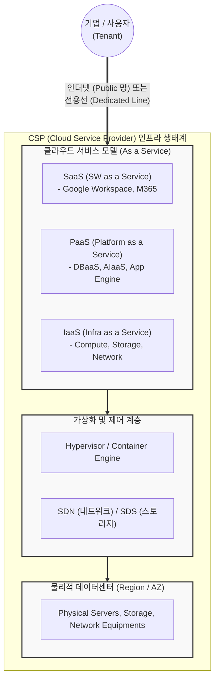

# CSP (Cloud Service Provider)

---

## I. 기업의 IT 인프라 혁신 파트너, CSP의 개요

* **가. CSP(Cloud Service Provider)의 정의**: 기업이나 개인에게 인터넷을 통해 서버, 스토리지, 네트워크, 소프트웨어 등의 [[클라우드 컴퓨팅]] 자원을 빌려주고, 사용한 만큼 과금(Pay-as-you-go)하는 제3자 IT 서비스 제공 사업자
* **나. CSP의 등장배경 및 주요 특징**:
* **등장배경**: 대규모 IT 초기 투자(CAPEX) 부담 완화, 비즈니스 민첩성(Agility) 요구 증대, 온프레미스(On-premise) [[유지보수]] 오버헤드 감소 필요
* **특징**:
* **자원 풀링 및 멀티테넌시**: 대규모 물리적 자원을 가상화하여 다수의 사용자(Tenant)에게 논리적으로 분할 제공
* **신속한 탄력성(Elasticity)**: 트래픽 증감에 따라 IT 자원을 실시간으로 스케일 업/다운(Scale-up/down) 가능
* **온디맨드 셀프 서비스**: 서비스 제공자의 개입 없이 사용자가 포털을 통해 필요한 자원을 즉시 [[프로비저닝]]

---

## II. CSP의 서비스 개념도 및 핵심 제공 기술

### 가. CSP 서비스 개념도 및 동작 원리

* 사용자는 퍼블릭 인터넷 또는 전용선을 통해 CSP가 구축해 놓은 IaaS, [[PaaS]], SaaS 형태의 서비스를 목적에 맞게 선택하여 사용하고, 기반이 되는 [[가상화]] 인프라 및 물리적 데이터센터의 관리는 CSP가 전담함

### 나. CSP의 핵심 기술 및 구성 요소

| 구분 | 요소기술(키워드) | 세부 설명 |
| --- | --- | --- |
| **서비스 모델** | IaaS (Infra) | [[CPU]], 메모리, 스토리지 등 기초 컴퓨팅 인프라를 가상화하여 제공 (예: AWS EC2) |
| **서비스 모델** | PaaS (Platform) | 애플리케이션 개발, 실행, 관리를 위한 [[OS(운영체제)|운영체제]] 및 미들웨어, 런타임 환경 제공 |
| **서비스 모델** | SaaS (Software) | 설치 없이 웹 브라우저를 통해 구독 형태로 즉시 사용 가능한 완제품 소프트웨어 제공 |
| **기반 기술** | 가상화 / [[컨테이너]] | 하이퍼바이저([[Hypervisor (VMM)|Hypervisor]]) 및 도커([[도커|Docker]]) 기반으로 자원의 논리적 분할 및 격리 지원 |
| **기반 기술** | [[SDN(Software Defined Network)|SDN]] / [[NFV]] | 물리적 네트워크 장비의 제어부를 소프트웨어로 분리하여 유연한 네트워크 프로비저닝 수행 |
| **관리 기술** | 오케스트레이션 | Kubernetes(K8s) 등을 활용하여 수많은 컨테이너 및 가상 머신의 배포와 확장을 자동화 |
| **보안 기술** | [[IAM]] / CSPM | 클라우드 접근 권한 제어(IAM) 및 클라우드 보안 [[형상 관리]](CSPM)를 통한 컴플라이언스 준수 |
| **확장 모델** | [[XaaS]] / AIaaS | 서버리스(FaaS), DBaaS, [[인공지능]] API 모델([[초거대 언어 모델|LLM]]) 등 IT 자원의 모든 요소를 서비스로 확장 제공 |

---

## III. CSP와 MSP의 비교 및 최신 클라우드 서비스 동향

### 가. 클라우드 생태계의 핵심 파트너, CSP와 MSP의 비교

| 비교 항목 | CSP (Cloud Service Provider) | MSP (Managed Service Provider) |
| --- | --- | --- |
| **핵심 역할** | 클라우드 **인프라 자원 자체의 제공** 및 관리 | 기업의 클라우드 **도입, 구축, 마이그레이션, 운영 대행** |
| **주요 제공 가치** | 확장성, [[HA(High Availability)|가용성]] 보장, 최신 글로벌 IT 인프라 환경 제공 | 아키텍처 설계 컨설팅, 이기종 클라우드 통합 모니터링 |
| **인프라 소유** | 대규모 데이터센터(Region/AZ) 직접 소유 및 구축 | 인프라를 소유하지 않고, 고객의 CSP 자원 관리에 집중 |
| **비용 관리** | 자원 사용량에 따른 종량제 인프라 요금 청구 | 멀티 클라우드 비용 최적화(FinOps) 리포팅 및 운영 수수료 |
| **대표 기업** | AWS, MS Azure, Google Cloud, Naver Cloud 등 | 메가존클라우드, 베스핀글로벌, 삼성SDS, LG CNS 등 |

### 나. 최신 CSP 발전 동향

* **소버린 클라우드(Sovereign Cloud)의 확산**: 각국의 데이터 주권(Data Sovereignty) 강화 기조에 따라, 공공 및 금융 기관의 데이터가 해외로 반출되지 않고 현지 법률 및 규제를 엄격하게 준수하도록 격리된 국가 맞춤형 리전(Region) 구축 증가 (예: [[CSAP]] 인증 체계 대응)
* **AI 모델 서비스(AIaaS) 경쟁 심화**: CSP들이 단순 인프라 대여를 넘어 자사의 대규모 클라우드 자원을 활용해 생성형 AI 모델(LLM)을 학습시키고, 이를 API 플랫폼(예: AWS Bedrock, Google Vertex AI) 형태로 제공하여 기업의 자체 AI 구축 부담을 경감시키는 비즈니스로 핵심 역량을 전환 중임

---

### 🔗 연관 토픽

- **소속 도메인**: [[00_디지털서비스_MOC|🚀 디지털서비스]]
- **세부 분류**: `1. 클라우드 컴퓨팅 & 가상화 인프라`
- **핵심 연관 토픽**:
  - [[클라우드 컴퓨팅|클라우드 컴퓨팅 (Cloud Computing)]]
  - [[XaaS|XaaS(Everything as a Service)]]
  - [[CSAP|CSAP, CSAP(Cloud Security Assurance Program)]]
  - [[컨테이너|컨테이너 (Container)]]
  - [[가상화]]
