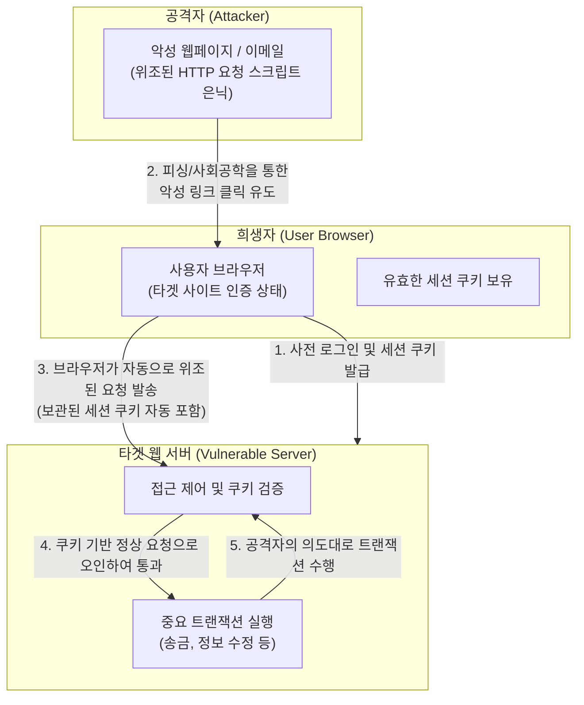

# Cross-Site Request Forgery (CSRF)

---

## I. 신뢰된 사용자의 권한을 도용하는 웹 보안 위협, CSRF의 개요

* **가. CSRF(Cross-Site Request Forgery)의 정의**: 인증된 사용자가 자신의 의지와 무관하게 공격자가 의도한 행위(비밀번호 변경, 결제 등)를 특정 웹사이트에 요청하게 만드는 크로스 사이트 요청 위조 해킹 기법
* **나. CSRF의 동작 특징 및 위험성**:
* **[[세션]] [[쿠키]] 자동 전송 악용**: 브라우저가 HTTP 요청 시 도메인에 종속된 세션 쿠키를 자동으로 포함하여 전송하는 특성을 악용함
* **무상태성 및 식별 불가**: 서버는 정상적인 사용자가 보낸 요청인지, 공격자에 의해 위조된 사이트에서 발송된 요청인지 쿠키만으로는 구분하지 못함
* **상태 변경(State-Changing) 유발**: [[XSS]]가 데이터 탈취에 집중한다면, CSRF는 권한을 도용하여 서버 측의 데이터를 변경하고 조작하는 데 목적이 있음

---

## II. CSRF의 공격 메커니즘 및 핵심 방어 기술

### 가. CSRF 공격 메커니즘 및 동작 원리

* 공격자는 희생자가 이미 인증을 유지하고 있는 상태를 노려 악성 스크립트를 실행하게 만들고, 서버는 동반된 세션 쿠키를 신뢰하여 위조된 트랜잭션을 승인함

### 나. CSRF의 핵심 방어 및 대응 기술

| 구분 | 방어/대응 기술(키워드) | 세부 설명 |
| --- | --- | --- |
| **토큰 검증** | Anti-CSRF Token (동기화 토큰) | 사용자의 요청 폼(Form)에 난수로 생성된 일회성 토큰을 은닉(Hidden) 삽입하여, 서버에서 세션 토큰과 일치 여부 검증 |
| **토큰 검증** | Double Submit Cookie | 서버 상태 유지가 어려운 환경에서, 난수 토큰을 쿠키와 요청 파라미터 양쪽에 담아 보내 일치 여부를 검증하는 무상태 기법 |
| **쿠키 제어** | SameSite 속성 (Strict/Lax) | 타 도메인에서 시작된 크로스 사이트 요청 시 브라우저가 세션 쿠키를 서버로 전송하지 않도록 원천 차단 |
| **헤더 검증** | Referer / Origin 헤더 검증 | HTTP 요청 헤더에 포함된 출발지(Source) 주소와 목적지(Target) 주소가 동일 출처인지 서버에서 확인 |
| **헤더 검증** | Fetch Metadata (Sec-Fetch-Site) | 최신 브라우저가 제공하는 메타데이터 헤더를 확인하여 요청의 출처(Same-origin, Cross-site 등)를 식별하고 차단 |
| **API 보안** | Custom HTTP Header 검증 | [[AJAX]]/REST API 통신 시 `X-Requested-With` 등의 커스텀 헤더 삽입을 강제하여 외부 도메인에서의 위조 요청 방지 |
| **인증 강화** | Re-authentication (재인증) | 결제, 계정 정보 변경 등 중요 상태 변화를 유발하는 [[트랜잭션]] 수행 시 비밀번호 재입력, CAPTCHA, 2FA 요구 |
| **연계 방어** | XSS 차단 및 [[CSP]] 적용 | XSS 취약점이 존재할 경우 CSRF 토큰이 탈취되어 모든 방어 기법이 무력화되므로, 입출력 필터링 및 콘텐츠 보안 정책(CSP) 병행 |

---

## III. CSRF와 XSS의 비교 및 최신 보안 동향

### 가. 웹 애플리케이션 주요 취약점(CSRF vs XSS) 비교

| 비교 항목 | CSRF (Cross-Site Request Forgery) | XSS (Cross-Site Scripting) |
| --- | --- | --- |
| **공격 타겟(대상)** | **웹 서버** (애플리케이션 상태 변경) | **클라이언트** (웹 브라우저 사용자) |
| **주요 공격 목적** | 사용자의 권한을 도용하여 서버의 데이터 조작(송금 등) | 악성 스크립트를 실행하여 세션 쿠키 탈취, 피싱 |
| **악용되는 메커니즘** | 브라우저의 HTTP 요청 **쿠키 자동 전송** 특성 | 서버의 **부적절한 입력값 검증** 미흡 |
| **공격의 발생 위치** | 공격자가 통제하는 외부(Cross) 도메인에서 요청 발생 | 취약한 타겟 사이트 내부에서 스크립트 실행 |
| **핵심 방어 대책** | Anti-CSRF 토큰, SameSite 쿠키, Referer 검증 | 특수문자 입출력 인코딩(필터링), CSP 도입 |

### 나. CSRF 보안 방어의 향후 전망 및 동향

* **SameSite 쿠키의 기본 적용**: 최근 구글 크롬 등 모던 브라우저들은 서드파티 쿠키 보안 강화를 위해 쿠키의 SameSite 속성 기본값을 'Lax'로 적용하여 기본적인 CSRF 공격을 자체적으로 차단하는 추세임
* **심층 방어(Defense in Depth) 아키텍처 필수**: SameSite 정책만으로는 서브도메인 탈취나 특정 우회 기법에 완벽히 대응할 수 없으며, 특히 XSS 취약점이 존재할 경우 CSRF 방어 체계가 완전히 무너지므로 **[[프레임워크]] 자체에서 제공하는 Anti-CSRF 토큰 사용과 철저한 XSS 방어(입력 검증)를 결합**한 다중 방어 전략이 요구됨

---

### 🔗 연관 토픽

- **소속 도메인**: [[00_보안_MOC|🛡️ 보안]]
- **세부 분류**: `2. 현대 암호학 & 키 관리 · 전자서명`
- **핵심 연관 토픽**:
  - [[쿠키]]
  - [[XSS]]
  - [[크로스 사이트 스크립팅]]
  - [[사이트간 위조공격]]
  - [[SSRF(Server-Side Request Forgery)]]
