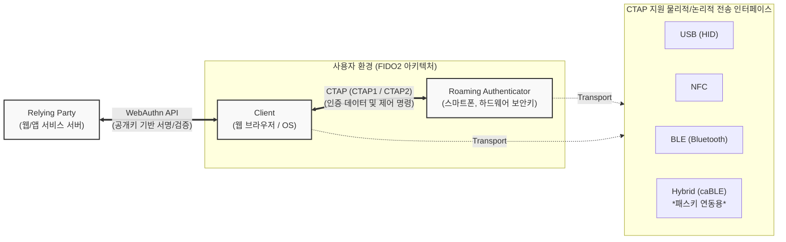

# CTAP (Client to Authenticator Protocol)

---

## I. 패스워드리스 인증을 위한 FIDO2 핵심 프로토콜, CTAP의 개요

* **가. CTAP(Client to Authenticator Protocol)의 정의**: FIDO2 표준 아키텍처에서 웹 브라우저나 [[OS(운영체제)|운영체제]] 등의 '클라이언트'와 스마트폰, 보안 키 등의 '외부 인증기(Authenticator)' 간의 안전한 통신과 인증 데이터를 교환하기 위한 규약
* **나. CTAP의 필요성 및 특징**:
* **필요성**: 피싱, 크리덴셜 스터핑 등 패스워드 기반 인증의 취약점 극복, 로밍 인증기(스마트폰 등)를 활용한 크로스 디바이스(Cross-Device) 패스워드리스 환경 구축
* **특징**: WebAuthn과 결합하여 E2E([[End-to-End]]) FIDO2 인증 구현, USB/[[NFC]]/BLE 등 다양한 전송 매체 지원, CBOR 기반의 경량화된 데이터 직렬화 처리

---

## II. CTAP의 개념도 및 핵심 기술 요소

### 가. CTAP의 개념도 및 동작 원리

* **동작 원리**: 사용자가 웹(Client)에서 로그인을 시도하면, 클라이언트가 CTAP을 통해 외부 인증기(Auth)로 인증을 요청하고, 인증기는 지문/PIN 등으로 사용자를 로컬 인증한 후 서명된 값을 CTAP을 통해 다시 클라이언트로 반환함

### 나. CTAP의 핵심 기술 및 구성 요소

| 구분 | 요소기술(키워드) | 세부 설명 |
| --- | --- | --- |
| **통신 규약** | CTAP1 (구 U2F) | 기존 [[FIDO]] U2F(Universal 2nd Factor)와의 하위 호환성을 제공하는 2단계 인증용 [[프로토콜]] |
| **통신 규약** | CTAP2 | 완전한 패스워드리스(Passwordless) 로그인 및 다중 인증(MFA)을 지원하는 FIDO2 핵심 프로토콜 |
| **데이터 포맷** | CBOR | 데이터 전송 크기를 최소화하기 위해 [[JSON]] 대신 사용하는 간결한 바이너리 객체 표현(Concise Binary Object Rep.) |
| **[[전송 계층]]** | Transport (USB/NFC/BLE) | 디바이스 간 물리적 통신 채널 (USB HID, 근거리 무선 통신, 블루투스 저전력) |
| **전송 계층** | Hybrid Transport (caBLE) | 클라우드 보조 블루투스(caBLE) 기술로, PC 브라우저와 스마트폰 간의 원격 [[패스키|패스키(Passkey)]] 인증을 위한 논리적 채널 |
| **보안 검증** | Attestation (인증기 증명) | 사용 중인 인증기가 신뢰할 수 있는 제조사로부터 안전하게 제작되었음을 RP 서버에 암호학적으로 증명 |
| **사용자 인증** | User Verification (UV) | 기기 소지뿐만 아니라 생체인식(지문/안면)이나 PIN을 통해 실제 사용자 본인임을 로컬 기기에서 검증하는 과정 |

---

## III. CTAP 버전별 비교 및 패스키(Passkey) 기반 최신 진화 동향

### 가. CTAP1과 CTAP2의 기술적 특성 비교

| 비교 항목 | CTAP1 (FIDO U2F) | CTAP2 (FIDO2) |
| --- | --- | --- |
| **기본 목적** | 비밀번호를 보완하는 **2차 인증(2FA)** | 비밀번호를 대체하는 **패스워드리스 인증** |
| **사용자 인증(UV)** | 미지원 (단순 기기 터치/소지 확인) | **지원** (PIN, 지문, 안면 인식 등 로컬 인증) |
| **상태 유지** | Resident Key 미지원 (인증기에 크리덴셜 미저장) | **Resident Key(Discoverable Credential) 지원** |
| **데이터 포맷** | Raw Binary Messages | **CBOR** (Concise Binary Object Representation) |

### 나. 향후 전망 및 동향 (Passkey 패러다임)

* **크로스 디바이스 인증(CDA)의 핵심**: 최근 구글, 애플, MS가 주도하는 **패스키(Passkeys)** 생태계 확산에 따라, PC(클라이언트)에서 스마트폰(인증기)에 저장된 패스키를 호출하기 위해 **CTAP 기반의 Hybrid Transport(caBLE)** 기술이 모바일-PC 연동의 핵심 기술로 자리 잡음
* **CTAP 2.2 표준 고도화**: 동적 PIN 설정, 엔터프라이즈 환경에서의 증명(Attestation) 정책 강화, 멀티 인증기 간 동기화 지원 등 보안성과 사용자 편의성을 동시에 높이는 방향으로 프로토콜이 지속 확장 중임

---

### 🔗 연관 토픽

- **소속 도메인**: [[00_보안_MOC|🛡️ 보안]]
- **세부 분류**: `2. 현대 암호학 & 키 관리 · 전자서명`
- **핵심 연관 토픽**:
  - [[FIDO]]
  - [[패스키|패스키(Passkey)]]
  - [[FIDO 1.0 (Fast IDentity Online 1.0)]]
  - [[FIDO 2.0 (Fast IDentity Online 2.0)]]
  - [[프로토콜]]
