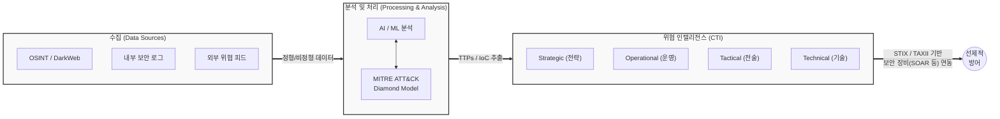

# CTI (Cyber Threat Intelligence)

---

## I. 지능형 사이버 위협에 대한 선제적 방어 체계, CTI의 개요

* **가. CTI(Cyber Threat Intelligence)의 정의**: 사이버 공격과 관련된 다양한 데이터와 정보를 수집 및 분석하여, 공격자의 의도, 목적, TTPs(전술·기술·절차)를 파악하고 선제적 방어를 가능하게 하는 지능형 위협 정보
* **나. CTI의 필요성 및 특징**:
* **필요성**: 기존의 침해사고 사후 대응(Reactive) 위주에서 벗어나, 고도화된 APT 공격 및 제로데이 위협에 대한 사전 예방(Proactive) 체계로의 패러다임 전환 필요
* **특징**: 증거 기반의 지식 확보, 위협 인텔리전스 라이프사이클(기획-수집-처리-분석-배포) 기반 지속적 고도화, 자동화된 위협 정보 공유 체계(STIX/TAXII) 활용

---

## II. CTI의 개념도 및 핵심 기술 요소

### 가. CTI의 정보 처리 아키텍처 및 라이프사이클 개념도

* 다양한 출처에서 원시 데이터를 수집하여 분석 프레임워크를 통해 컨텍스트를 부여하고, 이를 계층별 보안 관계자(C-Level, SOC 분석가 등)에게 맞춤형 인텔리전스로 배포하여 방어 체계에 즉각 적용함

### 나. CTI의 핵심 기술 및 구성 요소

| 구분 | 요소기술(키워드) | 세부 설명 |
| --- | --- | --- |
| **분석 [[프레임워크]]** | [[MITRE ATT&CK (Adversarial Tactics, Techniques & Common Knowledge)|MITRE ATT&CK]] | 해커의 공격 과정을 전술(Tactics), 기술(Techniques), 절차(Procedures)로 분류한 글로벌 지식 기반 프레임워크 |
| **분석 프레임워크** | Diamond Model | 사이버 공격을 공격자(Adversary), 인프라(Infra), 피해자(Victim), 역량(Capability)의 4대 요소로 모델링하는 기법 |
| **위협 지표** | IoC (Indicator of Compromise) | 침해사고의 징후를 나타내는 기술적 식별 지표 (예: 악성 IP, 악성코드 해시값, C&C 서버 도메인 등) |
| **위협 지표** | TTPs | 공격자의 전략, 기술, 절차를 의미하며, 단순 IoC 차단을 넘어선 공격자의 근본적인 행위 기반 패턴 지표 |
| **공유 표준** | STIX | 사이버 위협 정보를 구조화된 언어로 표현하기 위한 [[XML]]/[[JSON]] 기반의 국제 표준 규격 (OASIS 표준) |
| **공유 표준** | TAXII | STIX로 작성된 위협 인텔리전스 정보를 시스템 간에 실시간으로 안전하게 교환하기 위한 전송 [[프로토콜]] |
| **CTI 레벨(유형)** | 전략적/운영적 CTI | C-Level의 비즈니스 리스크 의사결정 지원(전략적), 보안 매니저의 위협 캠페인 분석 및 헌팅 수행(운영적) |
| **CTI 레벨(유형)** | 전술적/기술적 CTI | SOC 분석가의 TTPs 중심 방어(전술적), 실무 보안 장비(FW, IPS)에 적용되는 단기적 IoC 정보 차단(기술적) |

---

## III. 전통적 보안 체계와의 비교 및 CTI의 향후 전망

### 가. 전통적 보안 대응과 CTI 기반 보안 대응 비교

| 비교 항목 | 전통적 보안 체계 | CTI 기반 보안 체계 |
| --- | --- | --- |
| **대응 방식** | 사후 대응적 (Reactive) 및 이벤트 중심 | 사전 예방적 (Proactive) 및 컨텍스트 중심 |
| **주요 방어 대상** | 알려진 위협 (Signature 기반 탐지) | 알려지지 않은 위협, 제로데이, APT 공격 방어 |
| **핵심 식별 지표** | IP 주소, 파일 해시 (수명이 짧은 지표) | TTPs, 공격자 인프라/도구 (수명이 길고 우회하기 어려운 지표) |
| **정보의 고도화** | 단편적인 보안 로그 및 알림(Alert) 위주 | 데이터 상관관계 분석을 통한 실행 가능한(Actionable) 지식 |

### 나. 향후 전망 및 기술 동향

* **생성형 AI(GenAI)와 CTI의 융합 (AI-Driven CTI)**: Security Copilot과 같은 거대 언어 모델([[초거대 언어 모델|LLM]])이 방대한 자연어 기반의 위협 보고서와 다크웹 데이터를 실시간으로 요약 및 번역하고, IoC 및 TTPs를 자동으로 추출하여 [[위협 헌팅]](Threat Hunting)의 효율성을 극대화하는 추세임
* **[[SOAR (Security Orchestration, Automation and Response)|SOAR]](보안 오케스트레이션·자동화·대응)와의 연동 가속화**: 탐지된 CTI 위협 피드를 기반으로 [[SIEM]] 및 SOAR 솔루션과 자동 연동되어, 사람의 개입 없이 악성 IP 차단 및 격리 조치까지 이어지는 자동화된 플레이북(Playbook) 기반 능동 방어 체계로 발전 중임

---

### 🔗 연관 토픽

- **소속 도메인**: [[00_보안_MOC|🛡️ 보안]]
- **세부 분류**: `3. 네트워크 & 엔드포인트 · 인프라 보안`
- **핵심 연관 토픽**:
  - [[위협 헌팅|위협 헌팅(Threat Hunting)]]
  - [[SIEM]]
  - [[SOAR (Security Orchestration, Automation and Response)]]
  - [[CVE]]
  - [[샌드박스|샌드박스 (Sandbox)]]
