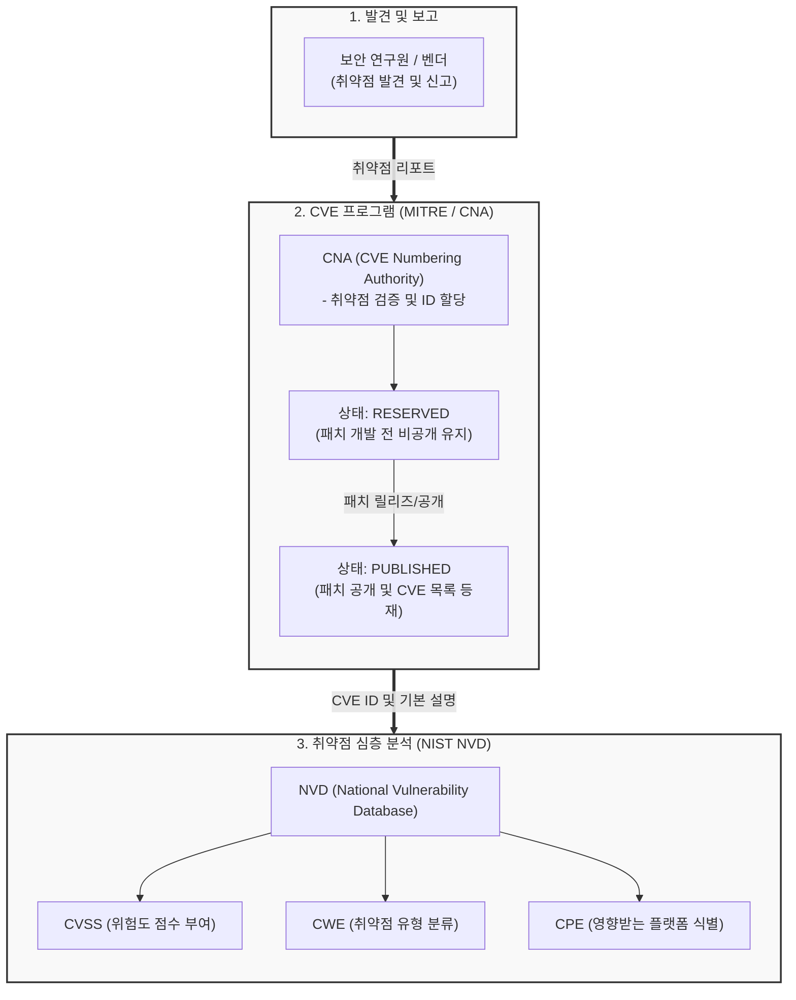

# CVE (Common Vulnerabilities and Exposures)

---

## I. 사이버 보안 위협의 표준화된 식별 체계, CVE의 개요

* **가. CVE(Common Vulnerabilities and Exposures)의 정의**: 공개적으로 알려진 소프트웨어 및 하드웨어의 보안 취약점(Vulnerability)과 노출(Exposure) 상태를 고유한 식별자로 표준화하여 명명한 취약점 사전(Dictionary)
* **나. CVE의 필요성 및 특징**:
* **필요성**: 이기종 보안 솔루션 간 취약점 정보 공유의 일관성 확보, 신속한 보안 패치 및 체계적인 취약점 관리(Vulnerability Management) 기반 마련
* **특징**:
* **고유 식별자(Unique ID)**: 전 세계적으로 통용되는 단일 식별 체계(CVE-YYYY-NNNNN) 제공
* **분산 할당 체계**: MITRE Corporation의 총괄 하에 지정된 CNA(CVE Numbering Authority)가 식별자 할당
* **공공재 성격**: 누구나 열람 가능한 공개 데이터로, NVD 등 각종 보안 데이터베이스의 인덱스로 활용

---

## II. CVE의 발급 프로세스 및 핵심 구성 요소

### 가. CVE의 발급 라이프사이클 및 연계 개념도

* 발견된 취약점은 CNA를 통해 고유 ID가 부여되며(CVE), 이후 NIST가 운영하는 NVD로 이관되어 위험도([[CVSS]]) 및 상세 기술 정보가 보강(Enrichment)되는 흐름을 가짐

### 나. CVE 및 취약점 관리의 핵심 기술 요소

| 구분 | 요소기술(키워드) | 세부 설명 |
| --- | --- | --- |
| **식별 체계** | CVE ID | `CVE-연도-일련번호` 형식으로 구성된 취약점의 고유 식별자 (예: CVE-2026-12345) |
| **운영 주체** | CNA (Numbering Auth.) | MITRE로부터 권한을 위임받아 자사 제품이나 특정 영역의 CVE ID를 할당하는 기관 (MS, Oracle 등) |
| **상태 관리** | CVE Status (상태 값) | 취약점의 처리 단계에 따라 RESERVED, PUBLISHED, REJECTED, DISPUTED 상태로 관리 |
| **평가 지표** | CVSS (위험도 평가) | 취약점의 심각도를 0.0부터 10.0까지의 점수와 정형화된 벡터(Vector)로 평가하는 개방형 [[프레임워크]] |
| **원인 분류** | [[CWE]] (약점 열거) | 버퍼 오버플로우, [[SQL(Structured Query Language)|SQL]] 인젝션 등 소프트웨어 보안 약점의 근본적인 원인(유형)을 분류한 체계 |
| **대상 식별** | CPE (플랫폼 열거) | 취약점이 존재하는 하드웨어, [[OS(운영체제)|운영체제]], 애플리케이션의 버전을 명확히 식별하기 위한 표준 명명법 |
| **통합 DB** | NVD (국가 취약점 DB) | 미국 NIST에서 운영하며, CVE 목록을 기반으로 CVSS, CWE, CPE, 패치 정보 등을 통합 제공하는 [[데이터베이스]] |
| **자동화 표준** | SCAP | CVE, CVSS, CPE 등의 표준을 활용하여 취약점 점검 및 보안 설정을 자동화하기 위한 [[프로토콜]] |

---

## III. CVE 관련 주요 보안 표준 비교 및 향후 동향

### 가. 보안 취약점 표준 체계 비교 (CVE vs NVD vs CWE)

| 비교 항목 | CVE (Common Vulnerabilities) | NVD (National Vulnerability DB) | CWE (Common Weakness) |
| --- | --- | --- | --- |
| **핵심 목적** | 취약점의 **고유 식별 및 목록화** | 취약점의 **심층 분석 및 평가** | 취약점의 **근본 원인/유형 분류** |
| **운영 기관** | MITRE Corporation | NIST (미국 국립표준기술연구소) | MITRE Corporation |
| **제공 정보** | CVE ID, 단순 요약 설명, 참조 링크 | CVSS 점수, CPE 매핑, 완화 방법 | 보안 설계 결함 패턴, 코딩 오류 등 |
| **비유(역할)** | 증상에 대한 **"이름표 (사전)"** | 증상의 심각도를 담은 **"진단서"** | 병을 일으키는 **"원인균 (분류학)"** |

### 나. 향후 전망 및 활용 동향

* **오픈소스 생태계 폭발로 인한 CVE 급증 및 자동화**: 오픈소스 소프트웨어 사용이 보편화됨에 따라 매년 발급되는 CVE 건수가 기하급수적으로 증가하고 있으며, 이를 효과적으로 대응하기 위해 [[CTI]](사이버 위협 인텔리전스) 및 AI 기반의 자동화된 취약점 식별·분석 기술이 요구됨
* **KEV(Known Exploited Vulnerabilities) 중심의 우선순위화**: 수만 개의 CVE 중 실제로 해커에 의해 악용 중인 취약점을 CISA가 KEV 카탈로그로 별도 관리함에 따라, 기업들은 단순 CVSS 점수 기반의 패치에서 벗어나 **실제 악용 여부(KEV) 기반의 리스크 우선순위화(Risk-based Vulnerability Management)** 전략으로 대응 체계를 고도화하고 있음

---

### 🔗 연관 토픽

- **소속 도메인**: [[00_보안_MOC|🛡️ 보안]]
- **세부 분류**: `3. 네트워크 & 엔드포인트 · 인프라 보안`
- **핵심 연관 토픽**:
  - [[CWE]]
  - [[CVSS]]
  - [[CTI]]
  - [[지속적인 위협 노출 관리|지속적인 위협 노출 관리(CTEM)]]
  - [[시큐어코딩]]
