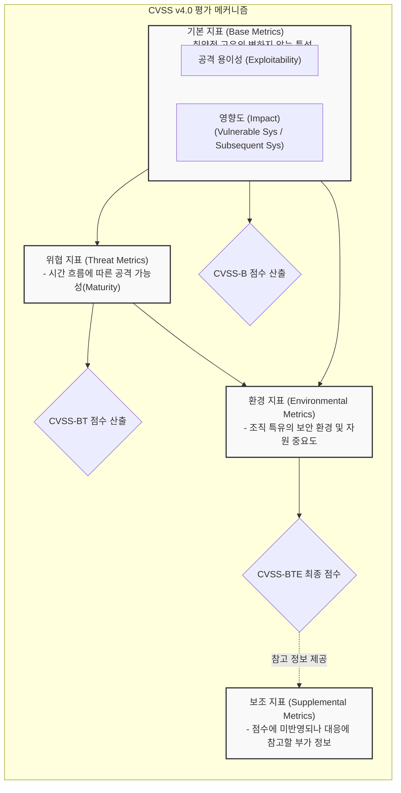

# CVSS (Common Vulnerability Scoring System)

---

## I. 객관적인 취약점 심각도 평가 표준, CVSS의 개요

* **가. CVSS(공통 취약점 등급 시스템)의 정의**: 소프트웨어 및 하드웨어 보안 취약점의 심각도(Severity)와 특성을 0.0부터 10.0까지의 정량적 점수와 벡터(Vector) 문자열로 평가하여, 보안 패치 및 대응의 우선순위를 결정하도록 돕는 글로벌 개방형 [[프레임워크]]
* **나. CVSS의 필요성 및 특징**:
* **필요성**: 벤더마다 상이한 취약점 평가 기준으로 인한 혼란 가중, 방대한 취약점([[CVE]]) 중 실제 조치가 시급한 위협의 선별 기준 필요
* **특징**: FIRST(보안사고 대응팀 협의회) 주도의 글로벌 표준, Base/Threat/Environmental 지표 조합을 통한 다각적 분석, 최신 v4.0 규격을 통한 OT/ICS 및 클라우드 환경 지원 강화

---

## II. CVSS의 개념도 및 핵심 구성 요소 (v4.0 기준)

### 가. CVSS v4.0의 평가 프레임워크 개념도

* 기본 지표(Base)를 바탕으로, 현재 시점의 위협 지표(Threat, 구 Temporal)와 대상 조직의 환경 지표(Environmental)를 결합하여 최종 심각도 점수(CVSS-BTE)를 산출함

### 나. CVSS v4.0의 핵심 기술 및 구성 요소

| 분류 (지표) | 요소기술(키워드) | 세부 설명 |
| --- | --- | --- |
| **기본 (Base)** | 공격 용이성 (Exploitability) | 공격 벡터(AV), 공격 복잡도(AC), 요구 권한(PR), 사용자 상호작용(UI) 기반 평가 |
| **기본 (Base)** | 시스템 영향도 (Impact) | v4.0에서 **취약 시스템(VC, IC, AC)**과 **후속 시스템(SC, SI, SA)**의 [[기밀성]]/[[무결성]]/[[HA(High Availability)|가용성]] 영향도로 세분화 |
| **위협 (Threat)** | 공격 성숙도 ([[Exploit]] Maturity) | 기존 Temporal 지표를 개편, 현재 공격 코드(PoC)의 존재 여부 및 실제 악용 상태를 반영 (E) |
| **환경 (Env.)** | 보안 요구사항 (Security Req.) | 해당 취약점이 존재하는 조직 내 자산의 기밀성(CR), 무결성(IR), 가용성(AR) 중요도 반영 |
| **보조 (Supp.)** | 안전성 (Safety) | (v4.0 신설) 취약점 악용 시 인명 피해나 물리적 손상(OT/ICS 환경)을 유발할 수 있는지 평가 (S) |
| **보조 (Supp.)** | 자동화/복구 (Automatable / Recovery) | (v4.0 신설) 공격의 자동화 가능성(A) 및 취약점 악용 후 시스템의 자동/수동 복구 가능성(R) 여부 |
| **심각도 등급** | 정량적 평가 척도 (Severity) | None(0.0), Low(0.1~3.9), Medium(4.0~6.9), High(7.0~8.9), **Critical(9.0~10.0)** 로 구분 |
| **표현 방식** | Vector String (벡터 문자열) | 평가된 각 항목의 요약값을 문자열로 표기하여 공유 (예: `CVSS:4.0/AV:N/AC:L/PR:N/UI:N/VC:H/...`) |

---

## III. CVSS 버전별 진화 및 최신 위협 관리 동향

### 가. CVSS v3.1 과 CVSS v4.0 의 핵심 변화 비교

| 비교 항목 | CVSS v3.1 | CVSS v4.0 (최신 표준) |
| --- | --- | --- |
| **지표 구성** | Base, Temporal, Environmental | Base, **Threat**, Environmental, **Supplemental** (추가) |
| **Impact(영향도) 범위** | Scope(권한 변경) 필드로 후속 영향 간접 평가 | **Vulnerable System**과 **Subsequent System**으로 명시적 분리 |
| **Temporal(위협) 지표** | 공격 코드 성숙도, 패치 수준, 보고 신뢰도 | 패치 및 신뢰도 항목 제거, **Exploit Maturity(공격 성숙도)**로 단순화 및 명칭 변경(Threat) |
| **주요 지원 환경** | IT(Web, Network, SW) 환경 중심 | IT뿐만 아니라 **OT(운영기술), ICS, IoT 환경(Safety 지표)** 지원 강화 |

### 나. 향후 전망 및 활용 동향

* **RBVM (Risk-Based Vulnerability Management) 체계로의 전환**: 단순 CVSS Base 점수(심각도)가 높다고 무조건 우선 패치하는 방식에서 벗어나, CISA의 KEV(Known Exploited Vulnerabilities) 리스트 및 CVSS v4.0의 Threat(위협) 지표를 결합하여 **"실제 해커가 악용 중인 취약점"을 최우선으로 조치**하는 리스크 기반 관리로 진화 중임
* **[[CPS]](Cyber-Physical System) 보안 표준으로 확장**: 스마트 팩토리, 자율주행차, 의료기기 등 사이버 물리 시스템 환경에서 취약점이 인명 피해로 직결될 수 있으므로, v4.0에 신설된 Safety(안전) 지표가 IoT/OT 보안 규제(예: 유럽 CRA) 대응의 핵심 지표로 적극 활용될 전망임

---

### 🔗 연관 토픽

- **소속 도메인**: [[00_보안_MOC|🛡️ 보안]]
- **세부 분류**: `4. 웹 & 애플리케이션 보안 · 취약점 점검`
- **핵심 연관 토픽**:
  - [[CVE]]
  - [[지속적인 위협 노출 관리|지속적인 위협 노출 관리(CTEM)]]
  - [[위협 모델링|위협 모델링(Threat Modeling) - Secure SDLC]]
  - [[Exploit]]
  - [[기밀성]]
