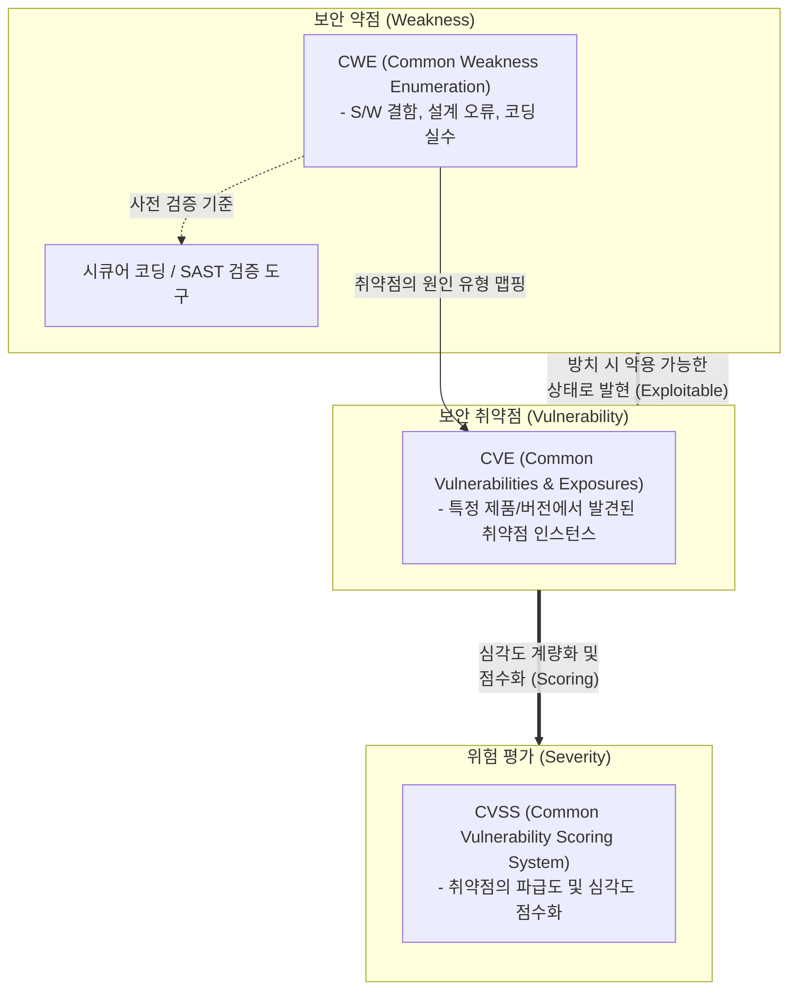

# CWE (Common Weakness Enumeration)

---

## I. 소프트웨어 보안 취약점의 근본 원인 분류 체계, CWE의 개요

* **가. CWE(Common Weakness Enumeration)의 정의**: 소프트웨어 및 하드웨어의 아키텍처, 설계, 코딩 단계에서 발생하는 보안 취약점의 근본 원인(보안 약점)을 식별하고 유형별로 분류한 글로벌 개방형 사전 체계
* **나. CWE의 필요성 및 특징**:
* **필요성**: 취약점 발생의 근본 원인 제거(Shift-Left 보안) 필요, 시큐어 코딩(Secure Coding) 가이드라인 및 정적 분석([[SAST]]) 도구의 표준 규격 제공
* **특징**:
* **근본 원인 중심(Root-Cause)**: 개별 취약점([[CVE]])이 아닌, 이를 유발하는 프로그래밍 오류 및 설계 결함(약점)의 패턴을 분류함
* **계층적 구조**: 약점을 View, Category, Weakness의 계층으로 세분화하여 관리 (MITRE 코퍼레이션 주도)
* **CWE Top 25 발표**: KEV(알려진 악용 취약점)와 [[CVSS]] 점수를 기반으로 매년 가장 위험하고 빈번한 25대 소프트웨어 약점 목록 제공

---

## II. CWE의 개념도 및 핵심 구성 요소

### 가. 취약점 생명주기 연계 개념도 및 동작 원리

* 개발 단계의 보안 약점(CWE)이 방치되어 실제 시스템에서 악용 가능한 상태로 드러나면 취약점(CVE)이 되며, 이에 대한 위험 수준과 대응 우선순위를 평가하는 것이 **CVSS**의 핵심 관계임

### 나. CWE의 핵심 기술 및 구성 요소

| 구분 | 요소기술(키워드) | 세부 설명 |
| --- | --- | --- |
| **구조적 분류** | View (뷰) | 특정 관점이나 목적(예: 개발자 관점, 연구자 관점, 모바일, Top 25 등)에 따라 약점들을 그룹화한 최상위 분류 |
| **구조적 분류** | Category (카테고리) | 공통적인 특징(예: 입력값 검증 누락, 메모리 버퍼 오류 등)을 공유하는 약점들의 집합 |
| **구조적 분류** | Weakness (약점) | 개별적이고 구체적인 소프트웨어 또는 하드웨어의 설계 및 구현 상의 결함 (CWE-ID 부여) |
| **주요 약점 (Top 25)** | CWE-79 ([[XSS]]) | 웹 애플리케이션에서 사용자 입력값 검증이 누락되어 클라이언트 측 악성 스크립트가 실행되는 결함 |
| **주요 약점 (Top 25)** | CWE-89 ([[SQL Injection]]) | [[SQL(Structured Query Language)|SQL]] 쿼리 생성 시 외부 입력값을 검증 없이 사용하여 의도치 않은 [[데이터베이스]] 명령이 실행되는 결함 |
| **주요 약점 (Top 25)** | CWE-787 (OOB Write) | 메모리 버퍼의 경계를 초과하여 데이터를 기록함으로써 시스템 붕괴나 코드 실행을 유발하는 결함 |
| **연계 표준** | CWSS (Scoring System) | 개별 소프트웨어 애플리케이션 내에 존재하는 특정 CWE 약점 인스턴스의 심각도를 평가하기 위한 점수 산정 방식 |
| **연계 표준** | CWRAF (Risk Analysis) | 특정 비즈니스 컨텍스트 및 도메인 환경에 맞춰 CWE 약점의 위험도를 평가하는 [[프레임워크]] |

---

## III. 취약점 3대 표준 비교 및 향후 전망

### 가. 취약점 3대 보안 표준(CWE, CVE, CVSS) 비교

| 비교 항목 | CWE (Common Weakness) | CVE (Common Vulnerabilities) | CVSS (Scoring System) |
| --- | --- | --- | --- |
| **핵심 목적** | 취약점의 **근본 원인(유형)** 분류 | 공개된 개별 취약점의 **고유 식별** | 발견된 취약점의 **심각도 평가** |
| **관리 대상** | 인젝션, 버퍼 오버플로우 등 **보편적 결함 패턴** | 특정 버전의 솔루션(예: Log4j 등)에서 발견된 **구체적 결함 [[인스턴스]]** | 취약점의 [[기밀성]], [[무결성]], [[HA(High Availability)|가용성]] 등 **파급 영향도** |
| **주요 활용 시기** | [[SDLC]] 전체 (기획, 설계, 시큐어 코딩 등 **사전 예방**) | 운영 단계 (침해사고 발견, 패치 릴리즈, **사후 대응**) | 운영 단계 (조치 및 패치 적용의 **우선순위 결정**) |
| **의료 비유** | 질병의 원인 체계 (예: 호흡기 바이러스 감염) | 특정 환자의 진단명 (예: 2026년 발생한 신종 코로나 변이) | 진단받은 환자의 중증도 (예: 위중증 9.0점) |

### 나. 향후 전망 및 동향

* **Shift-Left 보안의 컴플라이언스 기준화**: 시스템 개발 생명주기(SDLC) 초기부터 취약점을 제거하기 위해 정적 분석(SAST) 도구가 필수적으로 도입되고 있으며, 행정안전부 '소프트웨어 보안약점 진단가이드' 등 주요 컴플라이언스의 진단 기준 규격으로 CWE가 확고히 자리잡고 있음
* **Hardware CWE 도메인 확장**: 스펙터(Spectre), 멜트다운(Meltdown) 등 프로세서 레벨의 치명적 결함이 증가함에 따라, 소프트웨어를 넘어 반도체 및 하드웨어 펌웨어 설계 결함을 식별하고 예방하기 위한 **하드웨어 CWE 연구 및 분류(Hardware Design Weaknesses)** 체계가 급격히 확장되고 있음

---

### 🔗 연관 토픽

- **소속 도메인**: [[00_보안_MOC|🛡️ 보안]]
- **세부 분류**: `2. 현대 암호학 & 키 관리 · 전자서명`
- **핵심 연관 토픽**:
  - [[CVE]]
  - [[XSS]]
  - [[SQL Injection]]
  - [[CVSS]]
  - [[무결성]]
