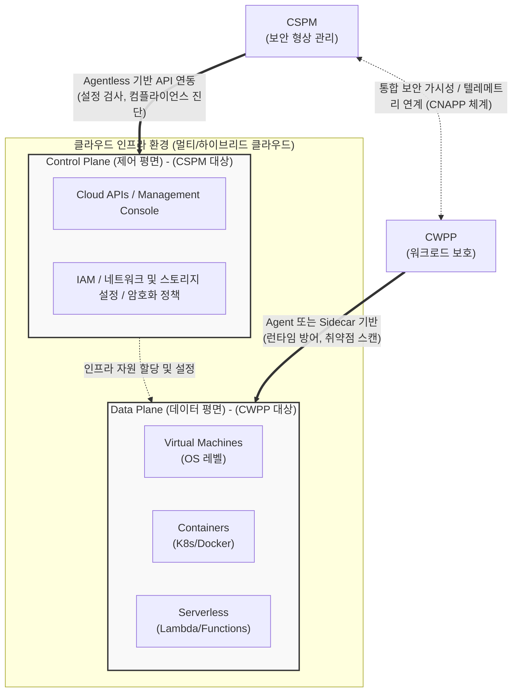

# CWPP와 CSPM (Cloud Workload Protection Platform & Cloud Security Posture Management)

---

## I. 안전한 클라우드 환경을 위한 양대 보안 축, CWPP와 CSPM의 개요

* **가. CWPP와 CSPM의 정의**:
* **CSPM (Cloud Security Posture Management)**: 클라우드 인프라의 설정 오류(Misconfiguration)를 탐지하고, 컴플라이언스 준수 여부를 지속 모니터링하여 클라우드 전반의 보안 형상을 관리하는 **제어 평면(Control Plane) 중심의 사전 예방적 보안 솔루션**
* **CWPP (Cloud Workload Protection Platform)**: 가상머신(VM), [[컨테이너]], 서버리스 등 실행 중인 워크로드 내부의 취약점을 분석하고 위협을 차단하는 **데이터 평면(Data Plane) 중심의 런타임 보안 솔루션**

* **나. 필요성 및 등장배경**:
* 클라우드 환경 확장으로 인한 관리 복잡성 증대 및 휴먼 에러(설정 오류)로 인한 대규모 데이터 유출 방지 필요
* 보안 경계가 사라진 클라우드 인프라(외부)와 실제 동작하는 애플리케이션(내부)을 아우르는 다계층 심층 방어(Defense in Depth) 체계 요구

---

## II. CWPP와 CSPM의 연계 아키텍처 및 핵심 구성요소

### 가. CWPP와 CSPM의 클라우드 보안 아키텍처 (개념도)

* **CSPM**은 집의 "설계도와 출입구 자물쇠"가 규정대로 잘 잠겨 있는지 밖에서(Agentless) 검사하고, **CWPP**는 집 내부의 방(워크로드) 안에서 침입자의 활동을 실시간으로 감시하고 제압(Agent-based)하는 역할을 수행함

### 나. CWPP와 CSPM의 핵심 기술 요소

| 구분 | 요소기술(키워드) | 세부 설명 |
| --- | --- | --- |
| **CSPM** | 설정 오류(Misconfig) 탐지 | 스토리지 공개 접근 허용, 오픈 포트, 과도한 권한 부여 등 클라우드 인프라 설정 취약점 자동 탐지 및 교정 |
| **CSPM** | 컴플라이언스 모니터링 | ISMS, PCI-DSS, GDPR 등 국내외 주요 산업 보안 규제 및 벤치마크(CIS) 준수 여부 지속 평가 |
| **CSPM** | 가시성 및 인벤토리 파악 | 멀티 클라우드 환경에 분산된 자산 내역을 API를 통해 에이전트 없이(Agentless) 자동 식별 |
| **CWPP** | 런타임 보호 (Runtime) | 실행 중인 워크로드의 비정상 [[프로세스]], 메모리 변조, 네트워크 행위 기반 실시간 위협 탐지 및 차단 |
| **CWPP** | 마이크로 [[세그멘테이션]] | 워크로드 간의 세밀한 네트워크 접근 통제 정책을 적용하여 해커의 측면 이동(Lateral Movement) 방지 |
| **CWPP** | 통합 취약점 관리 | 호스트 OS, 애플리케이션 라이브러리 및 컨테이너 이미지(Registry) 취약점 스캐닝 |
| **CWPP** | [[무결성]] 모니터링 (FIM) | 시스템의 핵심 파일 및 레지스트리에 대한 비인가 변경 탐지(File Integrity Monitoring) |

---

## III. CSPM과 CWPP의 상세 비교 및 최신 발전 동향

### 가. CSPM과 CWPP 비교

| 비교 항목 | CSPM (Cloud Security Posture Management) | CWPP (Cloud Workload Protection Platform) |
| --- | --- | --- |
| **보안 초점(Focus)** | **어떻게 설정되었는가? (How it is setup)** | **무엇이 실행 중인가? (What is executing)** |
| **보호 영역 (Plane)** | 제어 평면 (Control Plane) / 클라우드 인프라 | 데이터 평면 (Data Plane) / 내부 워크로드 |
| **보안 접근 방식** | **사전 예방적 (Proactive)**, 정적 분석 중심 | **실시간/사후 방어적 (Active/Reactive)**, 동적 분석 중심 |
| **구현 방식** | Agentless (클라우드 제공자 API 연동) | Agent-based 또는 융합 (OS, 하이퍼바이저, 컨테이너 내 설치) |
| **핵심 위협 대응** | 컴플라이언스 위반, 휴먼 에러 설정 오류 | 제로데이 공격, 런타임 악성코드, 내부망 측면 이동 |

### 나. 향후 전망 및 기술 동향

* **CNAPP(Cloud-Native Application Protection Platform)으로의 진화**: 가트너(Gartner)가 제시한 모델로, 별도로 운영되던 CSPM과 CWPP, 그리고 CIEM(클라우드 인프라 권한 관리)을 단일 플랫폼으로 통합하여 개발부터 런타임까지 심도 있는 클라우드 보안 컨텍스트(Context)를 제공하는 **CNAPP 체계**로 시장이 빠르게 재편되고 있음
* **시프트 레프트(Shift-Left) 보안 체계 통합**: CWPP의 이미지 취약점 스캐닝과 CSPM의 IaC(Infrastructure as Code, 예: Terraform) 설정 검증 기능을 CI/CD 파이프라인에 통합하여, 프로덕션 환경 배포 전에 보안 문제를 선제적으로 해결하는 [[DevSecOps]] 실천이 가속화 중임

---

### 🔗 연관 토픽

- **소속 도메인**: [[00_보안_MOC|🛡️ 보안]]
- **세부 분류**: `1. 정보보안 원칙 & 거버넌스 · 인증`
- **핵심 연관 토픽**:
  - [[제로 트러스트 보안모델|제로 트러스트 (Zero Trust) 보안모델]]
  - [[기밀성]]
  - [[DevSecOps]]
  - [[클라우드 감리|클라우드 감리 (Cloud Audit)]]
  - [[프로세스]]
