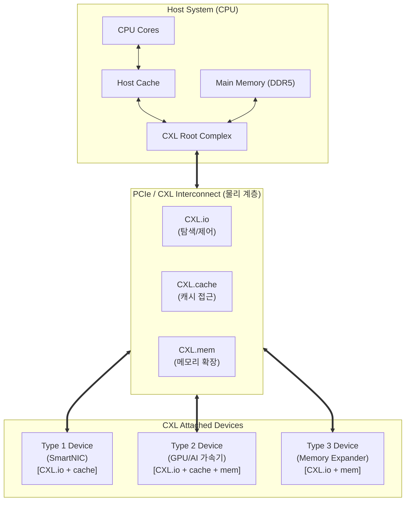

# CXL (Compute Express Link)

---

## I. 차세대 고속 인터커넥트 기술, CXL(Compute Express Link)의 개요

* **가. CXL의 정의**: 고성능 컴퓨팅 환경에서 [[CPU]], [[GPU]], 메모리 등 다양한 장치 간의 고속 통신과 메모리 [[캐시 일관성]](Cache Coherency)을 하드웨어 레벨에서 제공하는 PCIe 기반의 개방형 인터커넥트 표준 기술
* **나. CXL의 필요성 및 특징**:
* **필요성**: AI/ML 등 데이터 집약적 워크로드 증가에 따른 메모리 용량 및 대역폭 한계(Memory Wall) 극복, 이기종 컴퓨팅(Heterogeneous Computing) 자원의 효율적 활용 필요
* **특징**:
* **캐시 일관성 보장**: CPU와 가속기 간의 불필요한 데이터 복사를 제거하여 지연 시간(Latency) 최소화
* **PCIe 인프라 활용**: PCIe 5.0/6.0 물리 계층(PHY)을 그대로 사용하여 기존 하드웨어 생태계와의 완벽한 호환성 제공
* **유연한 자원 할당**: 메모리 풀링(Pooling) 및 스위칭을 통한 동적 자원 재배치로 TCO(총소유비용) 절감

---

## II. CXL의 아키텍처 및 핵심 기술 요소

### 가. CXL의 개념도 및 동작 원리

* 호스트 CPU와 연결된 CXL 디바이스들은 PCIe 물리 계층 위에서 동작하는 3가지 하위 [[프로토콜]](CXL.io, CXL.cache, CXL.mem)을 기기 특성에 맞게 조합하여 데이터를 일관성 있게 공유함

### 나. CXL의 핵심 기술 및 구성 요소

| 분류 | 요소기술(키워드) | 세부 설명 |
| --- | --- | --- |
| **통신 프로토콜** | CXL.io | 기존 PCIe 트랜잭션과 동일하며, 장치의 탐색(Discovery), 구성(Configuration), 초기화 및 레지스터 접근을 담당하는 필수 프로토콜 |
| **통신 프로토콜** | CXL.cache | 가속기(디바이스)가 호스트 CPU의 캐시 메모리에 낮은 지연 시간으로 일관성 있게 직접 접근할 수 있도록 지원 |
| **통신 프로토콜** | CXL.mem | 호스트 CPU가 가속기나 메모리 확장 장치에 탑재된 메모리를 자신의 주 메모리처럼 직접 접근(Load/Store)할 수 있도록 지원 |
| **물리 계층** | PCIe 5.0 / 6.0 PHY | 별도의 물리 규격 없이 PCIe 인터페이스를 활용하며, CXL 1.1/2.0은 PCIe 5.0(32GT/s), CXL 3.x는 PCIe 6.0(64GT/s) 규격 채용 |
| **자원 공유** | Memory Pooling | 다수의 호스트가 CXL 스위치를 통해 단일 메모리 풀(Pool)에서 필요한 만큼의 메모리를 동적으로 할당받아 공유하는 기술 |
| **네트워크 구조** | CXL Switch (Fabric) | 단일 호스트-장치 간 1:1 연결을 넘어, 멀티 레벨 스위칭 및 다중 호스트 환경의 스위칭 패브릭을 구성하여 인프라 확장성 제공 |
| **성능 최적화** | Cache Coherency | CPU와 가속기가 동일한 데이터를 처리할 때 데이터 복사 없이 일관성(Coherency)을 하드웨어 레벨에서 자동 유지함 |
| **보안 기술** | CXL IDE | CXL 링크 구간을 통과하는 데이터의 기밀성과 무결성을 보장하기 위해 지연 시간을 최소화한 [[무결성]] 데이터 [[암호화]](Integrity Data Encryption) 적용 |

---

## III. CXL 디바이스 유형 비교 및 향후 진화 전망

### 가. CXL 디바이스 유형(Type) 상세 비교

| 비교 항목 | Type 1 Device | Type 2 Device | Type 3 Device |
| --- | --- | --- | --- |
| **지원 프로토콜** | CXL.io + CXL.cache | CXL.io + CXL.cache + CXL.mem | CXL.io + CXL.mem |
| **메모리 의존성** | 자체 로컬 메모리 없음 | 자체 대용량 로컬 메모리 탑재 | 메모리 버퍼 그 자체 |
| **동작 특징** | 호스트의 메모리에 의존하여 캐시 일관성 확보 | 호스트와 디바이스 양방향으로 메모리 공유 및 일관성 유지 | CPU가 디바이스의 메모리를 시스템 주 메모리처럼 사용 |
| **주요 적용 사례** | SmartNIC, 암호화 가속기 | 고성능 GPU, AI/ML 연산 가속기, FPGA | CMM(CXL Memory Module), 메모리 대역폭/용량 확장기 |

### 나. 향후 전망 및 동향

* **컴포저블 인프라(Composable Infrastructure)의 실현**: CXL 2.0의 스위칭 및 메모리 풀링 기능에 이어, CXL 3.0/3.1 규격에서는 PCIe 6.0 기반의 64GT/s 속도와 다중 [[스위치 (Layer 3 Switch)|스위치]] 패브릭, P2P(Peer-to-Peer) 직접 통신을 지원함에 따라 서버 인프라가 CPU, 메모리, 가속기 단위로 완전히 분리(Disaggregation)되고 동적으로 결합되는 컴포저블 아키텍처로 진화하고 있음
* **AI 시대를 위한 메모리 병목 현상 해소 핵심 기술**: 생성형 AI 모델의 크기가 급증함에 따라 기존 [[HBM]](고대역폭 메모리)만으로는 용량 확장에 한계가 있어, CXL을 활용한 대용량 메모리 확장 및 AI 가속기 간의 고속 데이터 교환이 향후 데이터센터 아키텍처의 필수 표준으로 자리 잡을 전망임

---

### 🔗 연관 토픽

- **소속 도메인**: [[00_컴퓨터구조_MOC|💻 컴퓨터구조]]
- **세부 분류**: `1. CPU 프로세서 & 마이크로아키텍처`
- **핵심 연관 토픽**:
  - [[캐시 일관성|캐시 일관성(Cache Coherence)]]
  - [[중앙처리장치|중앙처리장치 (CPU Central Processing Unit)]]
  - [[지능형 반도체]]
  - [[캐시 일관성 유지 기법|캐시 일관성(Cache Coherence) 유지 기법]]
  - [[CPU]]
