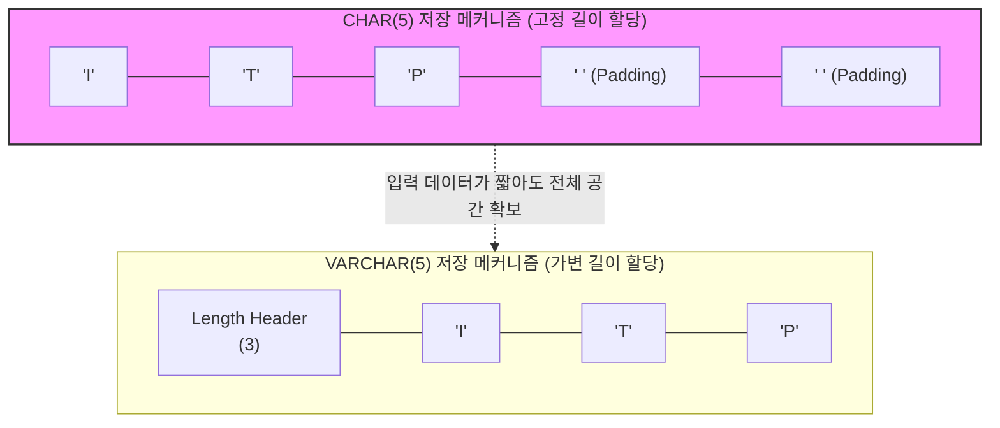

# Char Type

---

## I. 고정 길이 문자 데이터 저장 구조, Char Type의 개요

* **정의**: [[데이터베이스]] 및 시스템 메모리에 사전에 선언된 고정된 크기(바이트 또는 문자 수)만큼의 공간을 정적으로 할당하여 문자열을 저장하는 기본 데이터 타입
* **필요성/등장배경**: 데이터의 길이가 일정한 경우, 저장 공간의 포인터 오프셋(Offset) 계산을 단순화하여 디스크 I/O 성능 및 검색 속도를 극대화하기 위해 고안됨
* **특징**: 남는 공간에 대한 공백 채움(Right Padding), 정적 길이 할당에 따른 수정(Update) 시 [[단편화]] 방지, 가변 데이터 저장 시 스토리지 낭비 발생

---

## II. Char Type의 저장 메커니즘 및 핵심 속성

### 가. Char와 Varchar Type의 메모리 할당 메커니즘

* 데이터 'ITP' 저장 시, CHAR는 선언된 5자리만큼 메모리를 확보하고 남은 공간을 공백으로 채우는 반면, VARCHAR는 실제 데이터 길이(3)와 이를 저장하는 헤더 공간만을 할당함

### 나. Char Type의 핵심 기술 및 구성 요소

| 구분 | 요소기술(키워드) | 세부 설명 |
| --- | --- | --- |
| **공간 할당** | Fixed-length Allocation | 선언된 길이만큼 무조건 물리적 저장 공간을 할당하여 데이터 길이 편차 무시 |
| **빈 공간 처리** | Right Padding | 입력된 데이터가 선언된 길이보다 짧을 경우, 우측에 공백(Space) 문자를 채워 길이 맞춤 |
| **조회 연산** | Blank-Padded Comparison | 값 비교 시 우측에 패딩된 공백을 무시하고 의미 있는 실제 문자열 값만으로 동일성 비교 |
| **문자 인코딩** | Character Set (UTF-8 등) | 인코딩 방식에 따라 할당 기준이 다름 (바이트 기준 할당 vs 실제 문자 수 기준 할당) |
| **데이터 수정** | In-place Update | 데이터 수정 시 길이가 변하지 않아 레코드 크기가 고정되므로, 행 이주(Row Migration) 미발생 |
| **검색 성능** | Static Offset | 모든 레코드의 길이가 동일하여 특정 행의 물리적 위치 계산이 빠르고 Full Scan 시 유리함 |
| **저장 효율** | Storage Overhead | 길이가 들쭉날쭉한 데이터를 CHAR로 선언 시, 불필요한 공백 저장으로 스토리지 낭비 심화 |
| **적용 권장** | 코드성 데이터 (Code Value) | Y/N 플래그, 성별, 국가코드, 주민등록번호, [[암호화]] 해시(SHA-256) 등 길이가 고정된 속성에 최적화 |

---

## III. Char Type과 Varchar Type 비교 및 최적화 활용 가이드

### 가. CHAR Type과 VARCHAR Type 상세 비교

| 비교 항목 | CHAR (고정 길이 문자형) | VARCHAR (가변 길이 문자형) |
| --- | --- | --- |
| **저장 방식** | 선언된 최대 크기만큼 정적 공간 할당 | 실제 데이터 크기 + 길이 저장 헤더(1~2 Byte) 할당 |
| **공백(Padding) 유무** | 남은 공간을 공백으로 채움 (발생) | 입력된 데이터 크기만큼만 저장 (미발생) |
| **Update 비용 (수정 시)** | **비용 낮음** (크기 불변, In-place 업데이트) | **비용 높음** (크기 증가 시 Row Migration/Chaining 위험) |
| **검색(Read) 성능** | 오프셋 계산이 단순하여 상대적으로 빠름 | 길이 헤더를 읽어 데이터를 파싱해야 하므로 약간의 오버헤드 |
| **스토리지 효율성** | 고정 길이 데이터엔 우수, 가변 길이엔 낭비 | 가변 길이 데이터에 대해 저장 공간 극도로 절약 |
| **최적 적용 대상** | 짧고 길이가 일정한 코드, 플래그, 해시값 등 | 이메일, 주소, 게시판 제목, 본문 등 길이가 가변적인 텍스트 |

### 나. 실무적 데이터 타입 설계 및 활용 전망

* **Row Migration 및 Chaining 방지**: 잦은 Update가 발생하고 데이터 길이가 자주 변하는 인덱스 핵심 컬럼의 경우, VARCHAR 사용 시 디스크 단편화(Fragmentation)가 발생할 수 있으므로 성능 최적화를 위해 의도적으로 CHAR Type을 채택하는 설계 기법이 유효함
* **스토리지 최적화 동향**: 최근 RDBMS 및 빅데이터 DW(Data Warehouse) 엔진은 강력한 블록 단위 데이터 압축 [[알고리즘]](Zstd, Snappy 등)을 기본 제공하므로, 물리적 스토리지 절약보다는 논리적 데이터 성격(가변/고정)에 맞춘 명확한 타입 선언이 데이터 아키텍처 설계의 표준으로 자리잡고 있음

---

### 🔗 연관 토픽

- **소속 도메인**: [[00_컴퓨터구조_MOC|💻 컴퓨터구조]]
- **세부 분류**: `2. 캐시 & 메모리 계층 구조 · 스토리지`
- **핵심 연관 토픽**:
  - [[알고리즘]]
  - [[암호화|암호화 (Encryption)]]
  - [[데이터베이스]]
  - [[가상 메모리]]
  - [[메모리 관리]]
