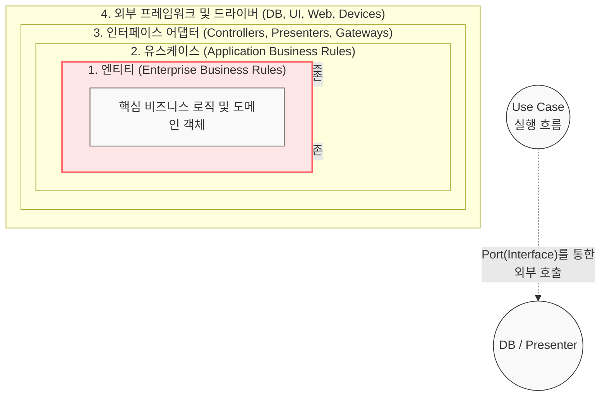

# Clean Architecture

---

## I. 의존성 역전을 통한 관심사 분리, Clean Architecture의 개요

* **정의**: 소프트웨어 시스템의 관심사를 여러 계층(동심원)으로 분리하고, 소스 코드의 의존성이 오직 외부에서 내부(핵심 도메인)로만 향하도록 설계하여 유지보수성과 테스트 용이성을 극대화한 아키텍처 패턴
* **필요성 및 등장배경**: 프레임워크나 데이터베이스에 강결합된 레거시 시스템의 수정 한계 극복, 비즈니스 핵심 로직의 독립성 및 재사용성 확보, [[TDD]](테스트 주도 개발) 도입 요구 증가
* **특징**:
* [[프레임워크]] 독립성: 외부 라이브러리나 프레임워크의 존재에 의존하지 않음
* UI/DB 독립성: 비즈니스 로직 변경 없이 UI나 DB(Oracle, MongoDB 등) 교체 가능
* 테스트 용이성: 외부 요소 없이 비즈니스 규칙(Use Case, Entity) 단독 테스트 가능

---

## II. Clean Architecture의 개념도 및 핵심 구성 요소

### 가. Clean Architecture의 아키텍처 및 동작 원리

* 의존성 규칙(Dependency Rule)에 따라 모든 소스 코드의 의존성은 반드시 바깥쪽(인프라)에서 안쪽(고수준 정책, [[엔티티]])으로만 향해야 하며, 실행 흐름이 밖으로 향할 때는 인터페이스를 통한 의존성 역전 원칙(DIP)을 적용함

### 나. Clean Architecture의 핵심 계층 및 기술 요소

| 구분 | 계층 / 요소기술(키워드) | 세부 설명 |
| --- | --- | --- |
| **핵심 계층** | 엔티티 (Entities) | 전사적 핵심 업무 규칙을 캡슐화한 객체로, 외부의 변화(보안, UI 등)에 가장 영향을 받지 않는 가장 안쪽 계층 |
| **핵심 계층** | 유스케이스 (Use Cases) | 애플리케이션에 특화된 업무 규칙을 포함하며, 엔티티로 들어오고 나가는 데이터 흐름을 조작하고 제어함 |
| **변환 계층** | 인터페이스 어댑터 (Interface Adapters) | 유스케이스와 외부 계층 간의 데이터를 변환하는 역할을 수행 (예: MVC의 Controller, Presenter, DB Gateway) |
| **외부 계층** | 인프라스트럭처 (Frameworks & Drivers) | [[데이터베이스]], 웹 프레임워크, UI 등 구체적인 세부 사항이 위치하는 가장 바깥쪽 계층 |
| **설계 원칙** | 의존성 역전 원칙 (DIP) | 내부 계층이 외부 계층의 구체 클래스를 직접 호출하지 않고, 추상화된 인터페이스를 통해 의존성을 역전시킴 |
| **설계 원칙** | 데이터 구조 분리 (DTO) | 계층 간 경계를 넘을 때 데이터베이스 행(Row) 객체를 그대로 쓰지 않고, 단순한 데이터 구조체(DTO)를 사용하여 [[결합도]] 통제 |
| **통신 규약** | 입력/출력 포트 (Port) | 인터페이스 어댑터와 유스케이스 간의 통신 규격을 정의하는 바운더리(Boundary) 인터페이스 명세 |
| **제어 흐름** | 제어 흐름 역전 (Inversion of Flow) | 로직의 실행 흐름(내부 $\rightarrow$ 외부)과 소스 코드 의존성(외부 $\rightarrow$ 내부)이 반대일 때 인터페이스를 다형성으로 구현하여 규칙 준수 |

---

## III. 타 아키텍처 비교 및 실무 적용 전망

### 가. 도메인 중심 아키텍처 비교 (Clean vs Hexagonal)

| 비교 항목 | Clean Architecture (클린 아키텍처) | Hexagonal Architecture (헥사고날) |
| --- | --- | --- |
| **제안자** | 로버트 C. 마틴 (Robert C. Martin) | 앨리스터 코오번 (Alistair Cockburn) |
| **핵심 메타포** | 의존성 규칙을 가진 **동심원 4계층** | 포트와 어댑터를 가진 **육각형 대칭 구조** |
| **경계 분리 방식** | 인프라 $\rightarrow$ 어댑터 $\rightarrow$ 유스케이스 $\rightarrow$ 엔티티 | 내부(도메인/비즈니스) $\leftrightarrow$ 외부(인프라/인터페이스) |
| **주요 통신 방식** | Boundary 인터페이스(Input/Output) 기반 통신 | Port(인터페이스)와 Adapter(구현체) 기반 통신 |
| **공통점** | 외부 프레임워크로부터 핵심 도메인 로직을 격리하여 의존성 역전(DIP)을 통한 테스트 가능성 확보 |  |

### 나. 클린 아키텍처의 실무 적용 및 향후 전망

* **[[MSA (Micro Service Architecture)|MSA]]와 [[DDD (Domain Driven Design)|DDD]](도메인 주도 설계)와의 시너지**: 비즈니스 도메인의 복잡성이 높은 마이크로서비스 환경에서, 각 서비스 내부의 핵심 로직을 보호하고 인프라 교체의 유연성을 제공하는 근간 아키텍처로 확고히 자리잡음
* **모바일 네이티브 개발의 표준화**: 프레임워크 의존성이 극도로 높은 모바일 환경(Android, iOS)에서 [[MVVM (Model, View, View Model)|MVVM]] 패턴 등과 결합하여, UI(View)와 비즈니스 로직(Domain)을 완벽히 분리해 [[테스트 커버리지]] 및 유지보수성을 획기적으로 높이는 표준 아키텍처 패턴으로 널리 활용되고 있음

---

### 🔗 연관 토픽

- **소속 도메인**: [[00_소프트웨어공학_MOC|🏗️ 소프트웨어공학]]
- **세부 분류**: `2. 애자일(Agile) & 지속적 통합/배포(CI/CD)`
- **핵심 연관 토픽**:
  - [[데메테르의 법칙|데메테르의 법칙 (Law of Demeter)]]
  - [[TDD|TDD (Test Driven Development)]]
  - [[프레임워크]]
  - [[MSA (Micro Service Architecture)]]
  - [[DDD (Domain Driven Design)]]
